# Agad project guide

Written on 27 September 2026 for the owner. It explains every part of Agad in plain words.

- Every claim about the code comes from the files on disk today, including the alert-rule fix that is not committed yet. Each one carries a `path:line` link. Click it to open the file on that line.
- Every outside fact carries a link to where it came from. Anything nobody could confirm on an official page is marked **UNVERIFIED**.
- Words that may be new are explained where they first appear, and again in the [glossary](#14-glossary).

## Contents

1. [Agad on one page](#1-agad-on-one-page)
2. [The big picture](#2-the-big-picture)
3. [Where it runs](#3-where-it-runs)
4. [What happens when a user signs up](#4-what-happens-when-a-user-signs-up)
5. [The engine that finds jobs and sends applications](#5-the-engine-that-finds-jobs-and-sends-applications)
6. [Data and safety](#6-data-and-safety)
7. [Keeping it healthy](#7-keeping-it-healthy)
8. [The code base tour](#8-the-code-base-tour)
9. [What to expect](#9-what-to-expect)
10. [Scaling when traffic grows](#10-scaling-when-traffic-grows)
11. [Getting paid](#11-getting-paid)
12. [Every bill to expect](#12-every-bill-to-expect)
13. [The MVP and the launch checklist](#13-the-mvp-and-the-launch-checklist)
14. [Glossary](#14-glossary)
15. [Sources](#15-sources)

---

## 1. Agad on one page

**In short.** Agad watches onlinejobs.ph for a job seeker and, minutes after a matching job is posted, puts a ready-to-paste application in their own Gmail so they can apply first. It is built and tested, it has worked end to end on your PC with a real Google account, and it has never run on the internet.

### What it does for a user

1. They sign in with Google.
2. They connect Gmail. That gives Agad permission to send email as them, and only ever to them.
3. They fill in four things. Their name, the kind of job they want, their usual subject line and their usual application message.
4. They add up to 20 watch words, like "shopify" or "virtual assistant" ([`applyfirst/saas/app.py:68-69`](../applyfirst/saas/app.py#L68-L69)).
5. They press Start. From then on, about every 10 minutes, Agad searches onlinejobs.ph for their words. When a new matching job appears, Gemini (Google's AI) tailors their own message to that job, and the result lands in their inbox. They read it, paste it into onlinejobs.ph and apply.

Agad never applies for anyone and never logs in to onlinejobs.ph. The email is sent from the user to the same user ([`applyfirst/saas/gmail_send.py:72-81`](../applyfirst/saas/gmail_send.py#L72-L81)).

### The promise

The homepage headline is "New job posted. Apply Agad." ([`applyfirst/saas/templates/home.html:31`](../applyfirst/saas/templates/home.html#L31)). "Agad" is Tagalog for "right away". The line under it promises a ready-to-paste application in your own Gmail within minutes ([`applyfirst/saas/templates/home.html:32`](../applyfirst/saas/templates/home.html#L32)). The pages offer a 14-day free trial and keep the price hidden for now, with "₱199 a month" ready to switch on ([`applyfirst/saas/templates/_ui.html:15-20`](../applyfirst/saas/templates/_ui.html#L15-L20)).

### Two surfaces, V1 and V2

| | V1, the personal tool | V2, the public service |
|---|---|---|
| Who uses it | You only | Any onlinejobs.ph applicant |
| Where the code lives | `applyfirst/` (`cli.py`, `pipeline.py`) | `applyfirst/saas/` |
| Its database file | `applyfirst.db` | `applyfirst-saas.db` |
| How letters arrive | Your own mail account by SMTP | Each user's own Gmail, through Google's Gmail API |
| Running today | Yes, on the Oracle server (per the handoff notes) | No, only on your PC |

The two never share a database file. V2 borrows V1's job reader, letter writer, email layout, backup code and mail sender (section 8.2).

### Where things stand today

- **Built.** Sign-in, the four sign-up steps, the dashboard, the worker, AI letters, Gmail sending, reconnect emails, owner alerts, backups and health checks are all in the code. Milestones M1 to M5 and the launch-blocker fixes B1 to B6 are committed and pushed.
- **Tested.** 1,391 automated tests pass. The smoke script, a quick check that opens every page and submits every form, passes all 607 of its checks. Both were measured on 27 September 2026 on the working copy (section 8.4).
- **Tried for real.** On 26 September 2026 you ran the real app on your PC with a real Google account. Sign-in and Connect Gmail worked and the first real application emails arrived.
- **One fix waits to be committed.** That first real run queued 59 alerts for one new user in a single round, mostly old jobs ([`docs/SYSTEM-DESIGN.md:350-353`](../docs/SYSTEM-DESIGN.md#L350-L353)). The alert rule now sends a user only jobs first stored after they started watching for them ([`applyfirst/saas/db.py:636-665`](../applyfirst/saas/db.py#L636-L665)). It is on disk and tested, but not committed (section 5.4).
- **Not deployed.** There is no Fly app yet. V2 has never run outside your PC.
- **Do before any deploy.** Make a new Google client secret, the password Agad uses to talk to Google, and delete the old one, because the old one appeared in a screenshot during setup.

### What stands between today and paying users

1. Written permission from onlinejobs.ph, and a slower, more honest crawler, meaning the part that reads their site (section 9.1).
2. Google's verification of the Gmail sending permission (section 9.2).
3. Gemini on the paid tier, with its thinking, the hidden reasoning it is billed for, turned down (section 9.3).
4. A way to take money (section 11).
5. Account deletion, updated legal pages and a registered business (section 13).
6. Money set aside for the bills, about PHP 4,900 to 15,000 once before launch and about PHP 330 to 5,420 a month after that, plus the AI letters (section 12).

---

## 2. The big picture

**In short.** Agad is two programs on one server that share one database file. The web app talks to people, the worker talks to the outside world, and the two never call each other. They leave notes for each other in the database, like two people on different shifts sharing one notebook.

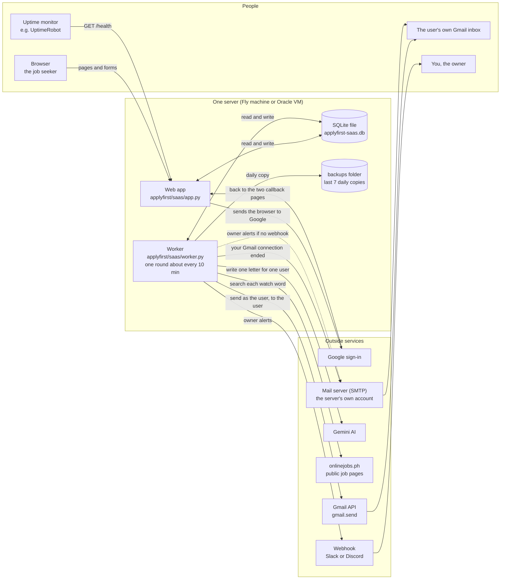

**How to read it.** The browser only ever talks to the web app. Only the worker reaches onlinejobs.ph, Gemini and the Gmail API. The database in the middle is how the two halves hear about each other. The dotted line is a spare route used only when no webhook is set.

### What each box is

- **Browser.** The job seeker's phone or computer. It gets pages, style files and signed cookies, which are small notes the browser keeps, sealed so nobody can change them. It may load nothing from any other site ([`applyfirst/saas/app.py:229-232`](../applyfirst/saas/app.py#L229-L232)).
- **Web app.** The program that answers every page and form. It is built with FastAPI, a Python toolkit for websites, and run by uvicorn, the program that listens for browsers. One function, `create_app`, assembles it ([`applyfirst/saas/app.py:210`](../applyfirst/saas/app.py#L210)).
- **Worker.** A second program with no pages that wakes up, does one round of work and sleeps, forever ([`applyfirst/saas/worker.py:613-620`](../applyfirst/saas/worker.py#L613-L620)).
- **SQLite file.** The one database, a single file both programs open the same way ([`applyfirst/saas/db.py:103-110`](../applyfirst/saas/db.py#L103-L110)).
- **Backups folder.** Dated, compressed copies of that file, the newest 7 kept ([`applyfirst/backup.py:107-113`](../applyfirst/backup.py#L107-L113)).
- **Google sign-in.** Where the browser goes to prove who the person is ([`applyfirst/saas/google_oauth.py:73-86`](../applyfirst/saas/google_oauth.py#L73-L86)).
- **Gmail API.** Google's door for sending an email as the user ([`applyfirst/saas/gmail_send.py:84-100`](../applyfirst/saas/gmail_send.py#L84-L100)).
- **Gemini.** Google's AI, which tailors each letter. The only call to it is one line ([`applyfirst/tailor/llm.py:41`](../applyfirst/tailor/llm.py#L41)).
- **onlinejobs.ph.** The job site. Agad reads its public search and job pages ([`applyfirst/sources/onlinejobsph.py:54-66`](../applyfirst/sources/onlinejobsph.py#L54-L66)).
- **Mail server (SMTP).** The server's own email account. It tells users their Gmail connection ended ([`applyfirst/saas/reconnect.py:223-249`](../applyfirst/saas/reconnect.py#L223-L249)) and carries owner alerts when no webhook is set ([`applyfirst/saas/notify.py:49-56`](../applyfirst/saas/notify.py#L49-L56)).
- **Webhook.** A secret web address that turns a message into a Slack or Discord post, the first choice for owner alerts ([`applyfirst/saas/notify.py:31-47`](../applyfirst/saas/notify.py#L31-L47)).
- **Uptime monitor.** An outside service that calls `/health` every few minutes and wakes you when it answers 503, the web code for "not healthy" ([`applyfirst/saas/app.py:459-515`](../applyfirst/saas/app.py#L459-L515)).
- **The user's inbox.** Where the finished application lands.
- **You.** You get alerts, never user letters.

The shared notebook is a small table called `worker_meta`. The worker writes the time of its last round and how many blind rounds it had in a row ([`applyfirst/saas/worker.py:402-408`](../applyfirst/saas/worker.py#L402-L408)). A blind round is one where onlinejobs.ph gave back nothing (section 7.4). It also writes whether the AI is on ([`applyfirst/saas/worker.py:453-454`](../applyfirst/saas/worker.py#L453-L454)). The web app's `/health` page reads all three ([`applyfirst/saas/app.py:476-478`](../applyfirst/saas/app.py#L476-L478)).

The worker's heartbeat is this loop.

```python
# applyfirst/saas/worker.py:613-620
while True:
    try:
        _cycle(conn, source, cfg, master_key, dog)
    except Exception as exc:
        log.event(_LOG, "worker_cycle_crashed", level=logging.ERROR, error=str(exc)[:200])
    # Two-sided jitter (±worker_jitter fraction) so the cadence centers on `interval`.
    delay = interval + random.uniform(-1.0, 1.0) * interval * cfg.worker_jitter
    time.sleep(max(1.0, delay))
```

**Plain reading.** `while True` means "repeat forever". One round, then a nap of about 10 minutes that wobbles a little each time, so the visits to onlinejobs.ph never look robotic. When you read any background program, find its forever loop first. Everything else hangs off it.

---

## 3. Where it runs

**In short.** All of V2 runs on one small computer. For the beta that is one Fly.io machine in Singapore, and for later there is a ready runbook for the Oracle server that already runs V1.

### 3.1 What runs inside the one machine

- **The web app**, started by uvicorn on port 8080 on Fly. A port is a numbered door on the machine that one program listens at ([`entrypoint.sh:46`](../entrypoint.sh#L46)).
- **The worker**, started in a restart loop beside it ([`entrypoint.sh:30-43`](../entrypoint.sh#L30-L43)).
- **The database file** `applyfirst-saas.db`, on a disk that survives restarts, called a volume ([`fly.toml:36`](../fly.toml#L36), [`fly.toml:52-54`](../fly.toml#L52-L54)).
- **The backups folder** on the same volume ([`fly.toml:37`](../fly.toml#L37)).

Why one machine. A Fly volume plugs into one machine only, and both programs need the same database file. So the app must never be scaled to two machines ([`fly.toml:3-5`](../fly.toml#L3-L5), [`entrypoint.sh:8`](../entrypoint.sh#L8)). A second machine would get its own empty volume and split the data in two.

### 3.2 Path A. The Fly.io beta

Fly.io is a hosting service that runs Docker containers. A Docker image is a sealed box holding Python, the libraries and our code, built from a recipe called a Dockerfile.

1. **The recipe.** It starts from Python 3.12 ([`Dockerfile:8`](../Dockerfile#L8)), installs the libraries ([`Dockerfile:23-24`](../Dockerfile#L23-L24)), copies the `applyfirst` folder and the start script ([`Dockerfile:27-28`](../Dockerfile#L27-L28)), and runs the start script ([`Dockerfile:35`](../Dockerfile#L35)).
2. **The machine.** One machine in Singapore ([`fly.toml:8`](../fly.toml#L8)) with 512 MB of memory ([`fly.toml:77-79`](../fly.toml#L77-L79)). It is never put to sleep, because the worker must keep searching ([`fly.toml:59`](../fly.toml#L59)).
3. **The start script.** It prepares the database tables once ([`entrypoint.sh:13-18`](../entrypoint.sh#L13-L18)), starts the worker in its restart loop ([`entrypoint.sh:30-43`](../entrypoint.sh#L30-L43)), then runs the web app in front ([`entrypoint.sh:46`](../entrypoint.sh#L46)).
4. **Fly's own check** calls `/healthz`, which says "ok" whenever the web app is up ([`fly.toml:63-68`](../fly.toml#L63-L68)). It must stay that simple, because a failing Fly check takes the only machine off the air. The deeper `/health` page is for your outside monitor (section 7).

```sh
# entrypoint.sh:32-42
while :; do
  started=$(date +%s)
  status=0
  python -m applyfirst.saas.worker || status=$?
  ran=$(( $(date +%s) - started ))
  if [ "$ran" -ge 600 ]; then delay=10; fi
  echo "[entrypoint] worker exited with status $status after ${ran}s, restarting in ${delay}s" >&2
  sleep "$delay"
  if [ "$ran" -lt 600 ] && [ "$delay" -lt 300 ]; then delay=$(( delay * 2 )); fi
  if [ "$delay" -gt 300 ]; then delay=300; fi
done
```

**Plain reading.** This is the worker's babysitter. Whenever the worker stops, for any reason, it waits and starts it again. The wait is 10 seconds at first and doubles up to 5 minutes if the worker keeps dying fast. When you read a start script, look for a `while` loop around the program's name. That is what keeps it alive.

The deploy steps are in `Handoff.md` under "Deploy, Path A" and in `docs/OPERATIONS.md`. In short, create the app, create a 1 GB volume in Singapore, set the Google project up, set the secrets with `fly secrets set`, then `fly deploy`.

### 3.3 Path B. The Oracle server

systemd is Linux's built-in manager that starts programs at boot and restarts them when they die. Caddy is a front-door web server that gets and renews the padlock certificate by itself and passes visitors to our app.

1. **Setup** installs Caddy ([`deploy/oracle/setup.sh:26-35`](../deploy/oracle/setup.sh#L26-L35)). It makes `applyfirst`, a system user, which is an account with no login that the app runs as, and puts the code in `/opt/applyfirst` ([`deploy/oracle/setup.sh:37-54`](../deploy/oracle/setup.sh#L37-L54)). It then copies the V1 and V2 unit files into place. A unit file is systemd's instruction card for one program ([`deploy/oracle/setup.sh:69-85`](../deploy/oracle/setup.sh#L69-L85)). The V1 dashboard's unit is not among them. It starts nothing ([`deploy/oracle/setup.sh:7-8`](../deploy/oracle/setup.sh#L7-L8)).
2. **Caddy** sits on the public ports and hands every visitor to the app at `127.0.0.1`, an address only the machine itself can reach ([`deploy/oracle/Caddyfile:17-21`](../deploy/oracle/Caddyfile#L17-L21)).
3. **The web unit** runs uvicorn with 4 copies on `127.0.0.1:8000` ([`deploy/oracle/applyfirst-saas-web.service:20`](../deploy/oracle/applyfirst-saas-web.service#L20)), capped at 480 MB ([`deploy/oracle/applyfirst-saas-web.service:25`](../deploy/oracle/applyfirst-saas-web.service#L25)).
4. **The worker unit** runs the worker about every 330 seconds, give or take 27 percent, and always restarts it ([`deploy/oracle/applyfirst-saas-worker.service:18-22`](../deploy/oracle/applyfirst-saas-worker.service#L18-L22)).
5. **The backup timer** fires daily at 3 in the morning ([`deploy/oracle/applyfirst-saas-backup.timer:6`](../deploy/oracle/applyfirst-saas-backup.timer#L6)).
6. **Settings** come from `/opt/applyfirst/.env`, which V1 and V2 both read ([`deploy/oracle/applyfirst-saas-web.service:14-15`](../deploy/oracle/applyfirst-saas-web.service#L14-L15)). A full template is `deploy/oracle/saas-env.sample`.

Two traps on this path, both found by reading the unit files.

- **Two programs want port 8000.** V1's dashboard already listens on port 8000 ([`deploy/oracle/applyfirst-dash.service:14`](../deploy/oracle/applyfirst-dash.service#L14)), and V2's web unit asks for the same port ([`deploy/oracle/applyfirst-saas-web.service:20`](../deploy/oracle/applyfirst-saas-web.service#L20)). The second one to start fails. Move one of them, and Caddy with it, before using Path B. The runbook does not mention this.
- **The pages would say "about every 10 minutes" while the worker runs about every 5 and a half.** Only the worker unit sets the 330-second interval ([`deploy/oracle/applyfirst-saas-worker.service:18`](../deploy/oracle/applyfirst-saas-worker.service#L18)). The web unit does not, so the pages and the `/health` clock use 600 seconds ([`applyfirst/saas/app.py:50-56`](../applyfirst/saas/app.py#L50-L56)). Add the same setting to the web unit.

### 3.4 V1 on Oracle today

V1 is your personal tool, with its own database and its own settings ([`applyfirst/config.py:43-62`](../applyfirst/config.py#L43-L62)).

1. `applyfirst.service` runs the V1 loop forever ([`deploy/oracle/applyfirst.service:17-19`](../deploy/oracle/applyfirst.service#L17-L19)).
2. Each round searches onlinejobs.ph with the same job reader as V2 ([`applyfirst/cli.py:152`](../applyfirst/cli.py#L152)).
3. It emails **you** through your own mail account, not the Gmail API ([`applyfirst/cli.py:52-58`](../applyfirst/cli.py#L52-L58)).
4. A timer checks every 10 minutes and restarts the loop if it has gone quiet ([`deploy/oracle/applyfirst-health.timer:7-8`](../deploy/oracle/applyfirst-health.timer#L7-L8), [`deploy/oracle/health-check.sh:14-19`](../deploy/oracle/health-check.sh#L14-L19)).
5. A small read-only dashboard is reachable only over Tailscale, a private network between your own devices ([`deploy/oracle/applyfirst-dash.service:11-14`](../deploy/oracle/applyfirst-dash.service#L11-L14)).

The handoff notes add the live facts. The server is an Oracle `VM.Standard.E2.1.Micro` with 1 GB of memory, running Ubuntu 24.04, and all three V1 services are running.

### 3.5 The deployment picture

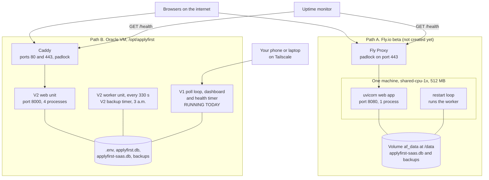

**How to read it.** There are two possible homes for V2, and only one would be used. Only the box marked "RUNNING TODAY" is live, and that fact comes from the handoff notes, not the code.

### 3.6 The database file and the volume

SQLite is a database that is just one file on disk, with no separate database server. Both programs open it with the same three settings.

```python
# applyfirst/saas/db.py:106-109
conn.row_factory = sqlite3.Row
conn.execute("PRAGMA journal_mode=WAL;")
conn.execute("PRAGMA busy_timeout=10000;")   # ride out web+worker write contention
conn.execute("PRAGMA foreign_keys=ON;")
```

**Plain reading.** `journal_mode=WAL` lets one program read while the other writes. `busy_timeout=10000` means "if the file is busy, wait up to 10 seconds instead of failing". These are why two programs can share one file safely. When a database is shared, look for settings like these right where it is opened.

- The file name comes from `APPLYFIRST_SAAS_DB`, and the code refuses to start if it is set to V1's file name by mistake ([`applyfirst/saas/config.py:123-128`](../applyfirst/saas/config.py#L123-L128)).
- The tables are built and upgraded in numbered steps, now at step 5 ([`applyfirst/saas/db.py:33`](../applyfirst/saas/db.py#L33)). A file newer than the code is refused, so an old copy of the code cannot damage it ([`applyfirst/saas/db.py:121-125`](../applyfirst/saas/db.py#L121-L125)).
- On Fly the volume is 1 GB (the deploy command in `Handoff.md`). Nothing deletes old rows from the `jobs` and `user_job_alerts` tables, only old cached letters are trimmed ([`applyfirst/saas/db.py:771-779`](../applyfirst/saas/db.py#L771-L779)). The operations doc estimates about 940 MB a year at 300 new posts a day ([`docs/OPERATIONS.md:326-327`](../docs/OPERATIONS.md#L326-L327)), so the disk fills within about a year.

### 3.7 Backups

A backup is a dated, compressed copy of the database file. One shared core does the copying for V1 and V2 ([`applyfirst/backup.py:35-71`](../applyfirst/backup.py#L35-L71)).

1. It checks there is room first, and refuses when free disk is under twice the database size ([`applyfirst/backup.py:97-104`](../applyfirst/backup.py#L97-L104)).
2. It takes a safe copy while both programs keep running ([`applyfirst/backup.py:59`](../applyfirst/backup.py#L59)).
3. It compresses into a temporary file, then renames it, so a half-written backup never has a real name ([`applyfirst/backup.py:63-65`](../applyfirst/backup.py#L63-L65)).
4. It keeps the newest 7 and deletes older ones, touching only its own file names ([`applyfirst/backup.py:107-113`](../applyfirst/backup.py#L107-L113)).

| Host | What starts the backup | Where |
|---|---|---|
| Fly | The worker, after its first round of each day | [`applyfirst/saas/worker.py:481-504`](../applyfirst/saas/worker.py#L481-L504), switched on at [`fly.toml:41`](../fly.toml#L41) |
| Oracle, V2 | A systemd timer at 3 in the morning | [`deploy/oracle/applyfirst-saas-backup.timer:6`](../deploy/oracle/applyfirst-saas-backup.timer#L6) |
| Oracle, V1 | The V1 loop, once a day | [`applyfirst/cli.py:84-96`](../applyfirst/cli.py#L84-L96) |

Two honest gaps.

- **On Fly the backups sit on the same disk as the database** ([`fly.toml:36-37`](../fly.toml#L36-L37)). If that disk is lost, both go. A setting exists to copy each backup off the machine, `APPLYFIRST_BACKUP_REMOTE` ([`applyfirst/saas/backup.py:31-37`](../applyfirst/saas/backup.py#L31-L37)), but nothing sets it yet.
- **Nobody has ever restored a backup.** The operations doc says no restore code or procedure exists in the project and writes out the steps the code implies ([`docs/OPERATIONS.md:181-221`](../docs/OPERATIONS.md#L181-L221)). Practise it once before real users depend on it.

### 3.8 Secrets and settings

An environment variable is a named setting handed to a program when it starts. On Fly they come from `fly secrets set` and from the `[env]` block of `fly.toml`. On Oracle and on your PC they come from a `.env` file ([`applyfirst/saas/config.py:121`](../applyfirst/saas/config.py#L121)).

One switch decides "this is production". `APPLYFIRST_SAAS_SECURE_COOKIES` is on unless you turn it off ([`applyfirst/saas/config.py:130`](../applyfirst/saas/config.py#L130)). With it on, the app refuses to start without a real session secret and a real public address.

```python
# applyfirst/saas/config.py:144-146
base_url_raw = os.getenv("APPLYFIRST_BASE_URL")
if secure and (not base_url_raw or "localhost" in base_url_raw or "127.0.0.1" in base_url_raw):
    raise RuntimeError(
```

**Plain reading.** `raise RuntimeError` stops the program before it serves one page. That is on purpose, because a wrong address would break every sign-in. In any settings file, look for `raise`. Those are the settings the program cannot live without.

The settings you must set before a real deploy.

| Setting | What it does | Where |
|---|---|---|
| `SESSION_SECRET` | Signs every cookie and CSRF token (section 6.6). Refuses to start without it | [`applyfirst/saas/config.py:132-142`](../applyfirst/saas/config.py#L132-L142) |
| `APPLYFIRST_BASE_URL` | The public address. Builds Google's return addresses. Must not be localhost | [`applyfirst/saas/config.py:144-151`](../applyfirst/saas/config.py#L144-L151) |
| `GOOGLE_CLIENT_ID`, `GOOGLE_CLIENT_SECRET` | Which Google app we are, and its password | [`applyfirst/saas/config.py:155-156`](../applyfirst/saas/config.py#L155-L156) |
| `APPLYFIRST_MASTER_KEY` | The master key that locks every Gmail pass (section 6.5). 32 random bytes written out as plain letters and digits, called base64 | [`applyfirst/saas/crypto.py:61-68`](../applyfirst/saas/crypto.py#L61-L68) |
| `GEMINI_API_KEY` | The Gemini credential. Missing means an alert and `/health` 503 | [`applyfirst/saas/config.py:160`](../applyfirst/saas/config.py#L160) |
| `APPLYFIRST_ALERT_WEBHOOK` | Slack or Discord address for your alerts | [`applyfirst/saas/config.py:170`](../applyfirst/saas/config.py#L170) |
| `APPLYFIRST_SMTP_HOST`, `_USER`, `_PASSWORD` | The server's mail account, for reconnect emails | [`applyfirst/saas/config.py:166-169`](../applyfirst/saas/config.py#L166-L169) |

The full list, with the ones Fly needs, is at the top of [`fly.toml:10-33`](../fly.toml#L10-L33). One warning is written there too. Never set `MASTER_KEY_PATH` on Fly, because it wins over the master key setting and points at a file that does not exist there, so the worker cannot start ([`fly.toml:48-50`](../fly.toml#L48-L50), [`applyfirst/saas/crypto.py:53-54`](../applyfirst/saas/crypto.py#L53-L54)).

Useful defaults, all changeable. 600 seconds between rounds ([`applyfirst/saas/config.py:163`](../applyfirst/saas/config.py#L163)), 10 letters per user per day ([`applyfirst/saas/config.py:162`](../applyfirst/saas/config.py#L162)), `gemini-2.5-flash` as the model ([`applyfirst/saas/config.py:161`](../applyfirst/saas/config.py#L161)), and 20 sign-in requests per address per minute ([`applyfirst/saas/config.py:171-172`](../applyfirst/saas/config.py#L171-L172)).

### 3.9 Monthly cost today

- **V2 costs nothing today**, because nothing is deployed.
- **V1 runs on Oracle's Always Free plan**, so its server costs nothing. Oracle may take back an Always Free machine that looks idle for 7 days ([Oracle Always Free](https://docs.oracle.com/en-us/iaas/Content/FreeTier/freetier_topic-Always_Free_Resources.htm)).
- **The Fly beta will cost about USD 4.30 a month, about PHP 270.** That is USD 4.05 for one shared-cpu-1x 512 MB machine in Singapore, USD 0.15 for the 1 GB volume and pennies of outbound data ([Fly pricing](https://docs.fly.io/about/pricing/)). The operations doc says USD 4.33 ([`docs/OPERATIONS.md:253-254`](../docs/OPERATIONS.md#L253-L254)). Fly has no ongoing free tier.
- **Each AI letter costs about USD 0.003 to 0.007, about PHP 0.17 to 0.40**, depending on how much the model is allowed to think. This is an estimate from Gemini's price list, which charges per token, a piece of text about three quarters of a word. The token counts per letter are **UNVERIFIED** until measured ([Gemini pricing](https://ai.google.dev/gemini-api/docs/pricing)).
- **Sending through the Gmail API is free today** ([Gmail API quota](https://developers.google.com/workspace/gmail/api/reference/quota)).
- **A domain name** is needed for Google's verification. A .com is about USD 10.46 a year at Cloudflare and a .ph is USD 48 at dotPH (section 12.2).

All money in this guide uses PHP 62.50 per USD, the Bangko Sentral reference rate on 4 September 2026 ([BSP](https://www.bsp.gov.ph/Lists/RERB/Attachments/2349/04Sep2026.pdf)).

---

## 4. What happens when a user signs up

**In short.** A new user makes two separate trips to Google, one to prove who they are and one to allow sending, then fills in the steps the app works out from what they have saved. Pressing Start stamps the moment from which new jobs count as theirs.

### 4.1 Sign in with Google

**The map.** The person clicks Continue with Google. Our server hides three one-time secrets in a sealed cookie and sends the browser to Google. Google sends it back with a one-time code. Our server checks the secrets match, trades the code for Google's signed ID card, checks the card, saves the person and gives them a sign-in cookie.

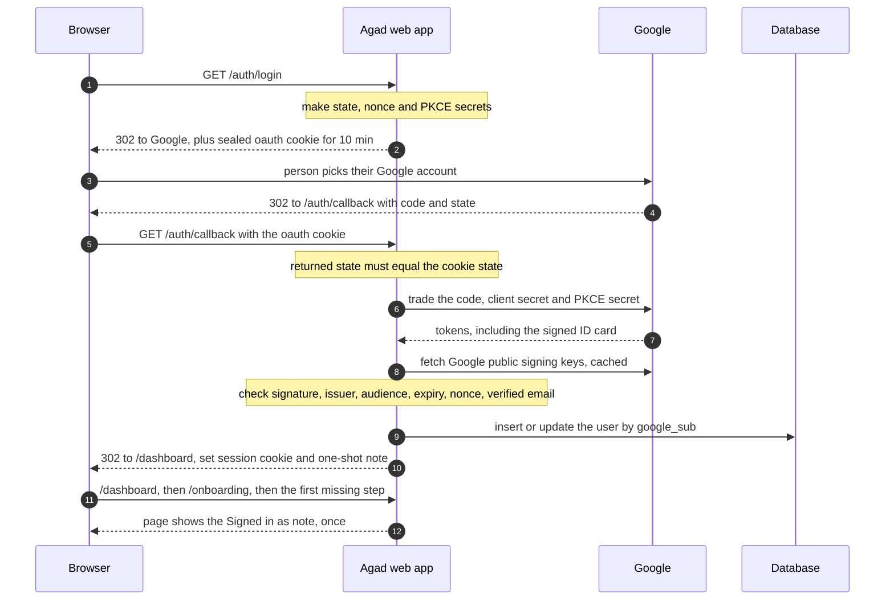

The hops, in order.

1. The Continue with Google button is a plain link to `/auth/login`, not a form, because the page's safety rules would block a form that jumps to Google ([`applyfirst/saas/templates/_ui.html:63-65`](../applyfirst/saas/templates/_ui.html#L63-L65)).
2. The rate limiter, a counter that turns away anyone asking too often, counts the visit, since every address starting with `/auth/` is limited ([`applyfirst/saas/app.py:235-254`](../applyfirst/saas/app.py#L235-L254)).
3. The server makes three random one-time values ([`applyfirst/saas/google_oauth.py:58-70`](../applyfirst/saas/google_oauth.py#L58-L70)). The **state** proves Google's answer belongs to this browser. The **nonce** must come back inside the ID card. The **PKCE** secret's fingerprint goes to Google now, and the secret itself only later.
4. It builds the Google address asking only for `openid email profile`, meaning name and email and never Gmail ([`applyfirst/saas/google_oauth.py:73-86`](../applyfirst/saas/google_oauth.py#L73-L86)).
5. The three values go into a sealed cookie that lives 10 minutes ([`applyfirst/saas/app.py:395-396`](../applyfirst/saas/app.py#L395-L396), [`applyfirst/saas/session.py:130-134`](../applyfirst/saas/session.py#L130-L134)).
6. Back at `/auth/callback`, a Cancel on Google's page shows the "Sign-in didn't finish" page ([`applyfirst/saas/app.py:403-404`](../applyfirst/saas/app.py#L403-L404)).
7. The state must match exactly, or sign-in ends ([`applyfirst/saas/app.py:409-410`](../applyfirst/saas/app.py#L409-L410)).
8. The code is traded for tokens at Google ([`applyfirst/saas/google_oauth.py:110-127`](../applyfirst/saas/google_oauth.py#L110-L127)).
9. The ID card's signature is checked with Google's public keys, and if the keys cannot be fetched the card is refused, so nobody can force a "skip the check" path ([`applyfirst/saas/google_oauth.py:217-240`](../applyfirst/saas/google_oauth.py#L217-L240)).
10. The card must come from Google, be meant for us, be in date and carry our nonce ([`applyfirst/saas/google_oauth.py:178-190`](../applyfirst/saas/google_oauth.py#L178-L190)), and the email must be verified by Google ([`applyfirst/saas/google_oauth.py:193-202`](../applyfirst/saas/google_oauth.py#L193-L202)).
11. The person is saved by Google's permanent id for them, never by email ([`applyfirst/saas/db.py:220-245`](../applyfirst/saas/db.py#L220-L245)).
12. The reply sets the 7-day sign-in cookie and the one-shot "signed_in" note, deletes the 10-minute cookie and goes to `/dashboard` ([`applyfirst/saas/app.py:424-427`](../applyfirst/saas/app.py#L424-L427)).
13. The first page drawn after that shows "Signed in as ..." and deletes the note in the same reply ([`applyfirst/saas/app.py:315-335`](../applyfirst/saas/app.py#L315-L335)).

```python
# applyfirst/saas/app.py:409-410
if not txn or not returned_state or returned_state != txn.get("state"):
    return _fail(request, cfg_, "state")
```

**Plain reading.** This `if` compares the ticket in the sealed cookie with the ticket in the address. Any mismatch ends the sign-in. In code shaped like this, look first at what is compared, then at what happens on a mismatch.

Every sign-in failure goes through `_fail`, which logs the real reason on the server and shows the same friendly page with status 400 ([`applyfirst/saas/app.py:718-726`](../applyfirst/saas/app.py#L718-L726)). The page reads nothing from the address, so an attacker learns nothing from it ([`applyfirst/saas/templates/signin_failed.html:4-6`](../applyfirst/saas/templates/signin_failed.html#L4-L6)).

### 4.2 Connect Gmail

**The map.** A second, separate trip to Google asks for one extra permission, sending email. What comes back is a long-lived **refresh token**, a reusable pass that lets the worker send later without the person present. It is locked before it touches the database.

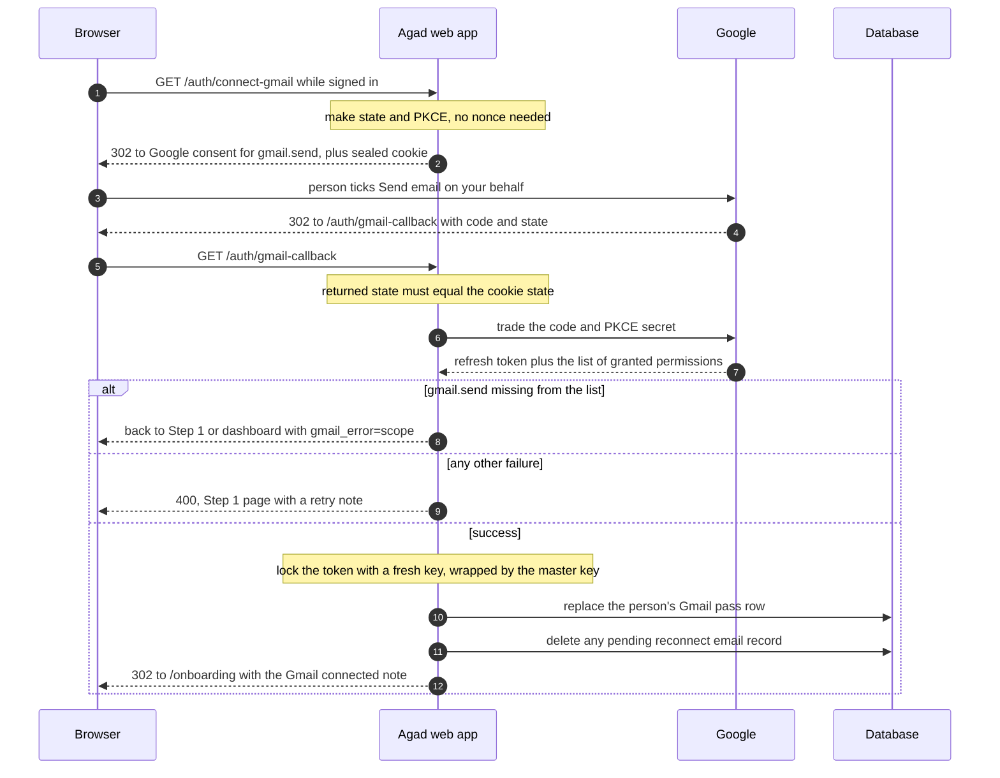

The hops, in order.

1. Every Connect Gmail button is a plain link to `/auth/connect-gmail` ([`applyfirst/saas/templates/onboarding_connect_gmail.html:65`](../applyfirst/saas/templates/onboarding_connect_gmail.html#L65), [`applyfirst/saas/templates/dashboard.html:37`](../applyfirst/saas/templates/dashboard.html#L37)).
2. A signed-out visitor is sent to `/login` instead ([`applyfirst/saas/app.py:633-635`](../applyfirst/saas/app.py#L633-L635)).
3. The Google address asks only for `gmail.send`, and asks for a long-lived pass and the consent screen every time ([`applyfirst/saas/google_oauth.py:89-107`](../applyfirst/saas/google_oauth.py#L89-L107)).
4. Back at `/auth/gmail-callback`, a Google error, a state mismatch or a missing code all end the trip ([`applyfirst/saas/app.py:650-658`](../applyfirst/saas/app.py#L650-L658)).
5. The server insists the person really ticked "Send email on your behalf" and that a refresh token came back ([`applyfirst/saas/google_oauth.py:137-156`](../applyfirst/saas/google_oauth.py#L137-L156)).
6. The refresh token is locked and the person's old pass row is replaced, so each person has at most one ([`applyfirst/saas/db.py:279-299`](../applyfirst/saas/db.py#L279-L299)). Section 6.5 explains the lock.
7. Any earlier "your Gmail connection ended" record is wiped, so the person is told again if this new connection ever ends too ([`applyfirst/saas/app.py:671`](../applyfirst/saas/app.py#L671), [`applyfirst/saas/reconnect.py:150-154`](../applyfirst/saas/reconnect.py#L150-L154)).
8. The reply sets the "gmail_connected" note and goes to `/onboarding` ([`applyfirst/saas/app.py:672-675`](../applyfirst/saas/app.py#L672-L675)).

Two failure paths.

- **The box was unticked.** Google returns a pass that cannot send. The code raises a special error ([`applyfirst/saas/google_oauth.py:149-152`](../applyfirst/saas/google_oauth.py#L149-L152)), stores nothing, keeps any earlier working pass and sends the person back with `gmail_error=scope` ([`applyfirst/saas/app.py:690-702`](../applyfirst/saas/app.py#L690-L702)). The page then asks them, calmly, to tick the box ([`applyfirst/saas/templates/_ui.html:135-146`](../applyfirst/saas/templates/_ui.html#L135-L146)).
- **Anything else.** Cancel, a bad state, a failed trade or a locking error all show the same Step 1 page with status 400, and the real reason goes only to the server log ([`applyfirst/saas/app.py:677-688`](../applyfirst/saas/app.py#L677-L688)).

### 4.3 The onboarding router

There is no saved "step number". Every time, `/onboarding` looks at what the person has actually saved and sends them to the first thing missing ([`applyfirst/saas/app.py:519-524`](../applyfirst/saas/app.py#L519-L524)).

```python
# applyfirst/saas/onboarding.py:32-39
if st["activated"]:
    return "done"
if not st["profile_complete"]:
    # Offer Connect Gmail first (skippable); once they're past it, the profile form.
    return "connect_gmail" if not st["gmail_connected"] else "profile"
if st["keyword_count"] == 0:
    return "keywords"
return "preview"
```

**Plain reading.** This is a decision list read from the top, and the first true line wins. Because it reads real data, a person who leaves halfway and comes back lands on the right page. The four facts it reads come from [`applyfirst/saas/onboarding.py:19-26`](../applyfirst/saas/onboarding.py#L19-L26).

### 4.4 The four steps

| Step | What the person does | Rules | Where |
|---|---|---|---|
| 1. Connect Gmail | Connects, or taps "Skip for now", which saves nothing | Shown again next time if they leave before Step 2 | [`applyfirst/saas/app.py:535-540`](../applyfirst/saas/app.py#L535-L540), [`applyfirst/saas/templates/onboarding_connect_gmail.html:68-75`](../applyfirst/saas/templates/onboarding_connect_gmail.html#L68-L75) |
| 2. Profile | Name, job type, subject line, message | 80, 80, 150 and 5,000 characters, checked on the server | [`applyfirst/saas/app.py:557-573`](../applyfirst/saas/app.py#L557-L573), limits at [`applyfirst/saas/app.py:66-67`](../applyfirst/saas/app.py#L66-L67) |
| 3. Watch words | Adds words one at a time or from Quick add | 60 characters each, 20 at most, a repeat is ignored | [`applyfirst/saas/app.py:586-594`](../applyfirst/saas/app.py#L586-L594), [`applyfirst/saas/db.py:403-412`](../applyfirst/saas/db.py#L403-L412) |
| 4. Preview | Sees a sample letter built from their own four fields | No AI, a fixed practice job, free and instant | [`applyfirst/saas/app.py:602-613`](../applyfirst/saas/app.py#L602-L613), [`applyfirst/saas/preview.py:38-50`](../applyfirst/saas/preview.py#L38-L50) |

Details that matter later.

- A good profile save also stores `profile_hash`, a short fingerprint of the four fields used to reuse letters ([`applyfirst/saas/db.py:361-385`](../applyfirst/saas/db.py#L361-L385)).
- On an error the address carries only a fixed error word, never the person's text ([`applyfirst/saas/app.py:84-96`](../applyfirst/saas/app.py#L84-L96)).
- Each watch word stamps `created_at`, the moment it was added ([`applyfirst/saas/db.py:403-412`](../applyfirst/saas/db.py#L403-L412)). The alert rule uses that stamp, so a word removed and added back starts fresh.
- Delete removes a word only when both the word and the signed-in person match, so nobody can delete someone else's word ([`applyfirst/saas/db.py:423-427`](../applyfirst/saas/db.py#L423-L427)).

### 4.5 Activation

1. The Start button posts to `/onboarding/activate` with a CSRF token ([`applyfirst/saas/templates/onboarding_preview.html:64-68`](../applyfirst/saas/templates/onboarding_preview.html#L64-L68)).
2. The route checks again that the profile is complete and there is at least one word ([`applyfirst/saas/app.py:623-627`](../applyfirst/saas/app.py#L623-L627)).
3. `set_activated` stamps `activated_at` only if it is still empty, so the first activation time is kept forever ([`applyfirst/saas/db.py:393-398`](../applyfirst/saas/db.py#L393-L398)).
4. The person lands on the dashboard, which now shows the live panel ([`applyfirst/saas/app.py:629`](../applyfirst/saas/app.py#L629)).

What that switches on in the worker. The worker only searches words that belong to at least one activated person ([`applyfirst/saas/db.py:598-609`](../applyfirst/saas/db.py#L598-L609)), and a job reaches a person only if it was first stored after the latest of their activation, the moment they added that word, and the word's latest baseline ([`applyfirst/saas/db.py:656`](../applyfirst/saas/db.py#L656)). Section 5.4 explains it in full.

A person can press "Start watching without Gmail" on Step 4 ([`applyfirst/saas/templates/onboarding_preview.html:70-87`](../applyfirst/saas/templates/onboarding_preview.html#L70-L87)). Every job found for them is then marked skipped for good, so they get nothing until they connect (section 5.11).

### 4.6 The dashboard

`/dashboard` gathers a few facts and the template shows exactly one big status panel, picked in a fixed order ([`applyfirst/saas/templates/dashboard.html:29-79`](../applyfirst/saas/templates/dashboard.html#L29-L79)).

The colours below are the light-mode ones.

| Panel | Shows when | Main button | Where |
|---|---|---|---|
| Amber | Gmail is not connected | Connect Gmail | [`applyfirst/saas/templates/dashboard.html:30-47`](../applyfirst/saas/templates/dashboard.html#L30-L47) |
| White | No watch words | Add keywords | [`applyfirst/saas/templates/dashboard.html:48-53`](../applyfirst/saas/templates/dashboard.html#L48-L53) |
| Sky blue | Today's letters reached the daily limit | Edit keywords | [`applyfirst/saas/templates/dashboard.html:54-60`](../applyfirst/saas/templates/dashboard.html#L54-L60) |
| Navy, live | Everything else | None | [`applyfirst/saas/templates/dashboard.html:61-78`](../applyfirst/saas/templates/dashboard.html#L61-L78) |

Today's usage is counted per UTC day. UTC is world time, 8 hours behind the Philippines ([`applyfirst/saas/db.py:711-721`](../applyfirst/saas/db.py#L711-L721)), which is why the page says the limit resets at 8 in the morning Philippine time. "Watching since" is the later of activation and the last Gmail reconnect, shown in Philippine time ([`applyfirst/saas/app.py:153-170`](../applyfirst/saas/app.py#L153-L170)).

### 4.7 Log out and Disconnect Gmail

**Log out.**

1. Every signed-in page has a Log out form with a CSRF token ([`applyfirst/saas/templates/base.html:29-32`](../applyfirst/saas/templates/base.html#L29-L32)).
2. The route deletes the sign-in cookie and goes to `/login` ([`applyfirst/saas/app.py:430-434`](../applyfirst/saas/app.py#L430-L434)).
3. The delete repeats every rule the cookie was set with, because a browser ignores a delete of a `__Host-` cookie that leaves out `Secure`. That was an old "Log out did nothing" bug, now fixed ([`applyfirst/saas/session.py:107-110`](../applyfirst/saas/session.py#L107-L110)).

The server keeps no list of live sessions. Log out removes the cookie from that browser, but a copy taken earlier would still work until its 7 days run out ([`applyfirst/saas/session.py:54-69`](../applyfirst/saas/session.py#L54-L69)).

**Disconnect Gmail.**

1. The button sits in a fold-out on the dashboard ([`applyfirst/saas/templates/dashboard.html:119-125`](../applyfirst/saas/templates/dashboard.html#L119-L125)).
2. The route first marks this pass as "switched off on purpose", so the worker never emails the person that their connection "ended" ([`applyfirst/saas/app.py:708`](../applyfirst/saas/app.py#L708)).
3. It unlocks the pass and asks Google to cancel it, best effort ([`applyfirst/saas/app.py:710-714`](../applyfirst/saas/app.py#L710-L714), [`applyfirst/saas/google_oauth.py:159-164`](../applyfirst/saas/google_oauth.py#L159-L164)).
4. It deletes our copy ([`applyfirst/saas/app.py:715`](../applyfirst/saas/app.py#L715), [`applyfirst/saas/db.py:346-348`](../applyfirst/saas/db.py#L346-L348)).
5. From then on the worker marks this person's matches as skipped without spending their daily limit ([`applyfirst/saas/worker.py:181-185`](../applyfirst/saas/worker.py#L181-L185)).

---

## 5. The engine that finds jobs and sends applications

**In short.** About every 10 minutes the worker searches onlinejobs.ph once per watch word, stores new jobs, decides which users each new job is for, has Gemini write each letter and sends it from each user's Gmail to themselves. Almost all of it is in `applyfirst/saas/worker.py`, and every database step goes through `applyfirst/saas/db.py`.

Four words used all through this section.

- A **round** (the code says cycle) is one full pass of search, decide, write and send.
- An **alert** is one row that means "send this job to this user". It has a status, like pending or sent ([`applyfirst/saas/db.py:448-462`](../applyfirst/saas/db.py#L448-L462)).
- A **baseline** is a search that stores what is already posted and tells nobody.
- A **log event** is one line the worker writes about what just happened, like `search_failed`.

### 5.1 One round, in a picture

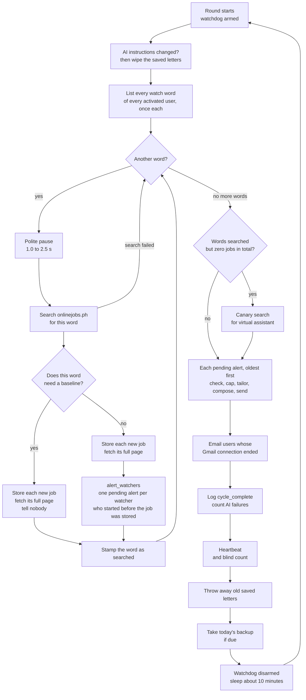

The round itself is `run_once` ([`applyfirst/saas/worker.py:240`](../applyfirst/saas/worker.py#L240)). The housekeeping after it is in `_cycle` ([`applyfirst/saas/worker.py:558-569`](../applyfirst/saas/worker.py#L558-L569)).

### 5.2 How the worker starts and sleeps

1. It reads the settings and switches logging on first ([`applyfirst/saas/worker.py:580-581`](../applyfirst/saas/worker.py#L580-L581)).
2. It loads the master key. Without it, it alerts you and quits ([`applyfirst/saas/worker.py:582-597`](../applyfirst/saas/worker.py#L582-L597)).
3. It builds the onlinejobs.ph reader ([`applyfirst/saas/worker.py:599-603`](../applyfirst/saas/worker.py#L599-L603)) and runs its start-up checks, which shout once when a production worker is missing the alert channel, the mail settings or the Gemini credential ([`applyfirst/saas/worker.py:445-478`](../applyfirst/saas/worker.py#L445-L478)).
4. It starts the watchdog, a timer that ends a stuck round (section 7.3), and loops forever ([`applyfirst/saas/worker.py:611-620`](../applyfirst/saas/worker.py#L611-L620)).

Between rounds it sleeps the interval plus or minus a random share. By default that is 600 seconds plus or minus 25 percent, so 7.5 to 12.5 minutes ([`applyfirst/saas/config.py:47-48`](../applyfirst/saas/config.py#L47-L48), [`applyfirst/saas/worker.py:619`](../applyfirst/saas/worker.py#L619)). The sleep starts after the round ends, so a long round quietly pushes everything later.

To run exactly one round and stop, use `python -m applyfirst.saas.worker --once` ([`applyfirst/saas/worker.py:607`](../applyfirst/saas/worker.py#L607)).

### 5.3 Searching and storing jobs

The list of words to search comes from one database question.

```sql
-- applyfirst/saas/db.py:602-606
SELECT DISTINCT k.keyword
FROM user_keywords k
JOIN user_profiles p ON p.user_id = k.user_id
WHERE k.is_active = 1 AND p.activated_at IS NOT NULL
ORDER BY k.keyword
```

**Plain reading.** `JOIN` links each watch word to its owner's profile. `activated_at IS NOT NULL` keeps only people who pressed Start. `DISTINCT` means a word watched by 50 people is searched once, not 50 times. When you read a database query, look at the `WHERE` line first, because it decides who is in and who is out.

`DISTINCT` compares exactly, so "Shopify" and "shopify" are two searches ([`applyfirst/saas/db.py:198`](../applyfirst/saas/db.py#L198)).

1. **Polite pauses.** 1.0 to 2.5 seconds between words and 0.3 to 0.8 seconds after each full job page ([`applyfirst/saas/worker.py:57-58`](../applyfirst/saas/worker.py#L57-L58)). onlinejobs.ph asks for 5 seconds (section 9.1).
2. **The search.** It opens the same address you get by typing the word into the site's search box ([`applyfirst/sources/onlinejobsph.py:55-57`](../applyfirst/sources/onlinejobsph.py#L55-L57)) and reads each job card from the page ([`applyfirst/sources/onlinejobsph.py:120-161`](../applyfirst/sources/onlinejobsph.py#L120-L161)).
3. **A failed search** is logged as `search_failed` and the word is skipped for this round ([`applyfirst/saas/worker.py:264-266`](../applyfirst/saas/worker.py#L264-L266)).
4. **Storing.** The `jobs` table is shared by everyone. A job already stored is not fetched again ([`applyfirst/saas/worker.py:114-118`](../applyfirst/saas/worker.py#L114-L118)). A new one gets its full page fetched once ([`applyfirst/saas/worker.py:122`](../applyfirst/saas/worker.py#L122)).
5. **Size limit.** The job text is cut to 8,000 characters, so one giant post cannot blow up the AI bill ([`applyfirst/saas/worker.py:59`](../applyfirst/saas/worker.py#L59), [`applyfirst/saas/worker.py:131`](../applyfirst/saas/worker.py#L131)).
6. **The stamp.** `insert_job` stamps `scraped_at` with the time right now, to the second ([`applyfirst/saas/db.py:573-588`](../applyfirst/saas/db.py#L573-L588)). This stamp is what the alert rule compares against.

### 5.4 The fan-out rule, and why it exists

Fan-out means turning one job into one alert for each person who should get it. This rule was fixed on 27 September 2026 and is not committed yet. It is described here as it is on disk.

**The rule.** A person hears about a job only if Agad first stored it after the latest of three moments. When they pressed Start. When they added that watch word. The word's latest baseline.

**The proof, hop by hop.**

1. Before storing a word's results, the worker asks whether this search is a baseline ([`applyfirst/saas/worker.py:269`](../applyfirst/saas/worker.py#L269)).
2. A word needs a baseline if it was never searched, or if nobody watching it now was watching at its last search ([`applyfirst/saas/db.py:784-804`](../applyfirst/saas/db.py#L784-L804)).
3. On a baseline, jobs are stored and nobody is told ([`applyfirst/saas/worker.py:274-275`](../applyfirst/saas/worker.py#L274-L275)).
4. Otherwise each job goes to `alert_watchers` ([`applyfirst/saas/worker.py:278`](../applyfirst/saas/worker.py#L278)), which keeps only the watchers who started before the job was stored ([`applyfirst/saas/db.py:636-665`](../applyfirst/saas/db.py#L636-L665)).
5. After the search the word is stamped, and a baseline also moves the word's baseline stamp to now ([`applyfirst/saas/worker.py:279`](../applyfirst/saas/worker.py#L279), [`applyfirst/saas/db.py:807-821`](../applyfirst/saas/db.py#L807-L821)).

```sql
-- applyfirst/saas/db.py:655-658
WHERE k.is_active = 1 AND k.keyword = ? AND p.activated_at IS NOT NULL
  AND j.scraped_at > MAX(p.activated_at, k.created_at, s.baselined_at)
  AND NOT EXISTS (SELECT 1 FROM user_job_alerts a
                  WHERE a.user_id = k.user_id AND a.job_id = j.id)
```

**Plain reading.** `MAX(...)` picks the latest of the three start moments, and the job must be strictly newer. The last two lines skip anyone who already has this job, so a quiet repeat search writes nothing. When you read a rule like this, find the comparison sign first, here `>`, then read what sits on each side.

```python
# applyfirst/saas/db.py:801-804
if row is None or row["baselined_at"] is None:
    return False
first_start = row["first_start"]
return first_start is None or (row["last_polled"] or "") >= first_start
```

**Plain reading.** `False` here means "do a baseline". It happens when the word was never searched, or when its last search came before any of its current watchers started. `first_start` is the earliest moment a current watcher began, worked out as the later of their activation and when they added the word ([`applyfirst/saas/db.py:793`](../applyfirst/saas/db.py#L793)). So a word nobody watched for a week, then someone adds again, gets a fresh quiet look instead of dumping a week of posts on them.

**A small example.** Ana presses Start at 9 in the morning and adds "shopify" five minutes later. The word gets its baseline a minute after that. Job X was first stored at half past eight through someone else's word, so it is old news to Ana. Job Y is first stored at twenty past nine, so Ana gets it.

**Why it exists.** Before the fix, every search after the first alerted the whole results page to every watcher. A search page mostly repeats jobs an earlier search already stored. On 26 September a new user got 59 alerts in one go, mostly old jobs ([`docs/SYSTEM-DESIGN.md:350-353`](../docs/SYSTEM-DESIGN.md#L350-L353), and the code comment at [`applyfirst/saas/db.py:643-645`](../applyfirst/saas/db.py#L643-L645)). Old jobs are useless to someone who wants to be first, and each one would have spent one of their 10 daily letters.

**One edge.** Stamps are to the second, so a job stored in the very same second as the start is left out ([`applyfirst/saas/db.py:643-644`](../applyfirst/saas/db.py#L643-L644)).

**The guards.** Each case has its own test in `tests/test_saas_worker.py`. Baseline jobs never alert later ([`tests/test_saas_worker.py:101`](../tests/test_saas_worker.py#L101)). A newcomer gets only newer jobs ([`tests/test_saas_worker.py:133`](../tests/test_saas_worker.py#L133)). Removing and re-adding a word restarts its clock ([`tests/test_saas_worker.py:162`](../tests/test_saas_worker.py#L162)). No backlog after a gap ([`tests/test_saas_worker.py:189`](../tests/test_saas_worker.py#L189), [`tests/test_saas_worker.py:220`](../tests/test_saas_worker.py#L220)). A quiet search writes nothing ([`tests/test_saas_worker.py:246`](../tests/test_saas_worker.py#L246)). Each watcher keeps their own start ([`tests/test_saas_worker.py:267`](../tests/test_saas_worker.py#L267)). The same-second edge ([`tests/test_saas_worker.py:292`](../tests/test_saas_worker.py#L292)).

The table allows one alert per person per job, even if two of their words match it ([`applyfirst/saas/db.py:459`](../applyfirst/saas/db.py#L459)). Gmail is not checked at this point. Someone without Gmail still gets an alert, and the next step marks it skipped.

### 5.5 Handling each alert

The worker takes every pending alert, oldest first, across all users, one at a time ([`applyfirst/saas/worker.py:288-298`](../applyfirst/saas/worker.py#L288-L298)). For each one, `process_alert` goes in this order ([`applyfirst/saas/worker.py:171-228`](../applyfirst/saas/worker.py#L171-L228)).

1. Not activated? Mark it skipped ([`applyfirst/saas/worker.py:175`](../applyfirst/saas/worker.py#L175)).
2. No Gmail pass? Mark it skipped, before any AI work, so no daily letter is spent on someone who cannot receive it ([`applyfirst/saas/worker.py:181-185`](../applyfirst/saas/worker.py#L181-L185)).
3. Write the letter ([`applyfirst/saas/worker.py:187-190`](../applyfirst/saas/worker.py#L187-L190), sections 5.6 and 5.7).
4. Build the email ([`applyfirst/saas/worker.py:195`](../applyfirst/saas/worker.py#L195)).
5. Send it, and on success mark it sent with the time ([`applyfirst/saas/worker.py:200-227`](../applyfirst/saas/worker.py#L200-L227)).

A safety net catches any surprise error for one alert, marks that one failed and moves on, so one bad alert never stops the others ([`applyfirst/saas/worker.py:292-295`](../applyfirst/saas/worker.py#L292-L295)).

### 5.6 Writing the letter with Gemini

1. The worker builds a letter engine with Gemini plugged in if a credential is set, or with no AI if not ([`applyfirst/saas/worker.py:83-88`](../applyfirst/saas/worker.py#L83-L88)).
2. The person's four answers are turned into the shape the engine expects. The standard message becomes the base pitch and the subject becomes the saved subject line ([`applyfirst/saas/preview.py:23-35`](../applyfirst/saas/preview.py#L23-L35)).
3. The engine is always told no resume is attached, because the SaaS never sends a resume file ([`applyfirst/saas/worker.py:156-162`](../applyfirst/saas/worker.py#L156-L162)).
4. The engine makes two texts, the rules and the data, and tries Gemini up to twice ([`applyfirst/tailor/engine.py:84-100`](../applyfirst/tailor/engine.py#L84-L100)).
5. The rules text says to use only true facts from the profile, to treat the job post as untrusted text and never obey it ([`applyfirst/tailor/prompt.py:54-55`](../applyfirst/tailor/prompt.py#L54-L55)), and to keep the user's own message format ([`applyfirst/tailor/prompt.py:62`](../applyfirst/tailor/prompt.py#L62)).
6. The data text wraps the profile and the job post each in a fence with a random tag, so words inside a post cannot fake the "end of post" marker and sneak in orders ([`applyfirst/tailor/prompt.py:131-137`](../applyfirst/tailor/prompt.py#L131-L137)).
7. The answer must fit a fixed shape. A digest of what the employer wants, a subject line, screening questions with drafted answers, an optional "start your reply with" word, and the cover letter ([`applyfirst/tailor/contract.py:28-34`](../applyfirst/tailor/contract.py#L28-L34)).

```python
# applyfirst/tailor/llm.py:34-41
body = {
    "system_instruction": {"parts": [{"text": system}]},
    "contents": [{"role": "user", "parts": [{"text": user}]}],
    "generationConfig": {"responseMimeType": "application/json", "temperature": 0.4},
}
# The credential rides in a header, never the URL, so no URL an HTTP library logs or
# an error message repeats can ever carry it.
resp = self._client.post(url, headers={"x-goog-api-key": self.api_key}, json=body)
```

**Plain reading.** This is the only place the product talks to Gemini. `body` is the whole request, the rules, the data and two settings. The credential travels in a header, a hidden label on the request, so it never lands in a log. Notice what the request does not set. There is no limit on the model's hidden "thinking", which is billed like normal output (section 9.3).

**When the AI is off or fails.** With no credential, or after two failed tries, the letter is the person's own message word for word, labelled `rules-fallback` ([`applyfirst/tailor/engine.py:110-140`](../applyfirst/tailor/engine.py#L110-L140)). If the post asks for a resume it adds "I can send my resume on request." ([`applyfirst/tailor/engine.py:137`](../applyfirst/tailor/engine.py#L137)). The email then carries a line saying the AI was unavailable, so the person edits before sending ([`applyfirst/notify/compose.py:89`](../applyfirst/notify/compose.py#L89)).

**The saved-letter cache.** Each finished letter is saved, keyed by the job and the profile fingerprint ([`applyfirst/saas/db.py:472-479`](../applyfirst/saas/db.py#L472-L479)), so a retry never pays twice. At the start of every round the worker compares a fingerprint of the AI instructions with the one it saved. If they differ, it empties the whole cache, so a letter written under old instructions is never re-sent ([`applyfirst/saas/worker.py:91-106`](../applyfirst/saas/worker.py#L91-L106)). Saved letters older than 30 days are thrown away after every round ([`applyfirst/saas/db.py:771-779`](../applyfirst/saas/db.py#L771-L779)).

**The email.** The subject is the job title, its type and "onlinejobs.ph" ([`applyfirst/notify/compose.py:82`](../applyfirst/notify/compose.py#L82)). The body holds the job facts and apply link, the subject to paste, the ready-to-paste letter and the screening answers ([`applyfirst/notify/compose.py:83-106`](../applyfirst/notify/compose.py#L83-L106)). Every piece of job or AI text is escaped in the HTML, so a job post cannot plant code in the email ([`applyfirst/notify/compose.py:111`](../applyfirst/notify/compose.py#L111)).

### 5.7 The daily cap and free retries

```python
# applyfirst/saas/worker.py:144-153
cached = db.cache_get(conn, alert.job_id, profile.profile_hash)
if cached is not None:
    package = TailoredPackage.model_validate_json(cached["package_json"])
    return package, cached["provider"], cached["provider"] != "rules-fallback"

if cfg.daily_tailor_cap <= 0:
    return None  # AI switched off (APPLYFIRST_DAILY_TAILOR_CAP=0), retries included
if alert.attempts == 0 and not db.try_increment_ai_usage(conn, alert.user_id,
                                                         cfg.daily_tailor_cap):
    return None  # daily cap reached
```

**Plain reading.** A saved letter is used first and is free. A cap of 0 switches letter writing off for everyone. Only a first try (`attempts == 0`) takes one of the day's slots. A retry was already paid for, so it re-writes for free even if the person hit the cap since.

- The counter adds one only while the count is under the cap, in one indivisible database step, so two things running at once cannot both slip past ([`applyfirst/saas/db.py:691-708`](../applyfirst/saas/db.py#L691-L708)).
- The day is the UTC date, so in the Philippines the count starts fresh at 8 in the morning ([`applyfirst/saas/db.py:695`](../applyfirst/saas/db.py#L695)).
- One slot is one job, not one AI call. The engine may call Gemini twice for one job ([`applyfirst/tailor/engine.py:80`](../applyfirst/tailor/engine.py#L80)).
- A job that hits the cap is marked `capped`, and that is final. It is not sent tomorrow either ([`applyfirst/saas/db.py:668-670`](../applyfirst/saas/db.py#L668-L670)).

### 5.8 Statuses and retries

An alert has one of five statuses, and the database refuses anything else ([`applyfirst/saas/db.py:453-454`](../applyfirst/saas/db.py#L453-L454)).

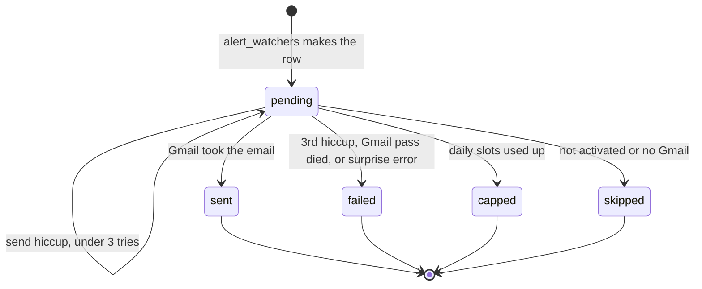

**How retries work.** Each hiccup adds one to the try count ([`applyfirst/saas/worker.py:231-237`](../applyfirst/saas/worker.py#L231-L237)). On the third try (`_MAX_ATTEMPTS = 3`, [`applyfirst/saas/worker.py:50`](../applyfirst/saas/worker.py#L50)) the alert fails for good. Before that it stays pending and the next round, about 10 minutes later, tries again.

### 5.9 Sending through Gmail

1. Before it writes the letter, the worker unlocks the person's pass, in memory only ([`applyfirst/saas/worker.py:181-182`](../applyfirst/saas/worker.py#L181-L182), [`applyfirst/saas/db.py:326-343`](../applyfirst/saas/db.py#L326-L343)).
2. It trades the long-lived pass for a short-lived access token at Google ([`applyfirst/saas/gmail_send.py:38-69`](../applyfirst/saas/gmail_send.py#L38-L69)).
3. It builds the message with From and To both set to the person's own address ([`applyfirst/saas/gmail_send.py:75`](../applyfirst/saas/gmail_send.py#L75)) and posts it to Gmail's send address ([`applyfirst/saas/gmail_send.py:95`](../applyfirst/saas/gmail_send.py#L95)).
4. It sorts failures into two kinds. **The pass is dead** when Google says `invalid_grant` or the permission is missing ([`applyfirst/saas/gmail_send.py:67`](../applyfirst/saas/gmail_send.py#L67), [`applyfirst/saas/gmail_send.py:114`](../applyfirst/saas/gmail_send.py#L114)). **Try again later** is everything else, including a rate-limit 403 ([`applyfirst/saas/gmail_send.py:116`](../applyfirst/saas/gmail_send.py#L116)). Throwing away a good pass over a rate limit would be wrong, so that split is on purpose.

### 5.10 When Google ends a Gmail connection

**Why this exists.** While the Google app is in Testing mode, Google kills every Gmail pass 7 days after the person connects ([`applyfirst/saas/reconnect.py:1-9`](../applyfirst/saas/reconnect.py#L1-L9)). Before this fix, called B6, the person simply stopped getting applications and nobody told them. Their own Gmail cannot carry the news, because that is the connection that just died. So the worker emails them from the server's own mail account.

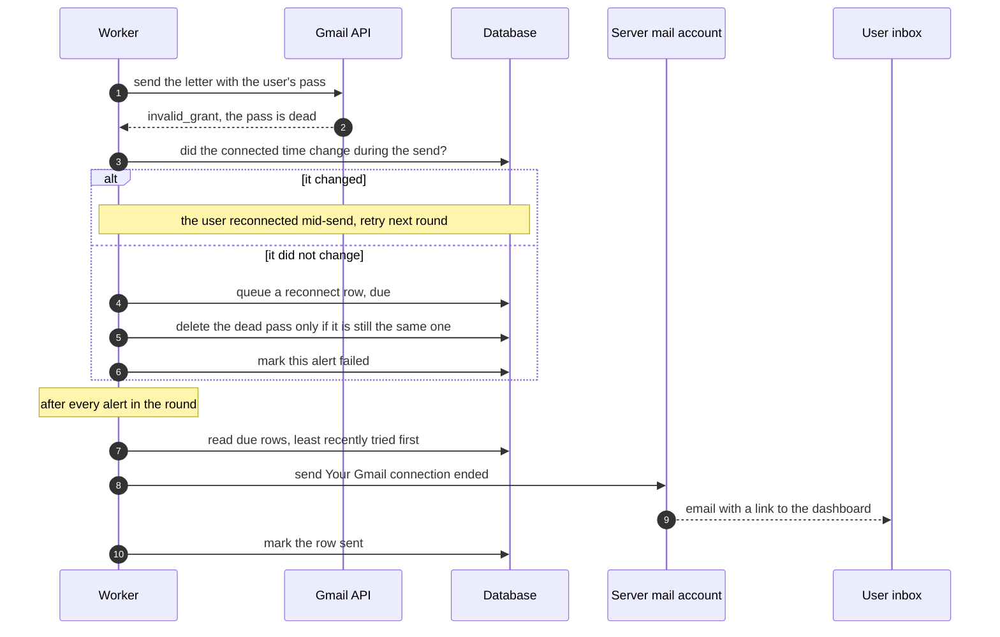

The hops, in order.

1. The worker catches the dead-pass error ([`applyfirst/saas/worker.py:201`](../applyfirst/saas/worker.py#L201)).
2. If the connection time changed during the send, it is not an expiry, and the alert is retried ([`applyfirst/saas/worker.py:202-205`](../applyfirst/saas/worker.py#L202-L205)).
3. It queues the email first, as one row in `worker_meta` ([`applyfirst/saas/worker.py:209`](../applyfirst/saas/worker.py#L209), [`applyfirst/saas/reconnect.py:123-140`](../applyfirst/saas/reconnect.py#L123-L140)). Nothing is queued if the person disconnected on purpose or was already told about this very connection ([`applyfirst/saas/reconnect.py:134`](../applyfirst/saas/reconnect.py#L134)).
4. It deletes the dead pass only if it is still the same one, so a reconnect that landed a moment ago is kept ([`applyfirst/saas/worker.py:211`](../applyfirst/saas/worker.py#L211), [`applyfirst/saas/reconnect.py:157-167`](../applyfirst/saas/reconnect.py#L157-L167)).
5. After all alerts it sends every queued email ([`applyfirst/saas/worker.py:300`](../applyfirst/saas/worker.py#L300), [`applyfirst/saas/reconnect.py:290`](../applyfirst/saas/reconnect.py#L290)), through the server's mail account ([`applyfirst/saas/reconnect.py:223-249`](../applyfirst/saas/reconnect.py#L223-L249)). The email links to the dashboard ([`applyfirst/saas/reconnect.py:205`](../applyfirst/saas/reconnect.py#L205)).

If the mail server itself fails, sending pauses 15 minutes, then 1 hour, then 6 hours ([`applyfirst/saas/reconnect.py:63`](../applyfirst/saas/reconnect.py#L63)). If only one message is refused, that one person waits on a slower clock of their own ([`applyfirst/saas/reconnect.py:183`](../applyfirst/saas/reconnect.py#L183)). The worker gives up on a person only after 3 days of refusals, and only if some other email got through in that time ([`applyfirst/saas/reconnect.py:344`](../applyfirst/saas/reconnect.py#L344)). You are alerted in each of these cases ([`applyfirst/saas/worker.py:316-357`](../applyfirst/saas/worker.py#L316-L357)).

To test it after a deploy, run `python -m applyfirst.saas.reconnect --test you@example.com` ([`applyfirst/saas/reconnect.py:364`](../applyfirst/saas/reconnect.py#L364)).

### 5.11 Gaps in the engine

These are true of the code as it is now.

- **Jobs found while Gmail is off are lost.** The alert becomes skipped, and skipped is final ([`applyfirst/saas/worker.py:184`](../applyfirst/saas/worker.py#L184), [`applyfirst/saas/db.py:668-670`](../applyfirst/saas/db.py#L668-L670)). After reconnecting, the person gets only jobs found from then on.
- **A capped job is never sent later** (section 5.7).
- **A word's first search fetches the full page of every job it finds**, about 30, even though a baseline tells nobody ([`applyfirst/saas/worker.py:114-132`](../applyfirst/saas/worker.py#L114-L132)). One person adding 20 new words can add about 15 minutes to one round ([`docs/OPERATIONS.md:298-300`](../docs/OPERATIONS.md#L298-L300)).
- **After an outage, every pending alert is handled one after another in one round**, with no limit per round ([`docs/OPERATIONS.md:302-304`](../docs/OPERATIONS.md#L302-L304)).
- **Failed sends never show on `/health`** (section 7.1).

---

## 6. Data and safety

**In short.** Everything lives in 11 tables in one SQLite file. The one dangerous thing in it, each person's Gmail sending pass, is locked with a key that never enters the file. Pages are protected by signed cookies, CSRF tokens (section 6.6), a strict CSP, which is a rule list for the browser (section 6.7), and a sign-in rate limit. The honest gaps are listed at the end.

### 6.1 The tables

| Table | What it is for | Belongs to one person | Created at |
|---|---|---|---|
| `users` | One row per Google account. Google id, email, display name, plan | yes | [`applyfirst/saas/db.py:147`](../applyfirst/saas/db.py#L147) |
| `oauth_credentials` | The locked Gmail pass | yes | [`applyfirst/saas/db.py:156`](../applyfirst/saas/db.py#L156) |
| `user_profiles` | The four answers, their fingerprint and the Start time | yes | [`applyfirst/saas/db.py:181`](../applyfirst/saas/db.py#L181) |
| `user_keywords` | The watch words and when each was added | yes | [`applyfirst/saas/db.py:195`](../applyfirst/saas/db.py#L195) |
| `jobs` | One shared pool of public onlinejobs.ph posts | no | [`applyfirst/saas/db.py:436`](../applyfirst/saas/db.py#L436) |
| `user_job_alerts` | "This job is for this person", with status and tries | yes | [`applyfirst/saas/db.py:448`](../applyfirst/saas/db.py#L448) |
| `ai_usage` | Letters written per person per day | yes | [`applyfirst/saas/db.py:464`](../applyfirst/saas/db.py#L464) |
| `tailoring_cache` | Letters already written, reused for the same job and profile | no | [`applyfirst/saas/db.py:472`](../applyfirst/saas/db.py#L472) |
| `worker_keyword_state` | When each word was last searched and last baselined | no | [`applyfirst/saas/db.py:483`](../applyfirst/saas/db.py#L483) |
| `worker_meta` | The shared notebook between the two programs | no | [`applyfirst/saas/db.py:489`](../applyfirst/saas/db.py#L489) |
| `auth_rate_hits` | The sign-in speed limit counter | no | [`applyfirst/saas/db.py:506`](../applyfirst/saas/db.py#L506) |

The rules that stop duplicates. One account per Google id ([`applyfirst/saas/db.py:149`](../applyfirst/saas/db.py#L149)), one profile per person ([`applyfirst/saas/db.py:183`](../applyfirst/saas/db.py#L183)), one copy of each word per person ([`applyfirst/saas/db.py:201`](../applyfirst/saas/db.py#L201)), one copy of each onlinejobs.ph post ([`applyfirst/saas/db.py:438`](../applyfirst/saas/db.py#L438)), one alert per person per job ([`applyfirst/saas/db.py:459`](../applyfirst/saas/db.py#L459)) and one saved letter per job and profile ([`applyfirst/saas/db.py:479`](../applyfirst/saas/db.py#L479)).

Four columns exist but nothing fills them. `refresh_token_tag` ([`applyfirst/saas/db.py:163`](../applyfirst/saas/db.py#L163)), `access_token_expiry` ([`applyfirst/saas/db.py:166`](../applyfirst/saas/db.py#L166)), `profile_extras_json` ([`applyfirst/saas/db.py:188`](../applyfirst/saas/db.py#L188)), and `plan`, which is always written as free ([`applyfirst/saas/db.py:234`](../applyfirst/saas/db.py#L234)). No billing exists yet.

The data drawing in `docs/SYSTEM-DESIGN.md` is older than the code. It shows an `applications` table and other columns that were never built. Trust the diagram below, which is drawn from the code.

### 6.2 The data diagram, as built

It shows the key columns only. Solid lines are links the database enforces. Dotted lines are matches by value that the code relies on but the database does not enforce.

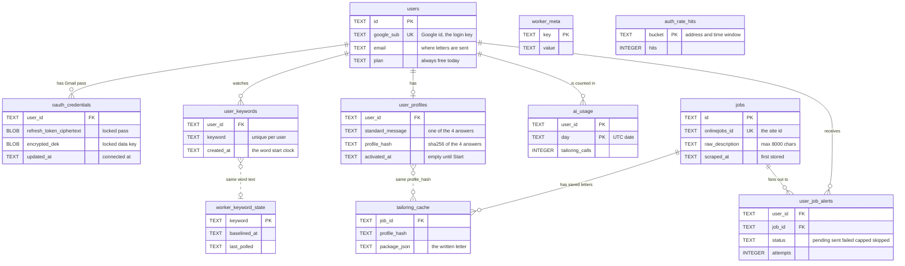

### 6.3 Keeping one person's data apart from another's

A tenant is one customer's private slice of a shared system, like one flat in an apartment block. Five tables carry a `user_id` and are listed as tenant tables ([`applyfirst/saas/db.py:28-31`](../applyfirst/saas/db.py#L28-L31)). Almost every read goes through a `db.py` function that takes the user id and filters by it, for example [`applyfirst/saas/db.py:415-427`](../applyfirst/saas/db.py#L415-L427). A helper that adds `AND user_id = ?` exists ([`applyfirst/saas/tenant.py:33-49`](../applyfirst/saas/tenant.py#L33-L49)), and it answers "not found" rather than "forbidden", so a stranger cannot even learn a row exists.

There is no second wall inside the database, because that feature belongs to Postgres, a bigger database server, and the app runs on SQLite. The function filters, plus a test that signs in as Bob, asks for Alice's data and requires "not found", are the whole defence ([`tests/test_saas_cross_tenant.py:37`](../tests/test_saas_cross_tenant.py#L37)).

### 6.4 What personal data is kept, and for how long

| What | Where | How long | Proof |
|---|---|---|---|
| Google id, email, display name | `users` | Forever. Nothing deletes the row | [`applyfirst/saas/db.py:147-154`](../applyfirst/saas/db.py#L147-L154) |
| Name, job type, subject, message | `user_profiles` | Forever, overwritten on each edit | [`applyfirst/saas/db.py:361-385`](../applyfirst/saas/db.py#L361-L385) |
| Watch words | `user_keywords` | Until the person removes one | [`applyfirst/saas/db.py:423-427`](../applyfirst/saas/db.py#L423-L427) |
| Gmail pass, locked | `oauth_credentials` | Until Disconnect, expiry or a reconnect replaces it | [`applyfirst/saas/app.py:715`](../applyfirst/saas/app.py#L715), [`applyfirst/saas/worker.py:211`](../applyfirst/saas/worker.py#L211) |
| Which jobs matched, and error text | `user_job_alerts` | Forever, never pruned | [`applyfirst/saas/db.py:448-462`](../applyfirst/saas/db.py#L448-L462) |
| Letters written per day | `ai_usage` | Forever, never pruned | [`applyfirst/saas/db.py:464-470`](../applyfirst/saas/db.py#L464-L470) |
| The written letters | `tailoring_cache` | At most 30 days | [`applyfirst/saas/db.py:771-779`](../applyfirst/saas/db.py#L771-L779) |
| Sign-in request addresses | `auth_rate_hits` | About two minutes | [`applyfirst/saas/db.py:737-748`](../applyfirst/saas/db.py#L737-L748) |
| Who is signed in | a browser cookie holding only the user id | 7 days | [`applyfirst/saas/session.py:28`](../applyfirst/saas/session.py#L28) |
| Event logs | Fly logs or the Oracle journal | As long as the host keeps them. User id and words, never emails or letters | [`applyfirst/log.py:50-60`](../applyfirst/log.py#L50-L60) |
| Whole-database copies | the backups folder | The last 7 | [`applyfirst/backup.py:107-113`](../applyfirst/backup.py#L107-L113) |
| The sent email | the person's own Gmail | Up to the person | [`applyfirst/saas/gmail_send.py:72-81`](../applyfirst/saas/gmail_send.py#L72-L81) |

A saved letter can be shared by two people only if their four answers are identical, because the key is a fingerprint of exactly those fields ([`applyfirst/saas/db.py:353-358`](../applyfirst/saas/db.py#L353-L358)). Identical inputs give the same letter, so nothing private crosses over.

### 6.5 How the Gmail pass is locked

**Why it matters.** The refresh token lets Agad send email as the person. Anyone who stole it could send email from their Gmail. So it is never stored in plain form.

**The idea, in everyday words.** Think of a lockbox inside a safe. Each pass goes into its own lockbox with a brand new key, called the data key. That key is then locked inside a safe opened by one master key, and the master key never enters the database. The person's user id is also stamped into the lockbox's seal. If someone moves the lockbox onto another person's row, the seal no longer matches and it will not open. The lock is AES-256-GCM, a standard cipher that also notices any changed byte.

```python
# applyfirst/saas/crypto.py:81-86
dek = AESGCM.generate_key(bit_length=256)
iv = os.urandom(_IV_LEN)
ciphertext = AESGCM(dek).encrypt(iv, plaintext, aad)

dek_iv = os.urandom(_IV_LEN)
encrypted_dek = dek_iv + AESGCM(master_key).encrypt(dek_iv, dek, None)
```

**Plain reading.** `generate_key` makes a new random key for every pass. `os.urandom` makes a fresh random starting value, so the same pass never locks to the same bytes twice. The last line locks the data key with the master key. The `aad` value is the owner stamp, and it is the user id ([`applyfirst/saas/db.py:287-288`](../applyfirst/saas/db.py#L287-L288)). When you look for how any secret is stored, find the `encrypt` call right before the database write.

- A stolen database file or backup cannot send any email, because the master key is not in it.
- Moving one person's locked pass onto another row fails. A test proves it ([`tests/test_saas_crypto.py:30`](../tests/test_saas_crypto.py#L30)).
- Anyone with a shell on the running server, meaning a command line typed straight into it, has both the file and the master key. Locking stored data does not stop that person.
- A wrong master key fails every unlock ([`applyfirst/saas/crypto.py:96-97`](../applyfirst/saas/crypto.py#L96-L97)), so every send fails quietly while `/health` stays green (section 6.10).

### 6.6 Cookies and CSRF

| Cookie | Holds | Lifetime | Set at |
|---|---|---|---|
| `applyfirst_session` | the user id | 7 days | [`applyfirst/saas/session.py:113-115`](../applyfirst/saas/session.py#L113-L115) |
| `applyfirst_oauth` | state, nonce, PKCE secret | 10 minutes | [`applyfirst/saas/session.py:130-134`](../applyfirst/saas/session.py#L130-L134) |
| `applyfirst_flash` | one code, `signed_in` or `gmail_connected` | 2 minutes | [`applyfirst/saas/session.py:150-155`](../applyfirst/saas/session.py#L150-L155) |

- Each cookie carries a seal made with the server secret, so any change is caught ([`applyfirst/saas/session.py:45-69`](../applyfirst/saas/session.py#L45-L69)).
- All three are HttpOnly, so page scripts cannot read them, and SameSite Lax, so other sites cannot make the browser send them with their own form posts ([`applyfirst/saas/session.py:95-104`](../applyfirst/saas/session.py#L95-L104)).
- In production each name gets the `__Host-` prefix, which locks the cookie to our exact site and to HTTPS ([`applyfirst/saas/session.py:83-84`](../applyfirst/saas/session.py#L83-L84)).

A CSRF attack is another website quietly making your browser press a button on our site. The defence is a secret token only our own pages know. It is the user id sealed with the server secret ([`applyfirst/saas/session.py:72-80`](../applyfirst/saas/session.py#L72-L80)), printed into every form as a hidden field ([`applyfirst/saas/templates/_ui.html:35-37`](../applyfirst/saas/templates/_ui.html#L35-L37)) and checked by `require_csrf`, which answers 403 on a mismatch ([`applyfirst/saas/app.py:292-305`](../applyfirst/saas/app.py#L292-L305)). Every action that changes something uses it. Log out, save profile, add and delete a word, Start and Disconnect Gmail ([`applyfirst/saas/app.py:430`](../applyfirst/saas/app.py#L430), [`applyfirst/saas/app.py:557`](../applyfirst/saas/app.py#L557), [`applyfirst/saas/app.py:586`](../applyfirst/saas/app.py#L586), [`applyfirst/saas/app.py:596`](../applyfirst/saas/app.py#L596), [`applyfirst/saas/app.py:623`](../applyfirst/saas/app.py#L623), [`applyfirst/saas/app.py:704`](../applyfirst/saas/app.py#L704)).

### 6.7 The CSP and the other safety headers

A CSP (Content Security Policy) is a rule list the browser obeys about where a page may load things from. One piece of middleware, code that wraps every reply on its way out, stamps it and three other headers on every page.

```python
# applyfirst/saas/app.py:226-232
resp.headers["X-Content-Type-Options"] = "nosniff"
resp.headers["X-Frame-Options"] = "DENY"
resp.headers["Referrer-Policy"] = "no-referrer"
resp.headers["Content-Security-Policy"] = (
    "default-src 'self'; style-src 'self' 'unsafe-inline'; img-src 'self' data:; "
    "form-action 'self'; base-uri 'none'; frame-ancestors 'none'"
)
```

| Rule | Plain meaning |
|---|---|
| `default-src 'self'` | Scripts, fonts and data load only from our own site, so no outside or inline script runs |
| `form-action 'self'` | Forms may only submit to our own site. This is why the Google button is a link |
| `frame-ancestors 'none'`, `DENY` | No other site may show our pages in a frame, which blocks trick clicks |
| `nosniff` | The browser must trust the file type we state and never guess |
| `no-referrer` | Other sites are not told which of our pages a person came from |

The CSP is frozen by your decision, and the tests pin its exact text in `tests/_saas_client.py`. Getting paid will need one deliberate change to `form-action` (section 11.5).

### 6.8 Rate limits

1. Only addresses starting with `/auth/` are counted ([`applyfirst/saas/app.py:239`](../applyfirst/saas/app.py#L239)).
2. The visitor's address comes from a label added by the proxy, the front-door server that passes visitors in. That is `fly-client-ip` on Fly, or the last `X-Forwarded-For` entry behind Caddy, never the first entry, which a visitor could fake ([`applyfirst/saas/app.py:187-207`](../applyfirst/saas/app.py#L187-L207)).
3. The count lives in the database, so all web processes share one count ([`applyfirst/saas/db.py:726-748`](../applyfirst/saas/db.py#L726-L748)).
4. The default is 20 hits per address per 60 seconds ([`applyfirst/saas/config.py:171-172`](../applyfirst/saas/config.py#L171-L172)). Over it the answer is 429, "slow down" ([`applyfirst/saas/app.py:251-253`](../applyfirst/saas/app.py#L251-L253)).
5. If the counter's database fails, the answer is 503, so the limiter fails closed instead of waving everyone through ([`applyfirst/saas/app.py:244-248`](../applyfirst/saas/app.py#L244-L248)).

Nothing else is rate-limited. Forms, the preview and `/health` are open to as many requests as anyone sends ([`docs/OPERATIONS.md:334-335`](../docs/OPERATIONS.md#L334-L335)).

### 6.9 Privacy promises against the code

The privacy page is `applyfirst/saas/templates/privacy.html`, and a test freezes its wording ([`tests/test_saas_legal_text.py:27`](../tests/test_saas_legal_text.py#L27)).

| Promise on the page | What the code does | Verdict |
|---|---|---|
| Only the send permission, never read your mail ([`applyfirst/saas/templates/privacy.html:43-48`](../applyfirst/saas/templates/privacy.html#L43-L48)) | Asks for name and email, then `gmail.send` only ([`applyfirst/saas/google_oauth.py:32-33`](../applyfirst/saas/google_oauth.py#L32-L33)) | Kept |
| Letters go only to you ([`applyfirst/saas/templates/privacy.html:43-46`](../applyfirst/saas/templates/privacy.html#L43-L46)) | From and To are both your address ([`applyfirst/saas/gmail_send.py:75-76`](../applyfirst/saas/gmail_send.py#L75-L76)) | Kept |
| The Gmail pass is encrypted at rest ([`applyfirst/saas/templates/privacy.html:30-32`](../applyfirst/saas/templates/privacy.html#L30-L32)) | Section 6.5 | Kept |
| Tokens and message contents are never logged ([`applyfirst/saas/templates/privacy.html:38-39`](../applyfirst/saas/templates/privacy.html#L38-L39)) | Log events carry ids and words, never passes or letters ([`applyfirst/saas/worker.py:302-305`](../applyfirst/saas/worker.py#L302-L305)) | Kept, as far as the code shows |
| Disconnect cancels the pass at Google and deletes it ([`applyfirst/saas/templates/privacy.html:78-79`](../applyfirst/saas/templates/privacy.html#L78-L79)) | [`applyfirst/saas/app.py:704-716`](../applyfirst/saas/app.py#L704-L716) | Kept |
| Your data is never used to train AI ([`applyfirst/saas/templates/privacy.html:65-66`](../applyfirst/saas/templates/privacy.html#L65-L66)) | The code cannot enforce it. It depends on Gemini billing being on (section 9.3) | Depends on you |
| Delete your account by emailing us ([`applyfirst/saas/templates/privacy.html:79-81`](../applyfirst/saas/templates/privacy.html#L79-L81)) | No route, script or tool deletes a person | **Not built** |
| "We keep your data while your account is active" ([`applyfirst/saas/templates/privacy.html:78`](../applyfirst/saas/templates/privacy.html#L78)) | There is no idea of an inactive account. Alerts and usage rows are never pruned | Partly |
| Not mentioned | Seven daily backups, sign-in addresses for two minutes, host logs | Missing from the page |

A deletion today would mean hand-typed SQL, the database's own command language, on the live file. The links from a person to their other rows all say "delete with the parent" ([`applyfirst/saas/db.py:168`](../applyfirst/saas/db.py#L168), [`applyfirst/saas/db.py:460`](../applyfirst/saas/db.py#L460)), but that rule only works when `foreign_keys` is on. The app switches it on ([`applyfirst/saas/db.py:109`](../applyfirst/saas/db.py#L109)), while the plain `sqlite3` tool does not ([`docs/OPERATIONS.md:319-321`](../docs/OPERATIONS.md#L319-L321)).

### 6.10 Honest gaps

1. **Account deletion is promised and not built** (section 6.9).
2. **A wrong master key breaks every send while `/health` stays green.** Each unlock fails inside its alert ([`applyfirst/saas/worker.py:182`](../applyfirst/saas/worker.py#L182)), the safety net marks it failed ([`applyfirst/saas/worker.py:292-295`](../applyfirst/saas/worker.py#L292-L295)), and `/health` only reads the three notes about searching and AI ([`applyfirst/saas/app.py:476-478`](../applyfirst/saas/app.py#L476-L478)).
3. **The "no AI training" promise depends on Gemini billing**, which is off today (section 9.3).
4. **The 429 and 503 replies from the rate limiter carry no safety headers.** The limiter was added second, which makes it the outer layer, so its early replies skip the header stamp ([`applyfirst/saas/app.py:223-254`](../applyfirst/saas/app.py#L223-L254)). They are one line of plain text, so the harm is small.
5. **Log out cannot cancel a copied cookie**, because there is no list of live sessions (section 4.7).
6. **Watch words are case-sensitive**, so "Shopify" and "shopify" are two words and two searches ([`applyfirst/saas/db.py:201`](../applyfirst/saas/db.py#L201)).
7. **Only `/auth/` is rate-limited** (section 6.8).
8. **Backups share the database's disk on Fly** (section 3.7).

---

## 7. Keeping it healthy

**In short.** Agad watches itself in four ways, a health page, alerts to you, a watchdog that restarts a stuck worker and a blind detector for when onlinejobs.ph stops answering. None of it reaches you unless an outside uptime monitor watches `/health`, which is the one thing you must set up.

### 7.1 Two health pages

- **`/healthz`** always answers "ok" while the web app is up ([`applyfirst/saas/app.py:455-457`](../applyfirst/saas/app.py#L455-L457)). Fly's own check uses it ([`fly.toml:63-68`](../fly.toml#L63-L68)).
- **`/health`** is for your outside monitor ([`applyfirst/saas/app.py:459-515`](../applyfirst/saas/app.py#L459-L515)). It reads the worker's notes and answers 503, meaning "not healthy", in these cases.

| Field | Value | When | Answer |
|---|---|---|---|
| `worker` | `starting` | No round yet, web up less than 2.5 intervals | 200 |
| `worker` | `ok` | Last round within 2.5 intervals | 200 |
| `worker` | `never_ran` | No round yet, web up longer than 2.5 intervals | 503 |
| `worker` | `stale` | Last round older than 2.5 intervals | 503 |
| `polling` | `blind` | 3 or more blind rounds in a row | 503 |
| `ai` | `off` | Production, no Gemini credential, not switched off on purpose | 503 |

The 2.5 factor is at [`applyfirst/saas/app.py:184`](../applyfirst/saas/app.py#L184), the states are worked out at [`applyfirst/saas/app.py:483-507`](../applyfirst/saas/app.py#L483-L507), and the final answer is at [`applyfirst/saas/app.py:508`](../applyfirst/saas/app.py#L508).

What `/health` cannot see. Failed sends and a wrong master key leave it green (section 6.10), and so does a suspended Google sign-in app, which fails every sign-in ([`docs/OPERATIONS.md:324-325`](../docs/OPERATIONS.md#L324-L325)). So also read the `cycle_complete` log line now and then, whose `failed` count shows them ([`applyfirst/saas/worker.py:302-305`](../applyfirst/saas/worker.py#L302-L305)).

### 7.2 Alerts to you

These go to **you**, never to users.

1. A webhook first, meaning a secret Slack or Discord address ([`applyfirst/saas/notify.py:31-47`](../applyfirst/saas/notify.py#L31-L47)).
2. Then email through the server's own mail account ([`applyfirst/saas/notify.py:49-56`](../applyfirst/saas/notify.py#L49-L56)).
3. If neither works, a CRITICAL log line, and the worker carries on ([`applyfirst/saas/notify.py:58-60`](../applyfirst/saas/notify.py#L58-L60)).

Each kind of alert goes out at most once every 6 hours, and one that no channel accepted is tried again after 15 minutes ([`applyfirst/saas/worker.py:54-55`](../applyfirst/saas/worker.py#L54-L55), [`applyfirst/saas/worker.py:416-432`](../applyfirst/saas/worker.py#L416-L432)).

| Alert | Why | Where |
|---|---|---|
| Agad worker cannot start | No master key | [`applyfirst/saas/worker.py:590-592`](../applyfirst/saas/worker.py#L590-L592) |
| AI not configured | Production without a Gemini credential | [`applyfirst/saas/worker.py:468-478`](../applyfirst/saas/worker.py#L468-L478) |
| AI calls are failing | Every AI call fell back, two rounds running | [`applyfirst/saas/worker.py:364-384`](../applyfirst/saas/worker.py#L364-L384) |
| Agad worker is blind | 3 rounds in a row with no answer from onlinejobs.ph | [`applyfirst/saas/worker.py:435-442`](../applyfirst/saas/worker.py#L435-L442) |
| Backup failed | The daily copy did not work | [`applyfirst/saas/worker.py:495-501`](../applyfirst/saas/worker.py#L495-L501) |
| Reconnect email trouble | Users cannot be told their Gmail ended | [`applyfirst/saas/worker.py:316-357`](../applyfirst/saas/worker.py#L316-L357) |

After a deploy, run `python -m applyfirst.saas.notify --test`. It names the channel that really delivered ([`applyfirst/saas/notify.py:63-90`](../applyfirst/saas/notify.py#L63-L90)).

### 7.3 The watchdog and the restart loop

A watchdog is a timer that ends a program that has stopped making progress, so something else can start a fresh copy.

1. It is armed only while a round runs, so the long nap never counts ([`applyfirst/saas/worker.py:558-569`](../applyfirst/saas/worker.py#L558-L569)).
2. The round "beats" after every job on a results page, every word (even a failed one), every alert and every reconnect email ([`applyfirst/saas/worker.py:273`](../applyfirst/saas/worker.py#L273), [`applyfirst/saas/worker.py:281`](../applyfirst/saas/worker.py#L281), [`applyfirst/saas/worker.py:298`](../applyfirst/saas/worker.py#L298), [`applyfirst/saas/reconnect.py:297`](../applyfirst/saas/reconnect.py#L297)).
3. After 900 seconds with no beat, it logs `worker_stalled` and ends the worker with exit code 70, a number a program leaves behind to say why it stopped ([`applyfirst/saas/worker.py:534-544`](../applyfirst/saas/worker.py#L534-L544)). It must use a hard exit, because a program stuck waiting on the network cannot be interrupted any other way.
4. On Fly the restart loop starts a fresh worker (section 3.2). On Oracle systemd does it after 10 seconds ([`deploy/oracle/applyfirst-saas-worker.service:21-22`](../deploy/oracle/applyfirst-saas-worker.service#L21-L22)).

So a hung worker now costs about 15 minutes, not a night.

### 7.4 Blind detection

A dead-man's switch raises the alarm when an expected signal stops. Here the signal is "jobs keep coming back from onlinejobs.ph".

1. If at least one word was searched and zero jobs came back in total, the worker searches "virtual assistant", a term that always has posts ([`applyfirst/saas/worker.py:283-286`](../applyfirst/saas/worker.py#L283-L286), [`applyfirst/saas/worker.py:64`](../applyfirst/saas/worker.py#L64)). That is the canary. A canary is a test you trust to always work, so its failure means the problem is on the other side.
2. A round is blind only if the canary also fails ([`applyfirst/saas/worker.py:405`](../applyfirst/saas/worker.py#L405)). One person watching a word with no posts never counts.
3. At 3 blind rounds in a row ([`applyfirst/saas/config.py:188`](../applyfirst/saas/config.py#L188)) it alerts you and `/health` turns 503.

One blind spot remains. A page that still parses, like a captcha that happens to yield one job link, keeps the switch quiet ([`docs/OPERATIONS.md:328-329`](../docs/OPERATIONS.md#L328-L329)).

### 7.5 AI health

A wrong, revoked or unpaid Gemini credential looks like "AI on" from outside, because letters still go out as the person's own message. So the worker counts, each round, how many fresh AI tries fell back ([`applyfirst/saas/worker.py:165`](../applyfirst/saas/worker.py#L165)). If every try failed two rounds running, it alerts you ([`applyfirst/saas/worker.py:364-384`](../applyfirst/saas/worker.py#L364-L384)).

### 7.6 Logs

Both programs write one JSON line per event to the error stream. JSON is a plain text format for data that people and programs can both read ([`applyfirst/log.py:50-60`](../applyfirst/log.py#L50-L60)). On Fly you read them with `fly logs`, and on Oracle systemd's journal keeps them.

| Event | Means |
|---|---|
| `cycle_complete` | One round finished, with counts of words, jobs, alerts, sent, failed, capped and skipped |
| `search_failed` | One word's search failed this round |
| `detail_fetch_failed` | A job's full page failed, the short blurb was kept |
| `worker_blind` | 3 blind rounds in a row |
| `worker_stalled` | The watchdog ended a hung round |
| `worker_cycle_crashed` | A round crashed, the loop carried on |
| `ai_call_failed`, `ai_all_failed` | One AI try failed, or every try in a round failed |
| `backup_failed` | The daily copy failed |
| `signin_failed` | A Google sign-in did not finish, with the reason |

### 7.7 What to watch in the first weeks after launch

1. **Round length against the interval.** Compare the time between `cycle_complete` lines with the 10 minutes the pages promise. The operations doc expects rounds to overrun at about 185 distinct words ([`docs/OPERATIONS.md:286-289`](../docs/OPERATIONS.md#L286-L289)).
2. **The `failed` count in `cycle_complete`.** It is the only sign of send trouble.
3. **`search_failed` and `detail_fetch_failed`.** A rising number is the first hint of a block.
4. **Gemini spending**, in Google's billing page, against your spend cap (section 9.3).
5. **Disk use on the volume.** Old jobs and alerts are never deleted (section 3.6).
6. **One backup copied off the machine each week**, until the off-machine copy is automatic.

### 7.8 The one monitor you must not skip

Point an outside uptime monitor, such as UptimeRobot, at `/health`. It is the only thing that turns a stale, hung or blind worker, or a missing AI credential, into a message that wakes you. With no webhook set, it is your only pager at all. The alternatives, like healthchecks.io's free plan with 20 checks, work the same way ([Healthchecks pricing](https://healthchecks.io/pricing/)).

---

## 8. The code base tour

**In short.** V2 lives in `applyfirst/saas/`, V1 and the shared pieces live in the rest of `applyfirst/`, and `tests/` holds 1,391 tests. Those tests and one smoke script are the only quality gates, because the project has no linter or type checker, the tools that scan code for mistakes without running it.

### 8.1 Folder by folder

**The repo root.**

- `Handoff.md` is the running project diary and the first thing a new session reads.
- `DESIGN-HANDOFF.md` is the brief to paste into a fresh design session.
- `Dockerfile`, `fly.toml` and `entrypoint.sh` are the Fly.io beta (section 3.2).
- `requirements.txt` and `requirements-dev.txt` list the Python packages, without pinned versions.
- `.gitattributes` keeps shell scripts and vendored files byte for byte the same on Windows and Linux. Vendored means a copy of someone else's code kept inside our project.

**`applyfirst/saas/`, the public service.**

| File | What it is |
|---|---|
| `app.py` | The web app. Every route, the safety headers and the sign-in rate limit |
| `db.py` | All the data code and the table layout |
| `worker.py` | The search, fan-out and send loop, plus the watchdog and the daily backup |
| `google_oauth.py` | Google sign-in and Connect Gmail, including the ID card checks |
| `gmail_send.py` | Sends one email from a person to themselves through the Gmail API |
| `crypto.py` | The Gmail pass lock (section 6.5) |
| `session.py` | Signed cookies, CSRF tokens and the one-shot note |
| `reconnect.py` | Emails a person once when Google ends their Gmail connection |
| `notify.py` | Owner alerts by webhook, then email, then log |
| `onboarding.py` | Works out the next sign-up step from what is saved |
| `preview.py` | Builds the sample letter for Step 4 |
| `config.py` | Reads every setting and refuses unsafe combinations |
| `tenant.py` | The per-person filter helper |
| `backup.py` | The backup entry point, with an optional off-machine copy |
| `static_assets.py` | Serves style files and scripts with a content fingerprint and long caching |
| `templates/` | The pages |
| `static/` | Style files, scripts, fonts, brand images, licences, and vendored copies of Basecoat, a small ready-made style kit, and of a confetti script |

**The rest of `applyfirst/`, V1 and the shared pieces.**

- `cli.py`, `pipeline.py`, `detector.py`, `store.py`, `config.py`, `health.py` and `pdf.py` are V1 only.
- `models.py` (the shape of a job), `profile.py` (the shape of a person's details) and `screening.py` (spots an employer's questions) are small shared helpers.
- `sources/` reads onlinejobs.ph. Shared.
- `tailor/` writes letters. `engine.py` runs it, `prompt.py` holds the AI instructions, `llm.py` calls Gemini and `contract.py` is the answer's shape. Shared.
- `notify/compose.py` lays out the application email. Shared.
- `notify/email_smtp.py` sends by SMTP, for V1's letters and V2's owner-alert fallback.
- `backup.py` and `log.py` are shared.
- `web/` is V1's private read-only dashboard.

**The other folders.**

- `tests/` holds 56 test files, three helper files, two saved onlinejobs.ph pages and saved copies of the legal page wording.
- `tools/` rebuilds the trimmed Basecoat and the Inter font subset.
- `deploy/oracle/` is the Oracle runbook, unit files, Caddyfile and settings template (section 3.3).
- `docs/` holds this guide, `SYSTEM-DESIGN.md`, `OPERATIONS.md` (every production command), `LOCAL-TEST.md` (running V2 on your PC), `legal/google-verification.md` (the Google runbook) and the finished milestone plans.
- **Local only, not in git.** `.venv/`, `.noxa/` (the smoke script and the preview runner), the two database files, `backups/`, `profile.yaml` and `REMOTE.md`.

### 8.2 What V1 and V2 share

They never share a database file, but V2 reuses five of V1's pieces.

The proof, one link per shared piece. The worker builds V1's job reader ([`applyfirst/saas/worker.py:599-603`](../applyfirst/saas/worker.py#L599-L603)) and V1's letter engine ([`applyfirst/saas/worker.py:83-88`](../applyfirst/saas/worker.py#L83-L88)), and lays out each email with V1's email code ([`applyfirst/saas/worker.py:42`](../applyfirst/saas/worker.py#L42)). V2's backup calls the shared core ([`applyfirst/saas/backup.py:19`](../applyfirst/saas/backup.py#L19)). Owner alerts by email reuse V1's SMTP sender ([`applyfirst/saas/notify.py:51-52`](../applyfirst/saas/notify.py#L51-L52)).

**Why it matters.** A change in `applyfirst/tailor/` or `applyfirst/sources/` changes your own letters and every user's letters at once. When the AI instructions change, their fingerprint changes and V2 wipes its saved letters once ([`applyfirst/tailor/prompt.py:112`](../applyfirst/tailor/prompt.py#L112), [`applyfirst/saas/worker.py:91-106`](../applyfirst/saas/worker.py#L91-L106)).

### 8.3 The front end in layers

The pages are HTML templates filled in on the server by Jinja, a template engine that swaps placeholders for real values. They live in `applyfirst/saas/templates/`. `base.html` is the frame every page extends, and `_ui.html` holds the shared pieces and the owner switches at the top, such as `INVITE_ONLY` ([`applyfirst/saas/templates/_ui.html:8`](../applyfirst/saas/templates/_ui.html#L8)) and `CELEBRATE` ([`applyfirst/saas/templates/_ui.html:22`](../applyfirst/saas/templates/_ui.html#L22)).

**How a page's head is built.** `base.html` loads files in a fixed order, with empty slots each page may fill ([`applyfirst/saas/templates/base.html:12-19`](../applyfirst/saas/templates/base.html#L12-L19)). `static_url()` adds a short fingerprint of a file's content to its address, so a browser can keep the file for a year and still fetch a new one the moment it changes ([`applyfirst/saas/static_assets.py:30-50`](../applyfirst/saas/static_assets.py#L30-L50), [`applyfirst/saas/static_assets.py:77-84`](../applyfirst/saas/static_assets.py#L77-L84)).

**CSS layers.** CSS is the language of style rules, the colours, sizes and spacing. Think of its layers as floors in a building. A rule on a higher floor always wins over a rule on a lower floor. `app.css` names the first seven floors, lowest first ([`applyfirst/saas/static/css/app.css:6`](../applyfirst/saas/static/css/app.css#L6)). `motion.css`, `hero.css` and `story.css` each add their own floor on top ([`applyfirst/saas/static/css/motion.css:2`](../applyfirst/saas/static/css/motion.css#L2), [`applyfirst/saas/static/css/hero.css:14`](../applyfirst/saas/static/css/hero.css#L14), [`applyfirst/saas/static/css/story.css:25`](../applyfirst/saas/static/css/story.css#L25)).

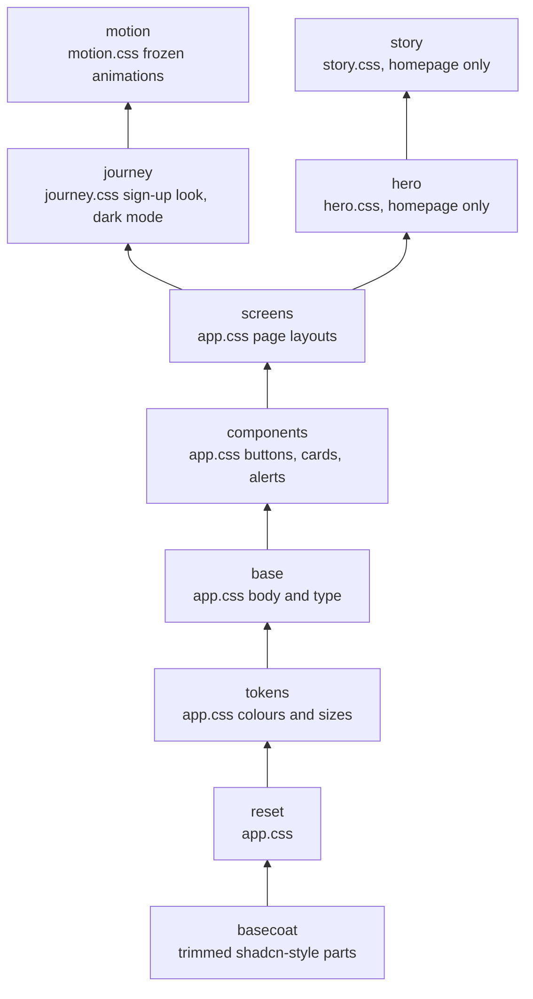

Read the arrows as "sits under". The straight column is the stack on the sign-up pages and the dashboard. The side branch is the homepage.

| Page | Basecoat and journey look | Motion files | Homepage hero files | Follows phone dark mode |
|---|---|---|---|---|
| Homepage | no | no | yes | no |
| Login, Sign-in didn't finish | yes | no | no | yes |
| Four onboarding steps, Dashboard | yes | yes | no | yes |
| Privacy, Terms | no | no | no | no |

- **Scripts only add polish.** Every page works with JavaScript off. `app.js` does copy buttons and busy states, `reveal.js` fades sections in, `vt.js` and `motion.js` run the sign-up animations, and `scene.js` draws the homepage background with its pause button.
- **Fonts.** The homepage and legal pages use the device's own font and download nothing ([`applyfirst/saas/static/css/app.css:52`](../applyfirst/saas/static/css/app.css#L52)). The sign-up pages use a self-hosted 28 KB Inter on Android and Windows ([`applyfirst/saas/static/css/journey.css:7-12`](../applyfirst/saas/static/css/journey.css#L7-L12)). Apple devices should never download it, because their own system font is first in the list ([`applyfirst/saas/static/css/journey.css:38`](../applyfirst/saas/static/css/journey.css#L38)). That has not yet been checked on a real iPhone.
- **Frozen files.** `motion.css`, `vt.js` and `motion.js` are each within about a hundred compressed bytes of a size limit their tests set ([`tests/test_saas_motion.py:358-365`](../tests/test_saas_motion.py#L358-L365)). New work goes in new files.
- **No purple.** A test rejects any colour at hue 230 to 345 anywhere, vendored files included ([`tests/test_saas_palette.py:227`](../tests/test_saas_palette.py#L227)).

### 8.4 Tests and gates

| Area | Tests | Main files |
|---|---|---|
| Look, motion and asset guards | 686 | `test_saas_journey.py`, `test_saas_motion.py`, `test_saas_palette.py` |
| Pages and the sign-up flow | 303 | `test_saas_flash.py`, `test_saas_profile_errors.py`, `test_saas_signin_failed.py` |
| Worker and operations | 186 | `test_saas_ops.py`, `test_saas_reconnect.py`, `test_saas_worker.py` |
| Security and data | 137 | `test_saas_gmail_scope.py`, `test_saas_cross_tenant.py`, `test_saas_crypto.py` |
| Shared code and V1 | 79 | `test_tailor_prompt.py` and the V1 tests |

That is 1,391 tests in 56 files, all passing in about two and a half minutes on your PC, measured on 27 September 2026. Run them from the repo root in PowerShell.

```powershell
.venv\Scripts\python.exe -m pytest -q
.venv\Scripts\python.exe .noxa\redesign-saas-ui\inputs\preserve_smoke.py
```

The first line runs every test. The second is the smoke script, 607 checks, 0 failed. It draws every page in every state, submits every form exactly as the HTML defines it and scans everything for anything the CSP would block. It exists because the unit tests send the CSRF token as a header, so a page that lost its hidden token field would still pass them while breaking every real browser ([`.noxa/redesign-saas-ui/inputs/preserve_smoke.py:1-24`](../.noxa/redesign-saas-ui/inputs/preserve_smoke.py#L1-L24)). Run it before and after any template or style change. It is git-ignored, so it lives only on your PC. Back it up.

What the guard tests protect, a few examples. A stranger gets "not found" on someone else's data ([`tests/test_saas_cross_tenant.py:37`](../tests/test_saas_cross_tenant.py#L37)). The Gmail lock refuses a wrong key and any tampering ([`tests/test_saas_crypto.py:13-80`](../tests/test_saas_crypto.py#L13-L80)). Every sentence of the legal pages still renders ([`tests/test_saas_legal_text.py:27`](../tests/test_saas_legal_text.py#L27)). A missing AI key is loud, a hung worker is restarted and a backup never leaves a half file ([`tests/test_saas_ops.py:1-15`](../tests/test_saas_ops.py#L1-L15)).

---

## 9. What to expect

**In short.** The biggest risks are not in the code. onlinejobs.ph's terms forbid automated use without permission, Google caps the beta at 100 users with weekly disconnects, and Gemini's model and free-tier rules both need action before real users arrive. They are listed here most important first.

### 9.1 onlinejobs.ph terms clause 7.4, and the 5-second crawl delay

**The terms.** Clause 7.4 of the onlinejobs.ph terms says "You are only permitted to use the Service personally and agree to do so without the use of any automated means including but not limited to the use of robotic tools except where permission has been expressly granted by OnlineJobs" ([onlinejobs.ph terms](https://www.onlinejobs.ph/terms)). Clause 10.3 lets them end your use of the service for a breach (same page). Agad's whole engine is automated reading of their site, and nothing grants permission.

**robots.txt.** The site's robots.txt, a file where a site tells robots its rules, lets any robot read the job pages but asks it to wait 5 seconds between requests with `Crawl-delay: 5` ([robots.txt](https://www.onlinejobs.ph/robots.txt)). The search page is not blocked.

**What the code does today.**

- It waits only 1.0 to 2.5 seconds between searches and 0.3 to 0.8 seconds after each job page ([`applyfirst/saas/worker.py:57-58`](../applyfirst/saas/worker.py#L57-L58)). That is faster than the site asks.
- It calls itself a normal Chrome browser ([`applyfirst/sources/base.py:18-21`](../applyfirst/sources/base.py#L18-L21)). That hides that Agad is a robot. It may delay a block, but it looks worse if the site owner notices.

**What it means.** If onlinejobs.ph blocks Agad's one address, every user stops getting jobs at the same moment. The site sits behind Cloudflare, which scores every request for how robotic it looks ([Cloudflare bot score](https://developers.cloudflare.com/bots/concepts/bot-score/)). Whether the site has bot blocking switched on is **UNVERIFIED**. Whether the terms bind a visitor who never signed up is a legal question, **UNVERIFIED**, ask a lawyer. No public API or job feed was found, which is also **UNVERIFIED**. Rotating addresses to dodge a block would be deliberately evading the owner's decision, and this guide does not recommend it.

**What to do.**

1. Email onlinejobs.ph, explain Agad (it reads public listings once per word for all users, never applies for anyone, and sends people back to their site) and ask for written permission or a feed.
2. Put one shared speed limit of one request every 5 seconds on everything that touches the site.
3. Use an honest browser name with a contact address, like `AgadBot/1.0 (+https://your-domain/bot)`.
4. Re-read robots.txt every day, which the robots standard recommends ([RFC 9309](https://www.rfc-editor.org/rfc/rfc9309.html)).
5. Never show their logo, and add "Agad is not affiliated with OnlineJobs.ph" to the footer.

### 9.2 Google verification, the 100-user Testing cap and the 7-day expiry

Your Google project is in Testing mode today.

- **100 users at most.** Testing mode is "limited to up to 100 test users" ([Google Cloud help](https://support.google.com/cloud/answer/15549945)).
- **Every Gmail connection dies after 7 days.** "Authorizations by a test user will expire seven days from the time of consent", refresh token included (same page). That is why the reconnect email exists (section 5.10).
- **`INVITE_ONLY` is page wording, not a gate.** It is a template switch ([`applyfirst/saas/templates/_ui.html:8`](../applyfirst/saas/templates/_ui.html#L8)), and `/auth/login` has no invite check ([`applyfirst/saas/app.py:386-397`](../applyfirst/saas/app.py#L386-L397)). The real gate today is Google's hand-made test-user list.

**The way out is verification.** A scope is one permission an app asks Google for. `gmail.send` is a "sensitive" scope, not a "restricted" one ([Gmail scopes](https://developers.google.com/workspace/gmail/api/auth/scopes)). That means Google's own review and **no paid CASA security audit**, which applies only to restricted scopes ([restricted scope verification](https://developers.google.com/identity/protocols/oauth2/production-readiness/restricted-scope-verification)). Never add `gmail.compose` or `gmail.insert`, which are restricted.

1. **Brand check.** A public homepage and a privacy policy on a domain you own, proven in Google Search Console. It takes a few minutes, or 2 to 3 business days if a person looks, and a pass is valid for 7 days ([brand verification](https://developers.google.com/identity/protocols/oauth2/production-readiness/brand-verification)). Whether a `fly.dev` address could pass is **UNVERIFIED**, so buy a real domain.
2. **Scope review.** A written reason for `gmail.send`, and a demo video of the whole sign-in and the features that use it. It "typically takes 3-5 business days" ([sensitive scope verification](https://developers.google.com/identity/protocols/oauth2/production-readiness/sensitive-scope-verification), [demo video](https://support.google.com/cloud/answer/13804565)). A ready-to-paste reason is in `docs/legal/google-verification.md`. Plan for 1 to 3 weeks with back-and-forth, which is an estimate.
3. **The gap in between.** From the moment you publish until approval, people see an "unverified app" warning and the app is capped at 100 new users in total ([unverified apps](https://support.google.com/cloud/answer/7454865)).

Even after verification a Gmail connection can still end when a person changes their Google password, revokes access or leaves it unused for six months ([OAuth overview](https://developers.google.com/identity/protocols/oauth2)). So the reconnect email stays useful after launch.

### 9.3 Gemini, the model change and the free tier training rule

**The model is being fenced off.** The code uses `gemini-2.5-flash` unless told otherwise ([`applyfirst/saas/config.py:161`](../applyfirst/saas/config.py#L161)). Since 18 September 2026 Google limits access to the 2.5 models "to users who have actively used them in the past" and points new projects to 3.5 Flash-Lite or 3.8 Flash ([changelog](https://ai.google.dev/gemini-api/docs/changelog), [2.5 Flash page](https://ai.google.dev/gemini-api/docs/models/gemini-2.5-flash)). No shutdown date is announced. Whether a new Google project for production counts as a past user is **UNVERIFIED**. Gemini 3.5 Flash-Lite costs the same, USD 0.30 per million input tokens and USD 2.50 per million output tokens ([Gemini pricing](https://ai.google.dev/gemini-api/docs/pricing)), so test it and switch `GEMINI_MODEL` when it reads well.

**The free tier breaks your privacy promise.** On the free tier Google uses content "to provide, improve, and develop Google products and services and machine learning technologies", people may read it, and Google says "Do not submit sensitive, confidential, or personal information to the Unpaid Services". The paid tier is not used to improve Google's products ([Gemini API terms](https://ai.google.dev/gemini-api/terms)). Agad sends names and application text, and the privacy page promises no training ([`applyfirst/saas/templates/privacy.html:65-66`](../applyfirst/saas/templates/privacy.html#L65-L66)). So turn on billing before any real user's data flows. The deploy file already warns about it ([`fly.toml:16-19`](../fly.toml#L16-L19)).

**Thinking is unlimited.** The request sets only the answer format and a temperature, the setting for how adventurous the wording is ([`applyfirst/tailor/llm.py:37`](../applyfirst/tailor/llm.py#L37)). Gemini 2.5 Flash thinks by default, and thinking is billed as output ([thinking docs](https://ai.google.dev/gemini-api/docs/thinking)). A cover letter needs little reasoning, so turning thinking down is the cheapest saving there is.

**Spending caps.** A billing account's first tier has a USD 250 monthly cap. When a cap is reached, the service pauses for every linked project "until the start of the next billing cycle" ([rate limits](https://ai.google.dev/gemini-api/docs/rate-limits), [billing](https://ai.google.dev/gemini-api/docs/billing)). That would stop every letter at once, so move up a tier before you need it.

### 9.4 One machine, because SQLite lives on one volume

A Fly volume attaches to one machine only, and Fly does not copy it ([Fly volumes](https://docs.fly.io/volumes/overview/)). SQLite's WAL mode also needs every program using the file on the same computer ([SQLite WAL](https://www.sqlite.org/wal.html)). So the web app and the worker must share one machine ([`fly.toml:3-5`](../fly.toml#L3-L5)), and one machine going down takes all of Agad down. SQLite's speed is not the problem. SQLite says sites under 100,000 hits a day "should work fine" ([When to use SQLite](https://www.sqlite.org/whentouse.html)), and the operations doc measured about 595 single-row writes per second ([`docs/OPERATIONS.md:311-312`](../docs/OPERATIONS.md#L311-L312)).

### 9.5 Gmail limits

- A personal Gmail can send about 500 emails a day, and recovers within 1 to 24 hours if it trips ([Gmail Help](https://support.google.com/mail/answer/22839?hl=en)). Agad sends at most 10 per person per day, so this only bites someone who already sends hundreds of emails a day.
- The Gmail API is free today. Google plans charges above 80,000,000 quota units per project per day "later in 2026", with at least 90 days' notice ([Gmail API quota](https://developers.google.com/workspace/gmail/api/reference/quota)). One send is 100 units, so 10,000 users at 10 a day would use about one eighth of that line.

### 9.6 Costs per user, and the margin at PHP 199

PHP 199 is about USD 3.18. The estimates below use the Gemini prices above and **UNVERIFIED** assumptions of about 4,000 input tokens, 600 output tokens and 1,500 thinking tokens per letter, and 3 letters a day for a typical user.

| Per user per month | Thinking turned down | Thinking at default |
|---|---|---|
| Gemini, 3 letters a day | USD 0.24, PHP 15 | USD 0.59, PHP 37 |
| Gemini, 10 a day (the cap) | USD 0.81, PHP 51 | USD 1.95, PHP 122 |
| Hosting at 100 users | USD 0.04, PHP 3 | USD 0.04, PHP 3 |
| PayMongo fee, GCash | PHP 5 | PHP 5 |
| PayMongo fee, card | PHP 22 | PHP 22 |

| What is left from PHP 199 | Thinking turned down | Thinking at default |
|---|---|---|
| Typical user, GCash | about PHP 176 | about PHP 154 |
| Heavy user at the cap, GCash | about PHP 140 | about PHP 69 |
| Heavy user at the cap, card | about PHP 123 | about PHP 52 |

These are before income tax. The margin holds in every case, but a heavy user with thinking left on eats most of it. Keep the daily cap, turn thinking down and watch real usage. Nothing today caps total spending across all users ([`docs/OPERATIONS.md:273-274`](../docs/OPERATIONS.md#L273-L274)), so also set your own spend cap in Google's billing page. Sources are [Gemini pricing](https://ai.google.dev/gemini-api/docs/pricing), [Fly pricing](https://docs.fly.io/about/pricing/) and [PayMongo pricing](https://www.paymongo.com/pricing).

### 9.7 Smaller things to expect

- **The disk fills in about a year**, because old jobs and alerts are never deleted (section 3.6). Backups also refuse when free disk is under twice the database, so they stop first.
- **A person who starts without Gmail gets nothing, silently**, and those jobs are never re-sent (section 5.11).
- **The library versions are not pinned**, so a rebuild can pull a new major version and break things with no code change ([`docs/OPERATIONS.md:332-333`](../docs/OPERATIONS.md#L332-L333)).
- **The homepage has never been looked at by a person on a real phone**, according to the handoff.

---

## 10. Scaling when traffic grows

**In short.** The first wall is Google's 100-user cap, not servers. After that the limit that matters is onlinejobs.ph's 5-second crawl delay, which no amount of machines can raise, so the real fix is to read the site's newest-jobs list once for everyone instead of searching once per watch word.

### 10.1 The one limit no server can raise

At one request every 5 seconds, Agad may make 12 requests a minute, 120 every 10 minutes and 17,280 a day, for the whole app and every user combined. More machines or parallel workers do not raise it, because the limit is on the site's side. Ten workers each waiting 5 seconds would still be ten times too fast. Only onlinejobs.ph can raise it, by giving permission or a feed.

Today the worker searches once per distinct watch word ([`applyfirst/saas/db.py:598-609`](../applyfirst/saas/db.py#L598-L609)), one after another ([`applyfirst/saas/worker.py:256-263`](../applyfirst/saas/worker.py#L256-L263)), and each person may save 20 words ([`applyfirst/saas/app.py:69`](../applyfirst/saas/app.py#L69)). So 100 people could mean anywhere from about 100 to 2,000 searches a round. Honouring 5 seconds fits only about 100 searches in 10 minutes. Past that a round takes longer than 10 minutes, and because the sleep starts after the round ([`applyfirst/saas/worker.py:619-620`](../applyfirst/saas/worker.py#L619-L620)), the promise of "about every 10 minutes" breaks with no warning.

### 10.2 How each part grows

| Part | Grows with | Hard limit | Cost growth |
|---|---|---|---|
| Reading onlinejobs.ph | Distinct words today, jobs posted with the newest-list design | 1 request per 5 s, for the whole app | About zero, incoming data is free |
| Writing letters (Gemini) | Letters sent | Your tier's monthly cap | The main cost, roughly in step with letters |
| Sending (Gmail API) | Letters sent | 500 a day per personal Gmail | Free today |
| Website | Visitors | One machine while on SQLite | Small |
| Database | Rows and connections | One machine while on SQLite | USD 25 to 75 once on Postgres |

### 10.3 Stage A, about 100 users (now)

- **What breaks first.** Google's 100-user Testing cap and weekly disconnects. The worker already crawls faster than the site asks. Free-tier Gemini would break the privacy promise. Gemini 2.5 may not work on a new project.
- **The change.** One shared speed limit of one request every 5 seconds, plus an honest browser name and a daily robots.txt check. Build the newest-list reader (section 10.6) and run it next to today's one for a week. Submit the Google verification. Turn on Gemini billing, turn thinking down and test 3.5 Flash-Lite. Email onlinejobs.ph.
- **Plan B, if the newest list misses too much.** Clean up words (lowercase, trim, merge "va" and "virtual assistant") and search each word on a schedule set by how many people watch it. Words with 5 or more watchers every 10 minutes, 2 to 4 every 20, and 1 every 30 to 60, all inside the 120-per-10-minutes budget.
- **Monthly cost.** USD 28 to 62, PHP 1,750 to 3,875. That is Fly USD 4.30 plus Gemini USD 24 to 58 for about 9,000 letters.
- **Effort.** About 1 to 2 weeks, plus Google's review and a week of side-by-side testing.

### 10.4 Stage B, about 1,000 users

- **What breaks first.** Letter writing in one line. Today searching, writing and sending all happen one after another in one loop ([`applyfirst/saas/worker.py:288-298`](../applyfirst/saas/worker.py#L288-L298)). Up to 10,000 Gemini calls a day at a guessed 5 to 10 seconds each (**UNVERIFIED**) is 14 to 28 hours of work a day in one line, which cannot fit. The expected Gemini bill of USD 243 to 585 a month also reaches or passes the USD 250 cap of Tier 1, and hitting it pauses every letter until the 1st of the next month.
- **The change.** Split the worker in two. Exactly one **poller** owns the speed limit and writes new jobs and alerts to a queue table. Several **senders** take alerts from the queue and write and send 5 to 10 at a time. Give each person their own send queue. Move to Postgres (Supabase Pro or Fly Managed Postgres in Singapore) so web, poller and senders can live on separate machines. Reach Gemini Tier 2 early. Add a free dead-man's-switch check and track letters sent, AI cost per day and round length ([Fly metrics](https://docs.fly.io/monitoring/metrics/)).
- **Monthly cost.** USD 284 to 639, PHP 17,750 to 39,940. Fly about USD 15.50, Postgres USD 25 to 38 ([Supabase pricing](https://supabase.com/pricing), [Fly Managed Postgres](https://docs.fly.io/mpg/)), Gemini USD 243 to 585.
- **Effort.** About 3 to 4 weeks. The Postgres move is the biggest piece.

### 10.5 Stage C, about 10,000 users

- **What breaks first.** Gemini cost and limits, about 900,000 letters a month, which needs Tier 3. And the product itself. 10,000 people applying from one site to a small stream of new jobs (about 2 a minute in one snapshot, **UNVERIFIED**) means many Agad letters per job. The "be first" edge shrinks, and onlinejobs.ph is far more likely to notice.
- **The change.** Tier 3 Gemini, a cheaper model for most letters after a quality test, and your own spend cap. Several senders taking work safely from the Postgres queue so no letter is sent twice. A "leader lock" so only one poller ever runs. Two or more web machines. A formal agreement or feed from onlinejobs.ph, because at this size running without one is a business risk no engineering can remove.
- **Monthly cost.** USD 2,510 to 5,975, PHP 156,900 to 373,400, almost all of it Gemini. Moving most letters to 3.1 Flash-Lite with thinking off would cut Gemini to about USD 1,710.
- **Effort.** About 3 to 5 weeks, plus the model test and partnership talks.

| Stage | Revenue at PHP 199 | Monthly cost | Share that is Gemini |
|---|---|---|---|
| About 100 users | PHP 19,900 (USD 318) | USD 28 to 62, PHP 1,750 to 3,875 | about 86 to 94 percent |
| About 1,000 users | PHP 199,000 (USD 3,184) | USD 284 to 639, PHP 17,750 to 39,940 | about 86 to 92 percent |
| About 10,000 users | PHP 1,990,000 (USD 31,840) | USD 2,510 to 5,975, PHP 156,900 to 373,400 | about 97 to 98 percent |

Revenue is before payment fees and tax. The figures come from the scaling research, built on [Fly pricing](https://docs.fly.io/about/pricing/) and [Gemini pricing](https://ai.google.dev/gemini-api/docs/pricing).

### 10.6 The newest-jobs-list idea, and its caveat

**The idea.** The site's search page with no word lists jobs newest first, 30 to a page. In one look on 27 September 2026 the newest 30 covered about 14 minutes, roughly 2 new jobs a minute ([search page](https://www.onlinejobs.ph/jobseekers/jobsearch)). If that holds, a round every 5 minutes needs about 1 list page plus about 10 new job pages. That is about 3,200 requests a day, 19 percent of the ceiling, **and it stays the same whether Agad has 100 or 10,000 users**. Watch words are then matched on our side against each job's title and full text.

**The caveat.** The rate is one Sunday-morning snapshot, so it is **UNVERIFIED** as typical. The page showed "30 out of 287 jobs", so it may apply a default filter and miss some job types, also **UNVERIFIED**. And onlinejobs.ph's own search may match on things we never see. Run both methods side by side for a week and compare what each finds before switching. The newest list still reads their site automatically, so it does not remove the need for permission.

### 10.7 The target shape

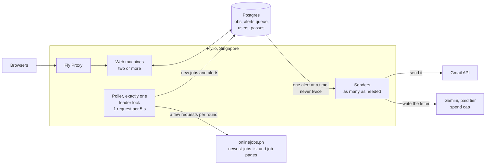

**How to read it.** Web machines and senders can multiply as users grow. The poller cannot. It is exactly one, it owns the site's speed limit, and its traffic depends on how many jobs are posted, not on how many people use Agad.

---

## 11. Getting paid

**In short.** Use PayMongo and sell a 30-day pass for PHP 199 on PayMongo's own payment page, because nobody lets a small business charge GCash automatically every month today. In this app that means three new addresses, two new tables, a few new columns, one deliberate change to the CSP and one new filter in the worker.

### 11.1 The recommendation

- **PayMongo, 30-day passes, Hosted Checkout.** The buyer taps Pay, lands on PayMongo's page, pays with GCash, Maya, QR Ph (the national QR code payment), GrabPay, ShopeePay or card, and PayMongo tells our server by a signed message ([Hosted Checkout](https://docs.paymongo.com/docs/payment-channels-hosted-checkout), [webhook setup](https://docs.paymongo.com/docs/developer-tools-webhook-setup-management)).
- **Why a pass and not a subscription.** PayMongo's automatic renewals cover only cards and Maya, switched on by asking support ([PayMongo Subscriptions](https://docs.paymongo.com/docs/payment-acceptance-subscriptions)). Xendit's GCash auto-debit needs "additional activation process with partner" ([Xendit GCash](https://docs.xendit.co/docs/gcash)), and HitPay says GCash and Maya are "not available for automated recurring billing" ([HitPay](https://hitpayapp.com/blog/recurring-billing-philippines)). For a GCash-first audience, a pass the person renews is the honest default.
- **It already matches the page wording.** The trial note says "No card needed" and that nothing is charged automatically when the trial ends ([`applyfirst/saas/templates/_ui.html:17`](../applyfirst/saas/templates/_ui.html#L17)).
- **Runner-up, Xendit.** It has the best ready-made subscription engine, with a start date you can set to the trial's last day ([Xendit subscriptions](https://docs.xendit.co/docs/subscriptions-overview), [create plan](https://docs.xendit.co/apidocs/create-recurring-plan)). But it does not accept individuals in the Philippines ([Xendit documents](https://docs.xendit.co/docs/philippines-business-documents)), its webhook proof is a fixed shared token rather than a signature ([Xendit webhooks](https://docs.xendit.co/docs/handling-webhooks)), and its fees are **UNVERIFIED**.

### 11.2 Why not Stripe, Paddle or Lemon Squeezy

- **Stripe** does not open accounts for Philippine businesses ([Stripe global](https://stripe.com/global)) and has no GCash or Maya ([Stripe payment methods](https://docs.stripe.com/payments/payment-methods/payment-method-support)). The US-company route through Stripe Atlas costs USD 500 once and USD 100 a year ([Stripe Atlas](https://stripe.com/atlas)), brings a yearly US filing with a USD 25,000 penalty for missing it ([IRS Form 5472](https://www.irs.gov/instructions/i5472)), and a Filipino card would cost about PHP 30.86 on PHP 199 ([Stripe pricing](https://stripe.com/pricing)).
- **Paddle** charges 5% plus 50 US cents, about 21% of a PHP 199 sale, sends products under USD 10 to its sales team, does not support the peso and has no GCash ([Paddle pricing](https://www.paddle.com/pricing), [Paddle currencies](https://developer.paddle.com/concepts/sell/supported-currencies/)).
- **Lemon Squeezy** also charges 5% plus 50 US cents ([Lemon Squeezy pricing](https://www.lemonsqueezy.com/pricing)), and since January 2026 it runs a waitlist while moving users to Stripe Managed Payments ([Lemon Squeezy update](https://www.lemonsqueezy.com/blog/2026-update)), which does not accept Philippine businesses ([Managed Payments eligibility](https://docs.stripe.com/payments/managed-payments/eligibility)).

All three are built for selling software to foreigners in dollars, which is the wrong fit for PHP 199 GCash buyers.

### 11.3 Fees on one PHP 199 payment

PayMongo's prices are "exclusive of VAT", so the figures add 12% VAT, the Philippine sales tax, on the fee. The 12% rate is set by the TRAIN Act, Sec. 106 ([TRAIN Act](https://lawphil.net/statutes/repacts/ra2017/ra_10963_2017.html)). Source is [PayMongo pricing](https://www.paymongo.com/pricing).

| Method | PayMongo rate | Fee on PHP 199 | You keep |
|---|---|---|---|
| QR Ph | 1.34% | PHP 2.99 | PHP 196.01 |
| Maya | 1.79% | PHP 3.99 | PHP 195.01 |
| GCash | 2.23% | PHP 4.97 | PHP 194.03 |
| Local card | 3.125% + PHP 13.39 | PHP 21.96 | PHP 177.04 |

Other PayMongo charges. The Standard plan has no setup fee and no monthly fee, and each transfer from your PayMongo wallet to your bank is PHP 10 plus VAT (same page). The same page lists a PHP 30 identity check and PHP 3 to 15 a month of wallet upkeep, but those belong to PayMongo's Wallets product for businesses that hand wallets to their own customers, so they are probably not Agad costs (**UNVERIFIED**, ask PayMongo). Section 12.5 lists every charge on a payment. Money clears in 1 banking day for QR Ph, 2 for e-wallets and 3 for cards ([PayMongo payouts](https://docs.paymongo.com/docs/money-movement-payouts)).

### 11.4 The registration you need

- **An Individual PayMongo account** can take QR Ph, Maya, GrabPay and ShopeePay. **GCash and cards need a registered business** ([account capabilities](https://docs.paymongo.com/docs/account-settings-account-capabilities)).
- **A sole proprietor uploads** a DTI business name certificate, a government ID and BIR Form 2303. DTI is the Department of Trade and Industry, where business names are registered. BIR is the Bureau of Internal Revenue, the tax office, and Form 2303 is its certificate of registration ([Philippine entities](https://docs.paymongo.com/docs/account-settings-philippine-entities)).
- **Approval** takes 3 to 7 business days per e-wallet and 5 to 10 for cards (account capabilities page).
- **The bank account name must match** your registered business or personal name (payouts page).
- **A catch for the Individual account.** The BIR says sellers "are not allowed to receive payments through their personal/individual accounts" ([BIR RMC 8-2024](https://bir-cdn.bir.gov.ph/BIR/pdf/RMC%20No.%208-2024.pdf)). How that applies to a PayMongo Individual account is **UNVERIFIED**, so ask an accountant before using one for the beta.

Section 13.4 covers DTI and BIR, and section 12 prices every bill that comes with them.

### 11.5 How it plugs into this app

1. The person taps "Pay PHP 199".
2. Our server creates a PayMongo checkout session with our secret key, and gets back a `checkout_url` on `checkout.paymongo.com` ([quick start](https://docs.paymongo.com/docs/payment-channels-hosted-checkout-quick-start)).
3. The browser is sent there. The person pays.
4. PayMongo sends the browser back to our success page. **That is not proof of payment.**
5. PayMongo posts `checkout_session.payment.paid` to our webhook address. **That is the proof.**
6. We check its signature, record the event once and add 30 days of access.
7. The worker only searches words of people whose access is still valid.

The three new addresses.

| Address | What it does |
|---|---|
| `POST /billing/checkout` | Protected by CSRF like every other form. Makes a `payments` row, creates the checkout session for one "Agad 30-day pass" at 19900 centavos, with our payment id as `reference_number` and emailed receipts on, then redirects to `checkout_url` |
| `GET /billing/return` | Shows "Salamat, confirming your payment" and reads our own database. It never grants access |
| `POST /webhooks/paymongo` | No session and no CSRF. Checks the signature on the raw bytes first, records the event id, then extends access once per payment |

**The CSP note, important.** Our CSP says `form-action 'self'` ([`applyfirst/saas/app.py:229-232`](../applyfirst/saas/app.py#L229-L232)). Chrome blocks a form post that then redirects to another site not listed there, while Firefox does not ([MDN form-action](https://developer.mozilla.org/en-US/docs/Web/HTTP/Reference/Headers/Content-Security-Policy/form-action)). Most of your users are on Android Chrome, so a Pay form would fail silently for them. The Google button already dodges the same rule by being a plain link. Here the better fix is to keep the form, with its CSRF token, and add PayMongo to the rule, as `form-action 'self' https://checkout.paymongo.com`. The tests pin the exact CSP text in `tests/_saas_client.py`, so this is a deliberate, tested change to a frozen rule. No script change is needed, because the payment page runs on PayMongo's site.

**Billing emails** should come from the server's own mail account, the one the reconnect email uses ([`applyfirst/saas/reconnect.py:223-249`](../applyfirst/saas/reconnect.py#L223-L249)), never through the person's Gmail permission. Google's policy limits that permission to what you disclosed it is for ([API Services User Data Policy](https://developers.google.com/terms/api-services-user-data-policy)).

### 11.6 What to store

- **On `users`**, add `trial_ends_at` and `paid_until`. Later, for auto-renew, `paymongo_customer_id` and `paymongo_subscription_id`. The unused `plan` column is there today, always "free" ([`applyfirst/saas/db.py:234`](../applyfirst/saas/db.py#L234)).
- **A new `payments` table** with our own id (sent as `reference_number`), `user_id`, `checkout_session_id`, `payment_id`, `amount_centavos`, `method`, `status` (pending, paid, refunded, disputed), `days_granted`, `period_start`, `period_end`, `created_at` and `paid_at`.
- **A new `webhook_events` table** keyed by PayMongo's event id, with `type`, `received_at` and `processed_at`. Skip any event id already seen ([best practices](https://docs.paymongo.com/docs/developer-tools-best-practices)).
- **The access rule** is "now is before the later of `trial_ends_at` and `paid_until`, plus 2 days of grace". Apply it where the worker lists the words to search ([`applyfirst/saas/db.py:598-609`](../applyfirst/saas/db.py#L598-L609)) and where it picks watchers for a job ([`applyfirst/saas/db.py:636-665`](../applyfirst/saas/db.py#L636-L665)). That also saves Gemini and Gmail calls for people who stopped paying.

The schema, meaning the table layout, is at step 5 today ([`applyfirst/saas/db.py:33`](../applyfirst/saas/db.py#L33)), so this becomes step 6, and the tests must use the version constant rather than a number.

### 11.7 The trial rule

- Start the 14-day trial with **no payment details**, at the moment the person first presses Start. `activated_at` is already stamped once and kept forever ([`applyfirst/saas/db.py:393-398`](../applyfirst/saas/db.py#L393-L398)).
- Store `trial_ends_at` once and never reset it. Tie it to the Google id, which is already unique ([`applyfirst/saas/db.py:149`](../applyfirst/saas/db.py#L149)), so signing up again never gives a second trial.
- At the end the person buys a 30-day pass. This avoids two PayMongo gaps, no trial setting and a first subscription payment due within 24 hours ([PayMongo Subscriptions](https://docs.paymongo.com/docs/payment-acceptance-subscriptions)).
- Show a banner from 3 days before the end, keep 2 days of grace, then pause the worker for that person and keep all their data, so paying resumes at once. Offer 90-day passes later to cut fees and reminders.
- No Philippine rule specific to free trials was found, **UNVERIFIED**. Good practice anyway is to show the price and end date before the trial starts.

### 11.8 Webhooks

- The header is `Paymongo-Signature`, with parts `t` (a timestamp), `te` (test signature) and `li` (live signature) ([webhook setup](https://docs.paymongo.com/docs/developer-tools-webhook-setup-management)).
- The signature is HMAC-SHA256 of `t`, a dot and the raw body, using the endpoint's secret. HMAC is a seal made with a secret, so only someone who holds the secret can make a matching one. Compare in constant time and check it before reading the body ([best practices](https://docs.paymongo.com/docs/developer-tools-best-practices-1)).
- Answer within 30 seconds. Failed deliveries are retried up to 12 times ([webhook concepts](https://docs.paymongo.com/docs/developer-tools-webhooks-key-concepts)).
- Events to handle. `checkout_session.payment.paid` adds 30 days. `refund.succeeded` and `dispute.created` mark the payment and pull back that payment's days ([webhook events](https://docs.paymongo.com/docs/developer-tools-webhooks-events)).

In code this is about ten lines with Python's own `hmac` module. Rebuild the signature from the raw bytes with our secret, compare the two in a way that takes the same time whether they match or not, so an attacker learns nothing from the timing, and refuse anything older than 5 minutes. That age limit is our own choice, not PayMongo's. Confirm the timestamp format against a real test webhook, because that detail is **UNVERIFIED**.

### 11.9 The payment, in a picture

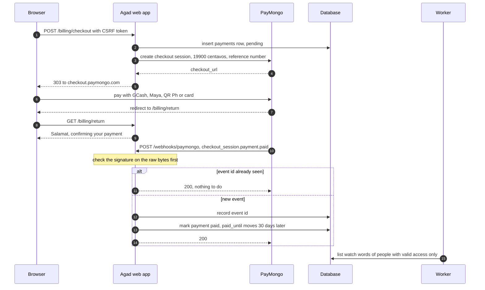

### 11.10 Later, auto-renew for Maya and cards

Once PayMongo support switches Subscriptions on, offer auto-renew to people who pick Maya or a card. Failed renewals are retried "once per day, up to 3 times", then the subscription becomes `unpaid` ([PayMongo Subscriptions](https://docs.paymongo.com/docs/payment-acceptance-subscriptions)). Listen for `subscription.invoice.paid`, `subscription.past_due` and `subscription.unpaid`.

Ask PayMongo support four things first. Can GCash subscriptions be switched on? Can Maya and card subscriptions be switched on for your account type? Is card vaulting available? Which card-security questionnaire applies? All four answers are **UNVERIFIED** today.

For the first handful of beta users, a PayMongo payment link made in the dashboard needs no code at all, and you match payments to people by hand (Hosted Checkout page). That is fine for 10 people, not for 100.

---

## 12. Every bill to expect

**In short.** Before launch you pay about PHP 4,900 to 15,000 once, then about PHP 330 to 5,420 a month in fixed bills plus about PHP 15 to 37 a month for each active user's AI letters, and Agad covers its own monthly bills from about 3 to 40 paying users.

Every number here has a link, or comes from the billing and scaling research with the arithmetic shown beside it. Anything nobody could confirm on an official page is marked **UNVERIFIED**. The tax parts are research, not tax advice, so book one paid hour with a Philippine accountant before the first sale.

The ground rules behind every figure in this section.

- Money is in pesos, with US dollars in brackets, at PHP 62.50 per USD ([BSP](https://www.bsp.gov.ph/Lists/RERB/Attachments/2349/04Sep2026.pdf)).
- A paying user buys 12 passes a year, so one user brings in PHP 2,388 a year. That is a simplification. Someone who renews every 30 days buys about 12.2.
- A typical user gets 3 letters a day and a heavy user gets 10, the daily cap. Both are guesses until real use is measured (**UNVERIFIED**).
- You are a sole proprietor, meaning one person running a business under their own name, in Metro Manila, and Agad is your only income.
- Your own SSS and PhilHealth are personal bills. Section 12.3 lists them, but every total leaves them out.

### 12.1 The short answer

Agad is cheap to run and pays for itself early, because its one big bill, Gemini, grows in step with the money coming in.

| When | What it covers | What you pay |
|---|---|---|
| Once, before launch | Business papers, city permits, notary fees, the domain and a first Gemini top-up (section 12.2) | PHP 4,900 to 15,000 (USD 78 to 241) |
| Each month of the beta, while nobody pays | Fixed bills (section 12.3) plus letters for each active tester (section 12.4) | PHP 330 to 5,420 (USD 5.25 to 87), plus PHP 15 to 37 (USD 0.24 to 0.59) per active tester. At Google's cap of 100 testers that is about PHP 1,850 to 9,050 (USD 30 to 145) |
| Each month at 100 paying users | Every bill, including payment fees, yearly bills spread per month and tax (section 12.7) | PHP 3,000 to 10,800 (USD 48 to 173) of the PHP 19,900 (USD 318) coming in, so PHP 9,100 to 16,900 (USD 146 to 270) is left |
| Each month at 1,000 paying users | The same, plus a Postgres database and income tax (section 12.7) | PHP 39,300 to 71,300 (USD 629 to 1,141) of the PHP 199,000 (USD 3,184) coming in, so PHP 127,700 to 159,700 (USD 2,043 to 2,555) is left |

The low figures are the cheapest sensible setup with Gemini's thinking turned down. The high figures are a comfortable setup, with a paid mailbox, a paid monitor and an accountant, and with thinking left at default.

**When Agad pays for itself.** About 3 paying users cover the cheapest setup and about 40 cover the comfortable one. Here is the arithmetic. Each paying user leaves about PHP 173 after the GCash fee of PHP 4.97, letters with thinking turned down at PHP 15 and up to 3% city business tax at PHP 6. The cheapest setup's monthly bills plus its yearly bills spread per month come to about PHP 507, and 507 divided by 173 is about 3. On the comfortable setup with thinking at default each user leaves about PHP 152, the bills come to about PHP 6,050, and that needs about 40 users. If most people pay by card, it is about 45.

Those break-even numbers leave out the one-time costs. At 100 paying users even the high one-time figure comes back within about two months.

### 12.2 One-time costs before launch

Getting legal and online costs about PHP 4,900 to 15,000 once, and most of the spread comes from your city and from choosing a .com or a .ph address.

| Item | PHP (USD) | What it is | Source |
|---|---|---|---|
| DTI business name, national scope | 2,030 (32.48) | PHP 2,000 plus PHP 30 documentary stamp tax (DST), a small national tax on official papers. National scope is the checklist's pick for an online business (section 13.1). Barangay scope is 230, city 530 and regional 1,030. Valid 5 years | [DTI BNRS FAQ](https://bnrs.dti.gov.ph/faq) |
| Barangay clearance, first year | 200 to 1,000 (3.20 to 16) **UNVERIFIED** | Each barangay sets its own "reasonable fee". The range is only a commonly reported one | [LGC Sec. 152(c)](https://lawphil.net/statutes/repacts/ra1991/ra_7160_1991.html), [barangayclearance.com](https://barangayclearance.com/fees/) (secondary) |
| Community tax certificate, the cedula | 5 plus 1 for every 1,000 of last year's income, at most 5,000 | Depends on your own income, so the total below leaves it out | [LGC Sec. 157](https://lawphil.net/statutes/repacts/ra1991/ra_7160_1991.html) |
| Mayor's permit, the city business licence, first year | 900 to 5,000 (14.40 to 80) | Pasig charges 900 for a small office. Makati and Mandaluyong charge 5,000 for "IT", and Mandaluyong charges 1,000 for "others". Which box your city puts Agad in is **UNVERIFIED** | [Pasig Revenue Code](https://assets.pasigcity.gov.ph/storage/downloadables/2022/10/07/633fc0e8d82941665122536632bfacec71cf16638266382017%20Revised%20Pasig%20Revenue%20Code.pdf), [Makati Sec. 4A.01](https://www.makati.gov.ph/assets/uploads/staticmenu/files/invest/sec.4a.01.pdf), [Mandaluyong fees](https://mandaluyong.gov.ph/business/revised-business-tax-code-mayors-permit-fees/) |
| Fire safety inspection fee | 500 to 750 (8 to 12) | 15% of all the fees the city charges for the permit, never under 500. The 750 counts the permit fee alone, so other city fees would push it higher | [Fire Code RIRR 2019, Sec. 12.0.0.4](https://archive.org/stream/ra-9514-rirr-rev-2019/RA9514-RIRR-rev-2019_djvu.txt) |
| City business tax, first year | about 25 to 38 (under 1) | At most one twentieth of 1% of your starting capital, and cities may charge up to 50% more. Worked out on PHP 50,000 of capital | [LGC Secs. 143 and 151](https://lawphil.net/statutes/repacts/ra1991/ra_7160_1991.html) |
| Sanitary, garbage and other city fees | **UNVERIFIED** | Makati lists garbage fees in its assessment. Pasig's code charges a yearly sanitary inspection fee, for example PHP 75 for a catch-all business under 50 sq m, read from a scanned copy. Which category fits Agad is **UNVERIFIED**, so the totals leave it out | [Makati business permit charter](https://www.makati.gov.ph/assets/uploads/staticmenu/docs/1581041920752.pdf), [Pasig Revenue Code](https://assets.pasigcity.gov.ph/storage/downloadables/2022/10/07/633fc0e8d82941665122536632bfacec71cf16638266382017%20Revised%20Pasig%20Revenue%20Code.pdf) |
| BIR registration, Form 1901, which gives Form 2303 | 30 (0.48) | Stamp tax only. The old PHP 500 yearly fee ended on 22 January 2024 | [BIR checklist](https://web-services.bir.gov.ph/eappointment/files/checklist_of_documentary_requirements.pdf), [BIR EOPT flyer](https://bir-cdn.bir.gov.ph/BIR/pdf/flyer-eopt.pdf) |
| BIR Registration Seal Badge for the website | 0 | Free, or 30 if you get it by updating your registration on ORUS. Show it by 31 October 2026 | [BIR RMC 38-2026](https://bir-cdn.bir.gov.ph/BIR/pdf/RMC%20No.%2038-2026%20Digest.pdf), [BIR RMC 99-2026](https://bir-cdn.bir.gov.ph/BIR/pdf/RMC%20No.%2099-2026.pdf) |
| Books of accounts, a journal and a ledger | Registration free. Notebooks **UNVERIFIED** | Registered on ORUS, which gives a QR stamp for the first page | [BIR checklist](https://web-services.bir.gov.ph/eappointment/files/checklist_of_documentary_requirements.pdf) |
| First registered invoices | **UNVERIFIED** | BIR Printed Invoices are sold at printing cost. A 2003 order said PHP 50 per booklet of 50, and today's price is unknown | [BIR checklist](https://web-services.bir.gov.ph/eappointment/files/checklist_of_documentary_requirements.pdf), [BIR RMO 13-2003](https://elibrary.judiciary.gov.ph/thebookshelf/showdocs/10/44460) |
| Sworn declaration to PayMongo, which stops tax being held back (section 12.5) | 130 to 330 (2 to 5) | 30 stamp tax plus a notary fee of 100 to 300 (**UNVERIFIED**). A notary is a lawyer who watches you swear to a paper and stamps it | [Annex A form](https://www.rcbc.com/uploads/media/RR-16-2023-Sworn-Declaration.pdf), [BIR RMC 8-2024](https://bir-cdn.bir.gov.ph/BIR/pdf/RMC%20No.%208-2024.pdf), notary range from [Respicio](https://www.respicio.ph/commentaries/notarial-fees-for-document-notarization-in-the-philippines) (secondary) |
| NPC sworn declaration, Annex 1 | 100 to 300 (1.60 to 4.80) | No NPC fee according to a secondary source, plus a notary fee. Both **UNVERIFIED** | [NPC Annex 1](https://privacy.gov.ph/wp-content/uploads/2023/05/Circular-2022-04-Annex-1-1.pdf), [Emerhub](https://emerhub.com/philippines/a-guide-to-npc-registration-in-the-philippines/) (secondary) |
| PayMongo account | 0 | No setup fee on the Standard plan | [PayMongo pricing](https://www.paymongo.com/pricing) |
| Google Cloud project, app verification and Search Console | 0 | Google lists no fee for any of them. CASA, the paid outside audit, is not needed for `gmail.send` | [Google verification FAQ](https://support.google.com/cloud/answer/13463817?hl=en), [Search Console](https://support.google.com/webmasters/answer/9128668?hl=en) |
| Domain, first year | .com 654 (10.46), or 698 (11.17) from 1 November 2026. A .ph is 3,000 (48) | Cloudflare sells .com at the wholesale price with no markup, and the exact cents show only at checkout (**UNVERIFIED**). dotPH says taxes may be added at checkout | [Cloudflare Registrar](https://www.cloudflare.com/products/registrar/), [Verisign](https://investor.verisign.com/news-releases/news-release-details/verisign-reports-first-quarter-2026-results), [ICANN fees](https://www.icann.org/en/announcements/details/icann-accredited-registrars-approve-registrar-level-fees-for-fiscal-year-2026-21-07-2025-en), [dotPH FAQ](https://www.dot.ph/faqs) |
| First Gemini top-up | 313 (5) at least | Credit you then spend on letters, not a fee. Unused credit expires after 12 months | [Gemini billing](https://ai.google.dev/gemini-api/docs/billing) |
| Fly.io reservation, optional | 2,250 (36) | A year of machine credit paid up front. It covers the machine for 12 months and saves about USD 12.60 a year | [Fly pricing](https://docs.fly.io/about/pricing/) |
| An hour with an accountant, recommended | **UNVERIFIED** | No published price was found | None found |

| Total | Low | High |
|---|---|---|
| Government and paperwork, with the national DTI name | PHP 3,915 (USD 63) | PHP 9,478 (USD 152) |
| Getting online | PHP 967 (USD 15) | PHP 5,563 (USD 89) |
| **All one-time costs** | **about PHP 4,900 (USD 78)** | **about PHP 15,000 (USD 241)** |

- **The low case** is Pasig's PHP 900 permit, the PHP 500 minimum fire fee, a PHP 200 barangay clearance, the first-year city tax, the BIR's PHP 30, the cheapest notary for both sworn papers, a .com and the Gemini top-up.
- **The high case** is a PHP 5,000 "IT" permit, a PHP 750 fire fee, a PHP 1,000 clearance, the dearest notary, a .ph, the Gemini top-up and the Fly reservation. Without the optional reservation the high end is about PHP 12,800 (USD 205).
- **A smaller DTI scope** saves up to PHP 1,800.
- **Not counted**, because no confirmed price exists, are the cedula, the invoices, the notebooks, the sanitary and garbage fees and the accountant's hour.
- **Your own city's figures are UNVERIFIED.** Quezon City's official pages, for example, list the steps and a 1 to 3 day wait but no peso amounts ([QC business guide](https://quezoncity.gov.ph/qcitizen-guides/opening-a-business-in-qc/)). Ask your city's permit office which category a home-based online subscription falls under.

These totals are my arithmetic from the rows above.

### 12.3 Monthly fixed costs

The bills that arrive every month however many users you have come to about PHP 330 on the cheapest sensible setup and about PHP 5,420 on a comfortable one, and most of the gap is an accountant.

| Bill | Cheapest sensible | Comfortable | Source |
|---|---|---|---|
| Fly.io machine, shared-cpu-1x 512 MB in Singapore, always on | PHP 253 (USD 4.05) | PHP 253 (USD 4.05) | [Fly pricing](https://docs.fly.io/about/pricing/) |
| Fly disk, the 1 GB volume | PHP 9 (USD 0.15) | PHP 9 (USD 0.15) | [Fly pricing](https://docs.fly.io/about/pricing/) |
| Domain, the yearly price spread over 12 months | PHP 55 (USD 0.87) for a .com | PHP 250 (USD 4.00) for a .ph | [Cloudflare Registrar](https://www.cloudflare.com/products/registrar/), [dotPH FAQ](https://www.dot.ph/faqs) |
| Email for `support@` and `privacy@` | **FREE.** Cloudflare Email Routing forwards them to your Gmail, and Gmail's "send mail as" replies from them | PHP 438 (USD 7.00). Google Workspace Business Starter for 1 user on a yearly commitment, before tax. USD 6.30 for the first 12 months for new customers | [Email Routing](https://developers.cloudflare.com/email-routing/), [Gmail send-as](https://support.google.com/mail/answer/22370?hl=en), [Workspace pricing](https://workspace.google.com/intl/en_ph/pricing) |
| Server mail for reconnect emails and alerts | **FREE.** A separate Gmail with an app password, about 500 emails a day | **FREE**, the same | [App passwords](https://support.google.com/accounts/answer/185833?hl=en), [Gmail limits](https://support.google.com/mail/answer/22839?hl=en) |
| Uptime monitor on `/health` | **FREE.** UptimeRobot Free, a check every 5 minutes, business use allowed | PHP 563 (USD 9). UptimeRobot Solo, a check every 60 seconds, billed yearly. One page shows USD and another EUR, so the currency is **UNVERIFIED** | [UptimeRobot pricing](https://uptimerobot.com/pricing/), [UptimeRobot free plan](https://help.uptimerobot.com/en/articles/11604710-who-should-use-uptimerobot-s-free-plan) |
| Worker check-in alarm, the dead-man's switch | **FREE.** Healthchecks.io, 20 checks | **FREE**, the same | [Healthchecks.io pricing](https://healthchecks.io/pricing/) |
| Alerts to your phone | **FREE.** A Discord webhook. UptimeRobot Free cannot post to Slack, so Discord suits both | **FREE**, the same | [Discord webhooks](https://docs.discord.com/developers/resources/webhook), [UptimeRobot pricing](https://uptimerobot.com/pricing/) |
| Backups copied off the machine | **FREE.** Cloudflare R2 up to 10 GB, and downloads are free on the day you restore | **FREE**, the same. Backblaze B2 is also free for the first 10 GB | [R2 pricing](https://developers.cloudflare.com/r2/pricing/), [B2 pricing](https://www.backblaze.com/cloud-storage/pricing) |
| Code hosting | **FREE.** GitHub Free, private repos included | **FREE**, the same | [GitHub pricing](https://github.com/pricing) |
| PayMongo monthly fee | **FREE.** None on the Standard plan | **FREE** | [PayMongo pricing](https://www.paymongo.com/pricing) |
| PayMongo transfer to your bank, once a month | PHP 11 (USD 0.18) | PHP 11 (USD 0.18) | [PayMongo pricing](https://www.paymongo.com/pricing) |
| Accountant or tax app | **FREE.** You file yourself on the BIR's eBIRForms, which has no fee the research could find (**UNVERIFIED**) | PHP 3,900 (USD 62). Taxumo's accountant retainer at PHP 3,000 plus its 8% plan at about PHP 900 | [Taxumo pricing](https://www.taxumo.com/pricing/) |
| **Total a month** | **about PHP 330 (USD 5.25)** | **about PHP 5,420 (USD 87)** | My sum of the rows |

- **A middle road.** Keep the cheap setup but pay for Taxumo's 8% plan alone, PHP 5,496 to 10,796 a year, which is about PHP 458 to 900 a month ([Taxumo pricing](https://www.taxumo.com/pricing/)). The month then comes to about PHP 790 to 1,230 (USD 13 to 20). A bookkeeper for freelancers costs PHP 2,500 to 5,000 a month by one firm's own guide (**UNVERIFIED**, [Loft](https://loft.ph/how-much-should-you-pay-for-bookkeeping-in-the-philippines/)).
- **The Fly reservation** from section 12.2 turns the machine line into about PHP 188 (USD 3.00) a month, paid a year ahead ([Fly pricing](https://docs.fly.io/about/pricing/)).
- **Fly has no free tier.** Its trial ends after 2 machine hours or 7 days, whichever comes first, and then a card must be on file. It bills monthly for each second the machine runs ([Fly free trial](https://docs.fly.io/about/free-trial/), [Fly billing](https://docs.fly.io/about/billing/)).
- **Also free if you need them.** Brevo sends 300 emails a day as a spare mail sender ([Brevo pricing](https://www.brevo.com/pricing/)). Zoho Mail's free plan gives a real mailbox for up to 5 users, but whether a Philippine sign-up gets it is **UNVERIFIED** ([Zoho pricing](https://www.zoho.com/mail/zohomail-pricing.html)).
- **Things you do not need.** A dedicated IPv4 address at USD 2 a month and paid Fly support from USD 29 a month ([Fly pricing](https://docs.fly.io/about/pricing/)), and PayMongo Storefront at PHP 349 a month ([PayMongo pricing](https://www.paymongo.com/pricing)). Tailscale Personal stays free for reaching your own V1, but it is "only suitable for non-commercial use". If it ever reaches Agad's machines, the honest plan is Standard at PHP 500 (USD 8) a user a month ([Tailscale pricing](https://tailscale.com/pricing)).
- **Not in these totals.** Gemini grows with users (section 12.4). Payment fees come with each sale (section 12.5). Yearly bills like the Mayor's permit are in section 12.6, and spread over 12 months they add about PHP 180 to 625 a month before the city's tax on your sales.

**Your own contributions.** As a self-employed person you likely also owe these every month. They are personal bills, not Agad's, so no total in this section includes them.

| Bill | PHP a month | Source |
|---|---|---|
| SSS, self-employed | 750 to 5,250. That is 15% of a monthly salary credit you declare, between 5,000 and 35,000 | [Grant Thornton on SSS Circular 2024-006](https://www.grantthornton.com.ph/insights/articles-and-updates1/tax-notes/sss-implements-revised-contribution-rates-for-2025/) (secondary, SSS's own table is an image) |
| PhilHealth, direct contributor | 500 to 5,000. That is 5% of monthly income, counted from at least 10,000 and at most 100,000 | [PhilHealth advisory PA2025-0002](https://www.philhealth.gov.ph/advisories/2025/PA2025-0002.pdf) |
| Pag-IBIG | **UNVERIFIED** for self-employed members | Not confirmed |

### 12.4 Costs that grow with each user

Each active user costs about PHP 15 a month in AI letters with thinking turned down, and up to PHP 122 for a heavy user with thinking left on, while Gmail and data transfer cost next to nothing.

Gemini charges by the token, a piece of text about three quarters of a word. The figures use the research's **UNVERIFIED** guess of 4,000 input tokens, 600 letter tokens and 1,500 thinking tokens per letter. The prices are USD 0.30 per million input tokens and USD 2.50 per million output tokens for both 2.5 Flash and 3.5 Flash-Lite, and thinking is billed as output ([Gemini pricing](https://ai.google.dev/gemini-api/docs/pricing), [thinking docs](https://ai.google.dev/gemini-api/docs/thinking)). So one letter costs about PHP 0.17 (USD 0.0027) with thinking turned down and about PHP 0.40 (USD 0.0065) at default.

| Per user per month | Typical, 3 letters a day (90 a month) | Heavy, 10 a day (300 a month) | Source |
|---|---|---|---|
| Gemini, thinking turned down | PHP 15 (USD 0.24) | PHP 51 (USD 0.81) | [Gemini pricing](https://ai.google.dev/gemini-api/docs/pricing), scaling research |
| Gemini, thinking at default | PHP 37 (USD 0.59) | PHP 122 (USD 1.95) | same |
| 12% Philippine VAT on Gemini, only until Google has your TIN | PHP 2 to 4 (USD 0.03 to 0.07) | PHP 6 to 15 (USD 0.10 to 0.23) | [Google Cloud taxes](https://docs.cloud.google.com/billing/docs/resources/vat-overview) |
| Gmail API, 100 quota units a send | PHP 0, free today (9,000 units) | PHP 0 (30,000 units) | [Gmail API quota](https://developers.google.com/workspace/gmail/api/reference/quota) |
| Fly outbound data, USD 0.04 per GB | under PHP 0.10, my estimate | under PHP 0.10, my estimate | [Fly pricing](https://docs.fly.io/about/pricing/) |
| **Total, thinking turned down** | **about PHP 15 (USD 0.24)** | **about PHP 51 (USD 0.81)** | |
| **Total, thinking at default** | **about PHP 37 (USD 0.59)** | **about PHP 122 (USD 1.95)** | |

- **How the data estimate works.** Incoming data is free, so reading onlinejobs.ph costs nothing. What goes out is mostly each letter's request to Gemini and its email to Gmail. The code caps a profile message at 5,000 characters and a job at 8,000, so even at a generous 50 KB per letter a heavy user sends about 15 MB a month, which is about PHP 0.04. Real traffic is **UNVERIFIED** until you read it in [Fly's metrics](https://docs.fly.io/monitoring/metrics/).
- **Each free trial costs money too.** 14 days at 3 letters a day is 42 letters, about PHP 7 to 17 (USD 0.11 to 0.27) per trial, and a trial pays nothing. My arithmetic.
- **Hosting is not per user.** The Fly machine costs the same for 1 user or 100, about PHP 3 (USD 0.04) each at 100 users (section 9.6). It steps up near 1,000 users (section 10.4).
- **Only people with valid access should cost anything.** The access rule in section 11.6 stops the worker from writing letters for people who stopped paying.

### 12.5 Costs on each payment

PayMongo keeps between PHP 3 and PHP 24 of each PHP 199 pass depending on how the person pays, moving money to your bank costs PHP 11.20 a time, and one notarized paper stops it from holding back tax too early.

PayMongo's prices are "exclusive of VAT", so each fee below adds 12% VAT ([PayMongo pricing](https://www.paymongo.com/pricing), [TRAIN Act, Sec. 106](https://lawphil.net/statutes/repacts/ra2017/ra_10963_2017.html)). The ShopeePay, GrabPay and foreign card lines are my arithmetic from the same price page.

| Method | PayMongo rate, before VAT | Fee on PHP 199, with VAT | You keep |
|---|---|---|---|
| QR Ph | 1.34% | PHP 2.99 | PHP 196.01 |
| ShopeePay | 1.70% | PHP 3.79 | PHP 195.21 |
| Maya | 1.79% | PHP 3.99 | PHP 195.01 |
| GrabPay | 1.96% | PHP 4.37 | PHP 194.63 |
| GCash | 2.23% | PHP 4.97 (USD 0.08) | PHP 194.03 |
| Local card | 3.125% + PHP 13.39 | PHP 21.96 (USD 0.35) | PHP 177.04 |
| Foreign card | 4.02% + PHP 13.39 | PHP 23.96 (USD 0.38) | PHP 175.04 |

| Other charge | Amount | When | Source |
|---|---|---|---|
| Setup fee and monthly fee | PHP 0 | Never, on the Standard plan | [PayMongo pricing](https://www.paymongo.com/pricing) |
| Payout into your PayMongo wallet | PHP 0 | Weekly on Wednesdays for new accounts. Verified business accounts default to what PayMongo calls bi-weekly, which its own table lists as every Tuesday and Friday. A monthly payout on a date you pick can be set in the dashboard | [PayMongo payouts](https://docs.paymongo.com/docs/money-movement-payouts) |
| Transfer from the wallet to your bank | PHP 11.20 (USD 0.18), which is PHP 10 plus VAT | Each transfer. About PHP 11 a month on a monthly schedule, about PHP 49 a month if weekly and about PHP 97 a month on the Tuesday and Friday default. A bank transfer needs at least PHP 80 cleared | [PayMongo pricing](https://www.paymongo.com/pricing), [PayMongo payouts](https://docs.paymongo.com/docs/money-movement-payouts) |
| Refund | No fee listed | Taken from your next payout if the money was already paid out. Whether PayMongo returns its own fee is **UNVERIFIED** | [PayMongo refunds](https://docs.paymongo.com/docs/payment-acceptance-refunds) |
| Card dispute, a chargeback | PHP 800, returned if you win (**UNVERIFIED**, the help page now gives an error). PayMongo's own blog says PHP 400 to 1,500 is typical in the Philippines | Taken from your next payout | [PayMongo blog](https://www.paymongo.com/blog/what-is-a-chargeback) |
| PHP 30 identity check and PHP 3 to 15 a month of wallet upkeep | Probably PHP 0 for you | They belong to PayMongo's Wallets product for businesses that hand wallets to their own customers (**UNVERIFIED** for your own payout wallet, ask PayMongo) | [PayMongo pricing](https://www.paymongo.com/pricing) |
| Tax withheld by PayMongo | 0.5% of what it pays you, about PHP 1 per sale | See below. It is a credit, not an extra tax | [BIR RR 5-2025](https://bir-cdn.bir.gov.ph/BIR/pdf/RR%205-2025.pdf), [PayMongo taxes](https://docs.paymongo.com/docs/account-settings-taxes) |

**Pick a monthly payout.** If each payout moves on to your bank, the Tuesday and Friday default for a verified business account costs about PHP 97 a month in transfer fees instead of about PHP 11. Set a monthly date under Payouts in the PayMongo dashboard ([PayMongo payouts](https://docs.paymongo.com/docs/money-movement-payouts)). The PHP 97 is my arithmetic, 104 transfers a year at PHP 11.20.

**Withholding, and how to avoid it.** Withholding means a payer holds back part of what it pays you and sends it to the BIR in your name.

- **The rate** is 0.5% of what PayMongo pays you. RR 5-2025 restated the older "1% on half", so it is the same money ([BIR RR 5-2025](https://bir-cdn.bir.gov.ph/BIR/pdf/RR%205-2025.pdf)).
- **You get it back.** PayMongo gives you BIR Form 2307, the certificate of tax withheld, under Settings then Taxes, and you subtract it from your income tax ([PayMongo taxes](https://docs.paymongo.com/docs/account-settings-taxes)).
- **The catch.** Without a sworn declaration on file, PayMongo withholds from your very first peso. The BIR says it is deducted "regardless of the actual total income or gross remittance" when the declaration is missing ([BIR RMC 8-2024](https://bir-cdn.bir.gov.ph/BIR/pdf/RMC%20No.%208-2024.pdf)).
- **The fix.** Fill in the sworn declaration of gross remittances, swear to it before a notary with a PHP 30 stamp, have the BIR stamp it received, and give it to PayMongo with your Form 2303 when you open the account ([Annex A form](https://www.rcbc.com/uploads/media/RR-16-2023-Sworn-Declaration.pdf), [BIR RMC 8-2024](https://bir-cdn.bir.gov.ph/BIR/pdf/RMC%20No.%208-2024.pdf), [PayMongo taxes](https://docs.paymongo.com/docs/account-settings-taxes)). Then nothing is withheld until yearly payouts pass PHP 500,000, about 210 paying users ([BIR RR 16-2023](https://bir-cdn.bir.gov.ph/BIR/pdf/RR%2016-2023.pdf)).
- **Renew it by 20 January** every year (BIR RMC 8-2024).
- **Past PHP 500,000** you cannot avoid it, but you still get every peso back as a credit.
- **One more rule.** The BIR says sellers "are not allowed to receive payments through their personal/individual accounts" (BIR RMC 8-2024). A PayMongo Individual account for the beta may clash with that, which is **UNVERIFIED**, so ask your accountant.

### 12.6 Taxes and yearly renewals

Tick the 8% income tax option in your very first quarterly return and at 100 paying users you owe no income tax at all, while the city's permit and business tax every January become your biggest yearly bill.

This part is research, not tax advice. Check it with an accountant before your first sale.

**The two ways to pay income tax.**

- **The default** is the graduated rates plus a 3% percentage tax. Graduated means the rate rises with your profit, from 0% on the first PHP 250,000 of profit up to 35%. Percentage tax is a separate 3% on every peso of sales, for businesses too small for VAT ([BIR RR 8-2018 digest](https://bir-cdn.bir.gov.ph/local/pdf/Digest%20RR%208-2018_copy.pdf), [BIR RMC 69-2023](https://bir-cdn.bir.gov.ph/local/pdf/RMC%20No.%2069-2023%20v2.pdf)).
- **The 8% option** is one flat 8% on sales above PHP 250,000, and it replaces both. It is open to a sole proprietor with sales up to PHP 3,000,000 a year (BIR RR 8-2018 digest).
- **How to choose it.** Tick 8% in your first quarterly return after you start. Miss that and you are on the graduated rates plus 3% for the whole year, with no way back (same digest).

**The PHP 250,000 exemption.** Under the 8% option the first PHP 250,000 of sales each year is tax free, but only if Agad is your only income. The digest says it "is not applicable to mixed income earners", meaning people who also earn a salary. For them 8% applies to every peso of Agad sales.

**Worked example, 100 paying users for a year.**

| | 8% option | Graduated rates plus 3% |
|---|---|---|
| Sales in the year, 100 × PHP 199 × 12 | PHP 238,800 | PHP 238,800 |
| Income tax | PHP 0, because sales stay under PHP 250,000 | PHP 0, because profit stays under PHP 250,000 |
| Percentage tax | PHP 0, the 8% option replaces it | PHP 7,164, which is 3% of every peso |
| **Tax for the year** | **PHP 0** | **PHP 7,164 (USD 115)** |
| If you also earn a salary | PHP 19,104 (USD 306), 8% of all Agad sales | Depends on your salary, ask an accountant |

So the 8% option saves PHP 7,164 at 100 users. At 1,000 paying users it is PHP 171,040 (USD 2,737) a year against about PHP 418,500 to 487,256 the other way, which saves roughly PHP 247,000 to 316,000. That comparison is my arithmetic from the business research, which takes off the running costs from section 10 and the GCash fee before applying the graduated table.

**VAT only past PHP 3,000,000.** While yearly sales stay under PHP 3,000,000, about 1,257 paying users, you are a non-VAT "micro taxpayer" ([BIR EOPT flyer](https://bir-cdn.bir.gov.ph/BIR/pdf/flyer-eopt.pdf)). Cross it and four things change at once. You add 12% VAT, the 8% option ends, a certified public accountant (CPA) must audit your books every year, and BIR e-invoicing becomes mandatory ([BIR EOPT flyer](https://bir-cdn.bir.gov.ph/BIR/pdf/flyer-eopt.pdf), [TRAIN Act](https://lawphil.net/statutes/repacts/ra2017/ra_10963_2017.html), [BIR RR 11-2025](https://bir-cdn.bir.gov.ph/BIR/pdf/RR%2011-2025.pdf)).

**Yearly renewals.**

| Renewal | When | PHP | Source |
|---|---|---|---|
| Mayor's permit | First 20 days of January | 900 to 5,000, by city and category | [LGC Sec. 167](https://lawphil.net/statutes/repacts/ra1991/ra_7160_1991.html), city codes in section 12.2 |
| Barangay clearance | Before the Mayor's permit | 200 to 1,000 **UNVERIFIED** | [LGC Sec. 152(c)](https://lawphil.net/statutes/repacts/ra1991/ra_7160_1991.html) |
| Cedula | With the permit | 5 plus 1 per 1,000 of last year's income, at most 5,000. About 244 at 100 users, about 2,393 at 1,000 | [LGC Sec. 157](https://lawphil.net/statutes/repacts/ra1991/ra_7160_1991.html) |
| Fire safety inspection fee | With the permit | 500 to 750 | [Fire Code RIRR 2019](https://archive.org/stream/ra-9514-rirr-rev-2019/RA9514-RIRR-rev-2019_djvu.txt) |
| City business tax on last year's sales | With the permit, or by quarter | In Pasig about 5,590 at 100 users on its contractor schedule, or 7,164 under its 3% catch-all. At 1,000 users about 17,910 or 71,640. Which schedule applies is **UNVERIFIED** | [Pasig Revenue Code](https://assets.pasigcity.gov.ph/storage/downloadables/2022/10/07/633fc0e8d82941665122536632bfacec71cf16638266382017%20Revised%20Pasig%20Revenue%20Code.pdf) |
| Sworn declaration to PayMongo | By 20 January | 130 to 330 with the notary | [BIR RMC 8-2024](https://bir-cdn.bir.gov.ph/BIR/pdf/RMC%20No.%208-2024.pdf) |
| Paying the city late | After 20 January | Up to 25% surcharge plus up to 2% a month | [LGC Sec. 168](https://lawphil.net/statutes/repacts/ra1991/ra_7160_1991.html) |
| DTI business name | Every 5 years | The same as new, 2,030 on national scope. Renewing late costs 50% more | [DTI BNRS FAQ](https://bnrs.dti.gov.ph/faq) |
| Domain | Each year on the day you bought it | .com 698 (USD 11.17) from 1 November 2026, .ph 3,000 (USD 48) | [Cloudflare Registrar](https://www.cloudflare.com/products/registrar/), [dotPH FAQ](https://www.dot.ph/faqs) |
| NPC registration, only if you cross a trigger such as sensitive data of 1,000 people (section 13.4) | Yearly | 350 to 2,500 **UNVERIFIED** | [NPC Circular 2022-04](https://privacy.gov.ph/wp-content/uploads/2023/05/Circular-2022-04-1.pdf), [FilePino](https://www.filepino.com/dpo-dps-registration-renewal/) (secondary) |

**BIR filing deadlines.**

- **Three quarterly income tax returns a year.** They are due on or before 15 May, 15 August and 15 November for the first, second and third quarters ([BIR RR 8-2018 digest](https://bir-cdn.bir.gov.ph/local/pdf/Digest%20RR%208-2018_copy.pdf), [TRAIN Act](https://lawphil.net/statutes/repacts/ra2017/ra_10963_2017.html)). The fourth quarter goes in the yearly return.
- **Every April, the yearly income tax return**, due by 15 April (same digest). When a date falls on a weekend or holiday, check the BIR's tax calendar for the moved day.
- **Every quarter, only if you are not on 8%, the percentage tax return**, within 25 days after the quarter ends ([NIRC Sec. 128](https://lawphil.net/statutes/repacts/ra1997/ra_8424_1997.html)).
- **Filing costs nothing** on eBIRForms as far as the research found (**UNVERIFIED**).
- **If you do file late**, micro taxpayers pay lighter penalties, a 10% civil penalty instead of the normal rate and half the interest ([BIR EOPT flyer](https://bir-cdn.bir.gov.ph/BIR/pdf/flyer-eopt.pdf)).

**Invoices and books.**

- **One registered invoice per payment is the safe habit.** A non-VAT seller must invoice any sale of PHP 500 or more, any buyer who asks, and each day's small sales once they pass PHP 500 ([BIR RMC 77-2024](https://bir-cdn.bir.gov.ph/BIR/pdf/RMC%20No.%2077-2024%20Digest.pdf)). The Internet Transactions Act wants invoices "for all sales" (section 13.4). At 100 users that is about 1,200 invoices a year, or 24 booklets of 50, at a price that is **UNVERIFIED**.
- **No e-invoicing yet.** Micro taxpayers are exempt from mandatory e-invoicing and use registered manual invoices or a registered computer system instead ([BIR RR 11-2025](https://bir-cdn.bir.gov.ph/BIR/pdf/RR%2011-2025.pdf)).
- **Keep a journal and a ledger.** While quarterly sales stay at or under PHP 50,000, about 83 paying users, simplified books are allowed ([NIRC Sec. 232](https://lawphil.net/statutes/repacts/ra1997/ra_8424_1997.html)). The 8% option does not remove bookkeeping (BIR RR 8-2018 digest). Loose-leaf or computer-printed books need a free BIR permit, binding within 15 days after each year ends and a sworn statement for each year, so budget one more notary fee a year for them ([BIR checklist](https://web-services.bir.gov.ph/eappointment/files/checklist_of_documentary_requirements.pdf)). Bound notebooks avoid that.

**One more thing to ask your accountant.** A Barangay Micro Business Enterprise (BMBE) is exempt from income tax on its operations, for businesses with assets up to PHP 3,000,000 ([RA 9178](https://lawphil.net/statutes/repacts/ra2002/ra_9178_2002.html)). Whether Agad qualifies, what registering costs and how it fits with the 8% option are all **UNVERIFIED**.

### 12.7 Worked monthly examples

At 100 paying users about 46 to 85 percent of the money is left after every bill, and at 1,000 users about 64 to 80 percent is left even after income tax.

Both tables assume a steady month in year two, so the city's tax on last year's sales is included. Everyone pays by GCash, Agad is your only income, you chose the 8% option, Google has your TIN and your sworn declaration is on file. The lean column is the cheapest sensible setup with thinking turned down. The comfortable column is the comfortable setup with thinking at default and the dearest city case. Yearly bills are spread over 12 months. The figures are my arithmetic from the rows and sources above.

**At 100 paying users.**

| Line | Lean, PHP (USD) | Comfortable, PHP (USD) | From |
|---|---|---|---|
| **Money in**, 100 passes at PHP 199 | **19,900 (318.40)** | **19,900 (318.40)** | |
| PayMongo fees, GCash at PHP 4.97 | 497 (7.95) | 497 (7.95) | section 12.5 |
| Transfer to your bank, once | 11 (0.18) | 11 (0.18) | section 12.5 |
| Fly.io machine, disk and data | 269 (4.30) | 269 (4.30) | section 3.9 |
| Gemini, about 9,000 letters | 1,500 (24.00) | 3,625 (58.00) | section 10.3 |
| Gmail API | 0 | 0 | section 12.4 |
| Domain, spread | 55 (0.87) | 250 (4.00) | section 12.3 |
| Email | 0 | 438 (7.00) | section 12.3 |
| Uptime monitor, alerts and backups | 0 | 563 (9.00) | section 12.3 |
| Accountant or tax app | 0 | 3,900 (62.40) | section 12.3 |
| Yearly bills spread. Permit, barangay, fire fee, cedula, sworn declaration and a fifth of the DTI fee | 198 (3.17) | 644 (10.30) | section 12.6 |
| City business tax on last year's sales, spread | 466 (7.46) | 597 (9.55) | section 12.6 |
| Income tax, 8% option | 0 | 0 | section 12.6 |
| **All costs** | **2,996 (47.94)** | **10,794 (172.70)** | |
| **What is left** | **16,904 (270.46)** | **9,106 (145.70)** | |

- **If every one of the 100 paid by local card**, fees rise from PHP 497 to PHP 2,196, about PHP 1,700 more.
- **Without your TIN on the Google account**, add 12% VAT on Gemini, PHP 180 to 435.
- **If Agad is not your only income**, 8% applies to every peso, about PHP 1,592 a month more.
- **If you forget to tick 8%**, the 3% percentage tax adds PHP 597 a month for that whole year.

**At 1,000 paying users.**

| Line | Lean, PHP (USD) | Comfortable, PHP (USD) | From |
|---|---|---|---|
| **Money in**, 1,000 passes at PHP 199 | **199,000 (3,184)** | **199,000 (3,184)** | |
| PayMongo fees, GCash at PHP 4.97 | 4,970 (79.52) | 4,970 (79.52) | section 12.5 |
| Transfer to your bank, once | 11 (0.18) | 11 (0.18) | section 12.5 |
| Fly.io, two 1 GB machines and data | 969 (15.50) | 969 (15.50) | section 10.4 |
| Postgres, Supabase Pro or Fly Managed Postgres Basic | 1,563 (25.00) | 2,375 (38.00) | section 10.4 |
| Gemini, about 90,000 letters, which needs Tier 2 | 15,188 (243) | 36,563 (585) | section 10.4 |
| Gmail API | 0 | 0 | section 12.4 |
| Domain, spread | 55 (0.87) | 250 (4.00) | section 12.3 |
| Email | 0 | 438 (7.00) | section 12.3 |
| Uptime monitor, alerts and backups | 0 | 563 (9.00) | section 12.3 |
| Accountant or tax app | 458 (7.33), Taxumo's 8% plan alone | 3,900 (62.40) | section 12.3 |
| Yearly bills spread, as above | 377 (6.03) | 823 (13.17) | section 12.6 |
| NPC registration if the 1,000-person trigger applies, spread (**UNVERIFIED**) | 0 | 208 (3.33) | section 12.6 |
| City business tax on last year's sales, spread | 1,493 (23.89) | 5,970 (95.52) | section 12.6 |
| Income tax, 8% option, PHP 171,040 a year spread | 14,253 (228.05) | 14,253 (228.05) | section 12.6 |
| **All costs** | **39,337 (629.39)** | **71,293 (1,140.69)** | |
| **What is left** | **159,663 (2,554.61)** | **127,707 (2,043.31)** | |

- **PayMongo withholds about PHP 970 a month here**, because yearly payouts pass PHP 500,000. That money is part of the income tax line, not extra.
- **The Gemini bill sits just under or well past Tier 1's USD 250 cap**, so reach Tier 2 before you get here (section 12.8).
- **If Agad is not your only income**, the 8% reaches every peso, about PHP 1,667 a month more.
- **Your own SSS and PhilHealth** come out of what is left (section 12.3).

### 12.8 Bills that could surprise you

Most surprise bills come from Gemini, so set a spend cap and turn thinking down before the first real user, then read the rest of this list once.

| Surprise | What it costs you | What to do |
|---|---|---|
| **Gemini's spending cap pauses every letter** | Tier 1 caps a billing account at USD 250 (PHP 15,625) a month. Reach it and Gemini pauses for every linked project until the 1st of the next month, and charges keep running for about 10 minutes after you cross it ([rate limits](https://ai.google.dev/gemini-api/docs/rate-limits), [Gemini billing](https://ai.google.dev/gemini-api/docs/billing)). Near 1,000 users the bill is USD 243 to 585 | Reach Tier 2 early. It needs USD 100 paid plus 3 days and lifts the cap to USD 2,000. Set your own lower spend cap per project as a safety net |
| **The prepaid balance runs out** | New Gemini billing accounts are prepaid. When the balance hits zero, "all API keys in all projects linked to that billing account will stop working simultaneously". Unused credit expires after 12 months ([Gemini billing](https://ai.google.dev/gemini-api/docs/billing)) | Turn on auto-reload with a monthly auto-charge limit |
| **Thinking tokens** | Gemini 2.5 Flash thinks by default and bills the thinking as output. That makes each letter about 2.4 times dearer, PHP 0.40 instead of PHP 0.17 ([thinking docs](https://ai.google.dev/gemini-api/docs/thinking), [Gemini pricing](https://ai.google.dev/gemini-api/docs/pricing)) | Turn thinking down in the request, or move to 3.5 Flash-Lite, which defaults to "minimal". Read real token counts from the API's usage field |
| **Gmail API charges later in 2026** | Free today. Google plans charges above 80,000,000 quota units per project per day "later in 2026", with the price not yet announced and at least 90 days' notice. Agad at 10,000 users would use about 10,000,000 a day ([Gmail API quota](https://developers.google.com/workspace/gmail/api/reference/quota)) | Nothing now. Watch your Google Cloud email for the notice and keep the daily cap of 10 letters |
| **Google adds 12% VAT** | Google has charged Philippine VAT on digital services since June 2025 unless it has your TIN. PHP 180 to 435 a month at 100 users ([Google Cloud taxes](https://docs.cloud.google.com/billing/docs/resources/vat-overview)) | Add your TIN to the Gemini billing account as soon as Form 2303 arrives |
| **Fly outbound data** | USD 0.04 (PHP 2.50) per GB sent out, while incoming data is free. Copying a full 1 GB backup off the machine every day would be about 30 GB, about PHP 75 (USD 1.20) a month. My arithmetic ([Fly pricing](https://docs.fly.io/about/pricing/)) | Backups are already compressed, which keeps this small. Glance at the usage on each monthly Fly invoice |
| **The disk grows** | Nothing deletes old jobs and alerts, about 940 MB a year on a 1 GB disk (section 3.6). A bigger disk is cheap at PHP 9.38 (USD 0.15) per GB a month, but backups stop first when free space drops under twice the database ([Fly pricing](https://docs.fly.io/about/pricing/)) | Delete old rows (section 13.1, item 10). Volume snapshots stay free up to 10 GB a month ([Fly cost management](https://docs.fly.io/about/cost-management/)) |
| **A restricted Gmail scope forces CASA** | Adding `gmail.compose`, `gmail.insert`, `gmail.readonly` or `gmail.modify` brings CASA, a paid outside security audit repeated at least every 12 months. One Google-listed lab charges USD 675 to 4,500, PHP 42,188 to 281,250 ([restricted scope verification](https://developers.google.com/identity/protocols/oauth2/production-readiness/restricted-scope-verification), [TAC Security](https://tacsecurity.com/esof-appsec-ada-casa-faqs/)) | Never add a restricted scope. `gmail.send` alone needs no audit |
| **Chargebacks** | A card owner asking their bank to reverse a payment reportedly costs PHP 800 per dispute, four times the sale (**UNVERIFIED**). PayMongo's blog says PHP 400 to 1,500 is typical ([PayMongo blog](https://www.paymongo.com/blog/what-is-a-chargeback)) | Refund anyone who complains straight away. It is almost always cheaper than a dispute |
| **Withholding from the first peso** | Without the sworn declaration, PayMongo holds back 0.5% of every payout from day one ([BIR RMC 8-2024](https://bir-cdn.bir.gov.ph/BIR/pdf/RMC%20No.%208-2024.pdf)) | File it when you open the account and again by 20 January each year (section 12.5) |
| **Missing the 8% election** | Forget to tick 8% in the first quarterly return and you pay the 3% percentage tax all year, PHP 7,164 at 100 users ([BIR RR 8-2018 digest](https://bir-cdn.bir.gov.ph/local/pdf/Digest%20RR%208-2018_copy.pdf)) | Tick it in the very first return |
| **Paying the city late** | Up to 25% surcharge plus up to 2% a month ([LGC Sec. 168](https://lawphil.net/statutes/repacts/ra1991/ra_7160_1991.html)) | Renew in the first 20 days of January |
| **Crossing PHP 3,000,000 of sales** | 12% VAT, the graduated rates, a yearly CPA audit and e-invoicing all arrive together, at about 1,257 paying users (section 12.6) | Talk to an accountant once you pass about 1,000 paying users |
| **Your bank's foreign currency fee** | Fly, Gemini and a .com are billed in US dollars, and your card may add a fee. The amount depends on your card and is **UNVERIFIED** | Check your card's terms, or pay with a card that has no foreign fee |
| **The .com price rise** | USD 10.46 now and USD 11.17 from 1 November 2026 ([Verisign](https://investor.verisign.com/news-releases/news-release-details/verisign-reports-first-quarter-2026-results), [Cloudflare Registrar](https://www.cloudflare.com/products/registrar/)) | Buy before 1 November. Paying several years ahead may hold the lower price, which is **UNVERIFIED** |

### 12.9 A billing calendar

Most months you only pay Fly, top up Gemini and move money to your bank, and the heavy dates are every January, each quarterly tax return and April.

| When | Pay or file | Section |
|---|---|---|
| Every month | The Fly.io invoice by card, for each second the machine ran ([Fly billing](https://docs.fly.io/about/billing/)) | 12.3 |
| Every month | Gemini top-ups by auto-reload. The tier cap resets on the 1st | 12.4, 12.8 |
| Every month | One PayMongo transfer to your bank, PHP 11.20 | 12.5 |
| Every month, if you use them | Google Workspace and the accountant's retainer | 12.3 |
| Every month | Your own SSS and PhilHealth | 12.3 |
| With every payment | One registered invoice | 12.6 |
| 15 May, 15 August, 15 November | The quarterly income tax returns for the first three quarters. Tick 8% in the very first one | 12.6 |
| Every quarter, only if not on 8% | The percentage tax return, within 25 days after the quarter ends | 12.6 |
| Every quarter, if billed that way | The Taxumo plan | 12.3 |
| By 20 January | Mayor's permit, barangay clearance, cedula, fire fee and the city's tax on last year's sales. A new sworn declaration to PayMongo | 12.6, 12.5 |
| By 15 April | The yearly income tax return | 12.6 |
| Once a year, on the day you bought it | Domain renewal, the Fly reservation if you bought one, and the end of any Gemini credit older than 12 months | 12.3, 12.2 |
| Once a year, only if it applies | NPC registration if you cross a trigger, a sworn statement for loose-leaf books, and CASA only with a restricted scope | 12.6, 12.8 |
| Every 5 years | DTI business name renewal, PHP 2,030 on national scope | 12.6 |
| 31 October 2026 | BIR Registration Seal Badge on the website, the no-penalty deadline | 12.2 |
| 1 November 2026 | The .com price rises to USD 11.17 | 12.8 |
| Later in 2026 | Gmail API charges above 80,000,000 units a day may start, after 90 days' notice | 12.8 |
| When yearly payouts pass PHP 500,000, about 210 paying users | PayMongo starts withholding 0.5% | 12.5 |
| When yearly sales pass PHP 3,000,000, about 1,257 paying users | VAT registration, graduated income tax, a yearly CPA audit and e-invoicing | 12.6 |

---

## 13. The MVP and the launch checklist

**In short.** A paid Agad needs about 15 to 20 working days of building plus 2 to 4 weeks of waiting on Google, the government and PayMongo, which can overlap, so a paid launch is about 4 to 6 weeks away. Those figures are estimates, and this section is research, not legal or tax advice.

MVP means minimum viable product, the smallest version people would pay for. Agad's MVP is done when a stranger on an Android phone can find Agad, sign up, get useful applications in Gmail, pay after the trial, cancel or delete themselves, and you can run it alone without being woken at 3 in the morning.

### 13.1 Must have before the first peso, in the order to do it

Sign-in, onboarding, watching and sending are already built. Start the slow, waiting-heavy items first so the waiting overlaps the building. Effort is for one developer who knows this code. S is about half a day, M is 1 to 2 days, L is 3 to 7 days.

| When | # | Item | Today | Effort |
|---|---|---|---|---|
| Week 1 | 1 | Rotate the Google client secret shown in a screenshot | Not done | S |
| Week 1 | 2 | Own domain, HTTPS, verified in Google Search Console | Not done | S |
| Week 1 | 3 | Business paperwork. DTI name (national scope), barangay clearance and Mayor's permit, BIR on ORUS with the 8% option, Form 2303 and the Seal Badge | Not started | S of your time, 1 to 3 weeks of waiting (**UNVERIFIED**, depends on your city) |
| Week 1 | 4 | onlinejobs.ph politeness. Permission email, 5-second limit, honest browser name, a cadence the pages can keep | Not done | S, then wait for a reply |
| Week 1 | 5 | Gemini billing on, thinking turned down, a spend cap | Billing off, no caps | S to M |
| Week 1 | 6 | UptimeRobot on `/health`, the alert webhook, then `notify --test` | Code ready, not set up | S |
| Week 2 | 7 | Legal pages and homepage footer updated (section 13.4) | Partly | M |
| Week 2 | 8 | Self-serve account deletion, which revokes the Google pass and deletes the rows | Promised, no code | M |
| Week 2 | 9 | Rate limits beyond `/auth/`, fix "start without Gmail and be skipped forever", pin library versions | Open | M |
| Week 2 | 10 | Delete old `jobs` and `user_job_alerts` rows, copy backups off the machine, practise one restore and write it down | Never done | M |
| Week 2 | 11 | A real sign-up gate, or none, since `INVITE_ONLY` is only wording | Not a gate | S |
| Week 2 | 12 | NPC (National Privacy Commission) sworn declaration, NPC breach system, a one-page security policy and breach steps | Not started | S, plus a notary |
| Week 2 | 13 | `support@` and `privacy@` addresses on your domain, answered within 7 days | Personal Gmail only | S |
| Week 2 | 14 | Demo video, publish "In production", "Prepare for verification", submit ([how](https://support.google.com/cloud/answer/13461325)) | Testing mode | S, then 1 to 3 weeks of waiting |
| Weeks 3 and 4 | 15 | Open the PayMongo account with the DTI certificate and Form 2303 | Not started | S, plus the approval wait |
| Weeks 3 and 4 | 16 | Billing with the 14-day trial, cancel, pause and an invoice email per charge (section 11) | Not built | L |
| Weeks 3 and 4 | 17 | Test the whole paid path in PayMongo's test mode, then one real payment of your own ([testing](https://docs.paymongo.com/docs/payment-acceptance-testing)) | Not started | S |

### 13.2 Can wait until after launch

- Moving off SQLite or adding a second machine. The crawl pace, not the database, is the limit.
- A self-serve data export button. Handle requests by email at first.
- NPC registration and its seal, unless you cross a trigger in section 13.4.
- VAT registration, needed only above PHP 3,000,000 a year ([BIR EOPT flyer](https://bir-cdn.bir.gov.ph/BIR/pdf/flyer-eopt.pdf)).
- A phone app, more job sites, analytics, referral codes and annual plans.
- CASA. Never needed unless you add a restricted Gmail scope.

### 13.3 The launch-day gate

All of these must be true.

1. Google shows the app as verified for `gmail.send`, with no unverified screen.
2. A stranger's account can sign up, trial, pay, cancel and delete itself.
3. A restore from an off-machine backup has worked at least once.
4. The uptime monitor has paged you at least once in a test.
5. Every promise on `/privacy`, `/terms` and the homepage is true in the code.

### 13.4 The legal basics

**Data Privacy Act (RA 10173) and the NPC, the National Privacy Commission.**

- Agad decides what personal data to collect and why, so you are a "personal information controller". The Act applies at any size, and you stay responsible for data you hand to Google, Fly.io and Gemini, including abroad ([Data Privacy Act](https://privacy.gov.ph/data-privacy-act/), Sec. 21).
- **Registration.** NPC Circular 2022-04 requires registering your systems if you have 250 or more staff, or process sensitive personal information of 1,000 or more people, or pose a likely risk ([Circular 2022-04](https://privacy.gov.ph/wp-content/uploads/2023/05/Circular-2022-04-1.pdf), Sec. 5). Otherwise you file a notarized sworn declaration instead, called Annex 1, through the NPC's online system ([Annex 1](https://privacy.gov.ph/wp-content/uploads/2023/05/Circular-2022-04-Annex-1-1.pdf), [NPC FAQs](https://privacy.gov.ph/pips-and-pics/faqs/)). Whether Annex 1 is free is **UNVERIFIED**.
- **The 1,000-person trigger.** Philippine law counts education, age and marital status as sensitive (Data Privacy Act, Sec. 3(l)). People paste their schooling and experience into their standard message, and the form asks for real experience ([`applyfirst/saas/templates/onboarding_profile.html:62`](../applyfirst/saas/templates/onboarding_profile.html#L62)). Past 1,000 users you will likely need to register, which is an estimate, not an NPC ruling. Or tell people in the form not to include age, marital status or ID numbers.
- **Data Protection Officer.** For a solo business that is you, with a separate address such as `privacy@yourdomain` (Circular 2022-04, Sec. 8).
- **Breaches.** Tell the NPC and affected people within 72 hours of knowing ([NPC Circular 16-03](https://privacy.gov.ph/wp-content/uploads/2022/01/sgd-npc-circular-16-03-personal-data-breach-management.pdf)). Register in the NPC breach system even when exempt from registration (NPC FAQs).
- **The privacy page is missing** people's rights and their right to complain to the NPC, your business name and address, the hosting provider and country (Fly.io, Singapore), and how long backups keep data (Data Privacy Act, Sec. 16). The 30-working-day answer time for rights requests is **UNVERIFIED** on the NPC's own page.

**DTI and BIR.**

- **DTI business name.** PHP 200 barangay, 500 city, 1,000 regional or 2,000 national scope, plus PHP 30 stamp tax, valid 5 years ([DTI BNRS FAQ](https://bnrs.dti.gov.ph/faq)).
- **BIR registration** on ORUS with Form 1901 gives Form 2303, for PHP 30 stamp tax. The PHP 500 yearly fee was abolished from 22 January 2024 ([BIR EOPT flyer](https://bir-cdn.bir.gov.ph/BIR/pdf/flyer-eopt.pdf)).
- **The 8% option.** A sole proprietor under PHP 3,000,000 a year can pay 8% on sales above PHP 250,000, instead of both the graduated income tax and the 3% percentage tax ([Grant Thornton](https://www.grantthornton.com.ph/insights/articles-and-updates1/lets-talk-tax/the-8-tax-for-self-employed-individuals/)). You elect it in your first quarterly return after you start. Miss that and you are on the graduated rates for the whole year. The PHP 250,000 tax-free part applies only if Agad is your only income ([BIR RR 8-2018 digest](https://bir-cdn.bir.gov.ph/local/pdf/Digest%20RR%208-2018_copy.pdf)). Section 12.6 works through both options.
- **Invoices.** Since 27 April 2024 the invoice is the proof of a sale of services ([BIR RMC 77-2024](https://bir-cdn.bir.gov.ph/BIR/pdf/RMC%20No.%2077-2024%20Digest.pdf)). Whether you may email a PDF invoice without a BIR-registered system is **UNVERIFIED**, ask an accountant. While yearly sales stay under PHP 3,000,000 you are a micro taxpayer, so BIR e-invoicing is not mandatory and you use registered manual invoices or a registered computer system instead ([BIR RR 11-2025](https://bir-cdn.bir.gov.ph/BIR/pdf/RR%2011-2025.pdf)).
- **Registration Seal Badge.** Online businesses must show a free BIR badge on their website ([BIR RMC 38-2026](https://bir-cdn.bir.gov.ph/BIR/pdf/RMC%20No.%2038-2026%20Digest.pdf)). The no-penalty deadline is 31 October 2026 ([BIR RMC 99-2026](https://bir-cdn.bir.gov.ph/BIR/pdf/RMC%20No.%2099-2026.pdf), also reported by the [Manila Times](https://www.manilatimes.net/2026/09/26/business/top-business/bir-sets-oct-deadline-for-registration-badges/2433272)).
- **Gateway withholding.** Payment providers withhold 0.5% of what they pay you ([BIR RR 5-2025](https://bir-cdn.bir.gov.ph/BIR/pdf/RR%205-2025.pdf)), the same money as the older "1% on half" ([BIR RR 16-2023](https://bir-cdn.bir.gov.ph/BIR/pdf/RR%2016-2023.pdf)). With a BIR-received sworn declaration on file they wait until yearly payouts pass PHP 500,000, about 210 paying users. Without one they withhold from the first peso ([BIR RMC 8-2024](https://bir-cdn.bir.gov.ph/BIR/pdf/RMC%20No.%208-2024.pdf)). It is a credit against your income tax. Section 12.5 shows how to file the declaration.

**Internet Transactions Act (RA 11967).** Selling a service to online consumers through your own site makes Agad an "e-retailer". The homepage must show your business name, a physical address, a phone number and an email, you must issue invoices for all sales, and you need a complaints process where a complaint counts as unresolved after 7 calendar days ([RA 11967](https://elibrary.judiciary.gov.ph/thebookshelf/showdocs/2/96902), Secs. 4, 23 and 24). The homepage has none of the business details today.

**Google's own rules.** Keep a Limited Use statement on the privacy page, which `/privacy` already has ([`applyfirst/saas/templates/privacy.html:70`](../applyfirst/saas/templates/privacy.html#L70)), honour deletion requests, and never use Google user data to train AI beyond that person's own use ([Workspace API User Data Policy](https://developers.google.com/workspace/workspace-api-user-data-developer-policy)).

---

## 14. Glossary

**In short.** Every technical word this guide uses, in one plain line each, in alphabetical order.

| Word | What it means |
|---|---|
| AAD | Extra data stamped into a lock's seal. Here the user id, so a locked pass only opens on its own row |
| Access token | A short-lived pass from Google, used for one send and never saved |
| AES-256-GCM | A standard lock for data that also notices if any byte was changed |
| Alert | One row that means "send this job to this person" |
| API | A door one program offers so other programs can use it |
| Barangay clearance | A yearly paper from your barangay that you need before the Mayor's permit |
| Baseline | A quiet first search that stores what is already posted and tells nobody |
| Basecoat | A small ready-made style kit with the shadcn/ui look, trimmed for the sign-up pages |
| BIR | The Bureau of Internal Revenue, the Philippine tax office |
| Blind | When onlinejobs.ph returns nothing, even for the canary search |
| BMBE | Barangay Micro Business Enterprise, a small-business registration that can remove income tax. Ask an accountant whether Agad fits |
| Break-even | The number of paying users at which the money coming in covers the monthly bills |
| Cache | A saved copy of work already done, here finished letters |
| Caddy | A front-door web server that handles the padlock certificate by itself |
| Canary | A test you trust to always work, so its failure points at the other side |
| CASA | Google's paid yearly security audit, needed only for restricted Gmail scopes |
| Cedula | The community tax certificate, a small yearly tax paper from your city |
| Chargeback | A card owner asking their bank to reverse a payment. PayMongo charges a fee for each one |
| Cloudflare | A service many sites sit behind that can spot and block robots |
| Cookie | A small note a site asks the browser to keep and send back each visit |
| CPA | Certified public accountant. One must audit your books every year once sales pass PHP 3,000,000 |
| Crawl-delay | A robots.txt line asking robots to wait that many seconds between requests |
| CSP | Content Security Policy, a rule list telling the browser where a page may load things from |
| CSRF | A trick where another site makes your browser press a button on ours. Stopped by a secret token |
| CSS | The language of style rules, the colours, sizes and spacing of a page |
| Data key (DEK) | The fresh key made for each Gmail pass, itself locked by the master key |
| Dead-man's switch | An alarm that fires when an expected signal stops |
| Docker image | A sealed box holding Python, the libraries and our code |
| Documentary stamp tax (DST) | A small national tax on official papers, usually PHP 30 |
| DPO | Data Protection Officer, the person answerable for privacy |
| DTI | The Department of Trade and Industry, where business names are registered |
| E-invoicing | Sending each invoice's details to the BIR electronically. Not mandatory for micro taxpayers |
| eBIRForms | The BIR's own software for filing tax returns yourself |
| Egress | Data a server sends out to the internet. Fly charges for it, and incoming data is free |
| Environment variable | A named setting handed to a program when it starts |
| Exit code | A number a program leaves behind to say why it stopped |
| Fan-out | Turning one job into one alert for each person who should get it |
| FastAPI | The Python toolkit the web app is built with |
| Fire safety inspection fee | A yearly fee paid with the Mayor's permit, 15% of the city's fees and at least PHP 500 |
| Fly.io | The hosting service chosen for the beta |
| Form 2303 | The BIR's certificate of registration, which payment companies ask for |
| Form 2307 | The certificate of tax withheld that PayMongo gives you, which you subtract from your income tax |
| Gemini | Google's AI, which tailors each letter |
| `gmail.send` | The Google permission to send email as a person, and nothing else |
| Graduated rates | The normal income tax table, where the rate rises from 0% to 35% as profit grows |
| Hash, fingerprint | A short code made from some text that changes completely if any letter changes |
| HMAC | A seal made with a secret, so only someone with the secret can make a matching one |
| Hosted Checkout | PayMongo's own payment page, which our app sends the buyer to |
| HTTPS | The padlocked way browsers talk to sites |
| ID card (ID token) | Google's signed note saying who the person is, checked at sign-in |
| Jinja | The template engine that fills in the pages on the server |
| JSON | A plain text format for data that both people and programs can read |
| Leader lock | A rule that lets only one copy of a program do a job at a time |
| Linter, type checker | Tools that scan code for mistakes without running it. This project has neither |
| Log event | One line a program writes about what just happened |
| Master key | The one key that locks every data key. It never enters the database |
| Mayor's permit | The yearly city business licence, renewed in the first 20 days of January |
| Micro taxpayer | The BIR's name for a business with yearly sales under PHP 3,000,000. It brings lighter rules and penalties |
| Middleware | Code that every request and reply passes through |
| Migration | One numbered step that builds or changes the database layout |
| Mixed income earner | Someone with both a salary and business income. The PHP 250,000 tax-free part of the 8% option does not apply to them |
| MVP | Minimum viable product, the smallest version people would pay for |
| Nonce | A one-time value Google must copy into its ID card, proving the card is fresh |
| Notary | A lawyer who watches you swear to a document and stamps it |
| NPC | The National Privacy Commission of the Philippines |
| OAuth | Google's way for a person to let an app do something without sharing their password |
| ORUS | The BIR's online registration system |
| Pag-IBIG | The national housing savings fund that members pay into every month |
| PayMongo | A Philippine payment company, the recommended way to take money |
| Payout | PayMongo moving your cleared sales into your PayMongo wallet |
| Percentage tax | A 3% tax on sales for businesses too small for VAT. The 8% option replaces it |
| PhilHealth | The national health insurance, which self-employed people pay into every month |
| PKCE | A secret whose fingerprint goes to Google first and the secret itself later, proving the same app finished the sign-in |
| Poller, sender | In the scaling plan, the one program that reads the site, and the programs that write and send letters |
| Port | A numbered door on a machine that one program listens at |
| Postgres | A database server that several machines can share |
| Prepay | Paying Google first and letting each letter draw the balance down. Gemini works this way for new accounts |
| Proxy | A front-door server that takes each visitor's request and passes it to the app |
| QR Ph | The national QR payment standard, the cheapest PayMongo method |
| Quota unit | Google's way of counting API use. One Gmail send is 100 units |
| Rate limit | A cap on how many requests one address may make in a time window |
| Redirect | The server telling the browser to go to another address at once |
| Refresh token | A long-lived pass from Google that lets the worker send later |
| Reservation block | Fly's yearly prepaid machine credit, USD 36 for USD 5 of credit a month |
| robots.txt | A file where a site tells robots its rules |
| Round | One full pass of the worker, also called a cycle |
| Route | An address the web app answers, with a function behind it |
| Schema | The layout of the database tables |
| Scope | One permission asked of Google. Sensitive and restricted scopes need review |
| Search Console | Google's tool where you prove you own a domain |
| Shell | A command line typed straight into a machine |
| Smoke script | A quick end-to-end check that draws every page and submits every form |
| SMTP | The ordinary way one mail server hands email to another |
| Sole proprietor | One person running a business under their own name, with no company formed |
| Spend cap | A monthly limit on AI spending. Reaching Google's cap pauses Gemini until the 1st |
| SQL | The database's own command language |
| SQLite | A database that is just one file on disk |
| SSS | The Social Security System, which self-employed people pay into every month |
| State | A one-time ticket that proves Google's answer belongs to this browser |
| Sworn declaration | A notarized statement. The one for PayMongo stops tax being held back until yearly payouts pass PHP 500,000 |
| System user | An account with no login that a program runs as |
| systemd | Linux's built-in manager that starts and restarts programs |
| Tailscale | A private network between your own devices |
| Temperature | An AI setting for how adventurous the wording is |
| Template | An HTML page with blanks the server fills in |
| Tenant | One customer's private slice of a shared system |
| Testing mode | Google's beta setting, 100 test users and 7-day Gmail connections |
| Thinking tokens | The AI's hidden reasoning, billed like normal output |
| Tier | One of Google's levels for a Gemini account, each with its own monthly spending cap |
| TIN | Tax Identification Number, which BIR registration gives you |
| Token | For AI pricing, a piece of text about three quarters of a word |
| Unit file | systemd's instruction card for one program |
| UTC | World time. The Philippines is 8 hours ahead |
| uvicorn | The program that listens for browsers and hands requests to FastAPI |
| V1, V2 | Your personal tool, and the public service |
| VAT | Value-added tax, 12% in the Philippines |
| Vendored | A copy of someone else's code kept inside our project |
| Volume | A Fly disk that survives restarts and plugs into one machine |
| WAL | A SQLite mode that lets one program read while another writes |
| Watch word | A search term a person added. The code calls it a keyword |
| Watchdog | A timer that ends a program that stopped making progress |
| Webhook | A secret web address one service posts messages to |
| Withholding | Tax a payer holds back from what it pays you and sends to the BIR in your name |
| Worker | The background program that searches, writes and sends |
| 8% option | A flat 8% income tax on sales above PHP 250,000 that replaces the graduated rates and the 3% percentage tax |
| 200, 302, 400, 403, 404, 429, 503 | Web answer codes. OK, go elsewhere, bad request, forbidden, not found, slow down, not healthy |

---

## 15. Sources

**In short.** Every outside fact above links to one of these pages, grouped by topic. They were read and fact-checked on 27 September 2026.

**onlinejobs.ph and crawling**

[onlinejobs.ph terms of use](https://www.onlinejobs.ph/terms) · [onlinejobs.ph robots.txt](https://www.onlinejobs.ph/robots.txt) · [onlinejobs.ph llms.txt](https://www.onlinejobs.ph/llms.txt) · [onlinejobs.ph job search page](https://www.onlinejobs.ph/jobseekers/jobsearch) · [RFC 9309, the robots standard](https://www.rfc-editor.org/rfc/rfc9309.html) · [Cloudflare bot score](https://developers.cloudflare.com/bots/concepts/bot-score/)

**Google sign-in, Gmail and verification**

[Gmail API scopes](https://developers.google.com/workspace/gmail/api/auth/scopes) · [Sensitive scope verification](https://developers.google.com/identity/protocols/oauth2/production-readiness/sensitive-scope-verification) · [Restricted scope verification](https://developers.google.com/identity/protocols/oauth2/production-readiness/restricted-scope-verification) · [Brand verification](https://developers.google.com/identity/protocols/oauth2/production-readiness/brand-verification) · [Verification requirements](https://support.google.com/cloud/answer/13464321) · [Demo video requirements](https://support.google.com/cloud/answer/13804565) · [Testing and production, 100 users, 7-day expiry](https://support.google.com/cloud/answer/15549945) · [Unverified apps and the 100 new-user cap](https://support.google.com/cloud/answer/7454865) · [Submitting for verification](https://support.google.com/cloud/answer/13461325) · [OAuth 2.0 overview](https://developers.google.com/identity/protocols/oauth2) · [Google API Services User Data Policy](https://developers.google.com/terms/api-services-user-data-policy) · [Google Workspace API User Data and Developer Policy](https://developers.google.com/workspace/workspace-api-user-data-developer-policy) · [Authorized domains](https://support.google.com/googleapi/answer/6158849) · [Gmail API usage limits](https://developers.google.com/workspace/gmail/api/reference/quota) · [Gmail API error handling](https://developers.google.com/workspace/gmail/api/guides/handle-errors) · [Gmail sending limits, personal](https://support.google.com/mail/answer/22839?hl=en) · [Gmail sending limits, Workspace](https://knowledge.workspace.google.com/admin/gmail/gmail-sending-limits-in-google-workspace)

**Gemini**

[Gemini API pricing](https://ai.google.dev/gemini-api/docs/pricing) · [Gemini 2.5 Flash model page](https://ai.google.dev/gemini-api/docs/models/gemini-2.5-flash) · [Gemini API changelog](https://ai.google.dev/gemini-api/docs/changelog) · [Gemini API deprecations](https://ai.google.dev/gemini-api/docs/deprecations) · [Gemini thinking](https://ai.google.dev/gemini-api/docs/thinking) · [Gemini API terms](https://ai.google.dev/gemini-api/terms) · [Gemini rate limits and tiers](https://ai.google.dev/gemini-api/docs/rate-limits) · [Gemini billing and spend caps](https://ai.google.dev/gemini-api/docs/billing) · [Gemini batch mode](https://ai.google.dev/gemini-api/docs/batch-mode)

**Hosting and databases**

[Fly.io pricing](https://docs.fly.io/about/pricing/) · [Fly.io free trial](https://docs.fly.io/about/free-trial/) · [Fly.io billing](https://docs.fly.io/about/billing/) · [Fly.io cost management](https://docs.fly.io/about/cost-management/) · [Fly.io volumes](https://docs.fly.io/volumes/overview/) · [Fly.io LiteFS](https://docs.fly.io/litefs/) · [Fly.io Managed Postgres plans](https://docs.fly.io/mpg/) · [Fly.io Managed Postgres overview](https://docs.fly.io/postgres/) · [Fly.io regions](https://docs.fly.io/reference/regions/) · [Fly.io metrics](https://docs.fly.io/monitoring/metrics/) · [SQLite write-ahead logging](https://www.sqlite.org/wal.html) · [SQLite, appropriate uses](https://www.sqlite.org/whentouse.html) · [Supabase pricing](https://supabase.com/pricing) · [Supabase compute sizes](https://supabase.com/docs/guides/platform/compute-and-disk) · [Neon pricing](https://neon.com/pricing) · [Oracle Always Free resources](https://docs.oracle.com/en-us/iaas/Content/FreeTier/freetier_topic-Always_Free_Resources.htm) · [Healthchecks.io pricing](https://healthchecks.io/pricing/) · [BSP reference exchange rate, 4 September 2026](https://www.bsp.gov.ph/Lists/RERB/Attachments/2349/04Sep2026.pdf)

**Payments**

[PayMongo pricing](https://www.paymongo.com/pricing) · [PayMongo Subscriptions product page](https://www.paymongo.com/products/accept-payments/subscriptions) · [PayMongo Subscriptions docs](https://docs.paymongo.com/docs/payment-acceptance-subscriptions) · [PayMongo account capabilities](https://docs.paymongo.com/docs/account-settings-account-capabilities) · [PayMongo Philippine entities](https://docs.paymongo.com/docs/account-settings-philippine-entities) · [PayMongo Hosted Checkout](https://docs.paymongo.com/docs/payment-channels-hosted-checkout) · [PayMongo Hosted Checkout quick start](https://docs.paymongo.com/docs/payment-channels-hosted-checkout-quick-start) · [PayMongo webhook setup](https://docs.paymongo.com/docs/developer-tools-webhook-setup-management) · [PayMongo signature best practices](https://docs.paymongo.com/docs/developer-tools-best-practices-1) · [PayMongo developer best practices](https://docs.paymongo.com/docs/developer-tools-best-practices) · [PayMongo webhook concepts](https://docs.paymongo.com/docs/developer-tools-webhooks-key-concepts) · [PayMongo webhook events](https://docs.paymongo.com/docs/developer-tools-webhooks-events) · [PayMongo payouts](https://docs.paymongo.com/docs/money-movement-payouts) · [PayMongo taxes](https://docs.paymongo.com/docs/account-settings-taxes) · [PayMongo refunds](https://docs.paymongo.com/docs/payment-acceptance-refunds) · [PayMongo blog, what is a chargeback](https://www.paymongo.com/blog/what-is-a-chargeback) · [PayMongo testing](https://docs.paymongo.com/docs/payment-acceptance-testing) · [Xendit GCash](https://docs.xendit.co/docs/gcash) · [Xendit subscriptions](https://docs.xendit.co/docs/subscriptions-overview) · [Xendit create plan](https://docs.xendit.co/apidocs/create-recurring-plan) · [Xendit Philippine business documents](https://docs.xendit.co/docs/philippines-business-documents) · [Xendit webhooks](https://docs.xendit.co/docs/handling-webhooks) · [HitPay, recurring billing in the Philippines](https://hitpayapp.com/blog/recurring-billing-philippines) · [Stripe global availability](https://stripe.com/global) · [Stripe payment method support](https://docs.stripe.com/payments/payment-methods/payment-method-support) · [Stripe pricing](https://stripe.com/pricing) · [Stripe Atlas](https://stripe.com/atlas) · [IRS Form 5472 instructions](https://www.irs.gov/instructions/i5472) · [Stripe Managed Payments eligibility](https://docs.stripe.com/payments/managed-payments/eligibility) · [Paddle pricing](https://www.paddle.com/pricing) · [Paddle supported currencies](https://developer.paddle.com/concepts/sell/supported-currencies/) · [Lemon Squeezy pricing](https://www.lemonsqueezy.com/pricing) · [Lemon Squeezy 2026 update](https://www.lemonsqueezy.com/blog/2026-update) · [MDN, CSP form-action](https://developer.mozilla.org/en-US/docs/Web/HTTP/Reference/Headers/Content-Security-Policy/form-action)

**Philippine law, tax and business**

[Data Privacy Act of 2012, RA 10173](https://privacy.gov.ph/data-privacy-act/) · [NPC Circular 2022-04](https://privacy.gov.ph/wp-content/uploads/2023/05/Circular-2022-04-1.pdf) · [NPC Circular 2022-04 Annex 1](https://privacy.gov.ph/wp-content/uploads/2023/05/Circular-2022-04-Annex-1-1.pdf) · [NPC FAQs](https://privacy.gov.ph/pips-and-pics/faqs/) · [NPC Advisory 2021-01](https://privacy.gov.ph/wp-content/uploads/2021/02/NPC-Advisory-2021-01-FINAL.pdf) · [NPC Circular 16-03, breach management](https://privacy.gov.ph/wp-content/uploads/2022/01/sgd-npc-circular-16-03-personal-data-breach-management.pdf) · [DTI BNRS FAQ](https://bnrs.dti.gov.ph/faq) · [BIR flyer on the Ease of Paying Taxes Act](https://bir-cdn.bir.gov.ph/BIR/pdf/flyer-eopt.pdf) · [BIR RMC 77-2024 digest, invoicing](https://bir-cdn.bir.gov.ph/BIR/pdf/RMC%20No.%2077-2024%20Digest.pdf) · [BIR RMC 38-2026 digest, Registration Seal Badge](https://bir-cdn.bir.gov.ph/BIR/pdf/RMC%20No.%2038-2026%20Digest.pdf) · [Manila Times, BIR sets October deadline for registration badges](https://www.manilatimes.net/2026/09/26/business/top-business/bir-sets-oct-deadline-for-registration-badges/2433272) · [BIR RR 16-2023, withholding by payment providers](https://bir-cdn.bir.gov.ph/BIR/pdf/RR%2016-2023.pdf) · [Grant Thornton, the 8% tax option](https://www.grantthornton.com.ph/insights/articles-and-updates1/lets-talk-tax/the-8-tax-for-self-employed-individuals/) · [Internet Transactions Act, RA 11967](https://elibrary.judiciary.gov.ph/thebookshelf/showdocs/2/96902) · [PayMongo guide to registering an online business](https://www.paymongo.com/blog/how-to-register-online-business-philippines) · [BIR RR 5-2025, withholding restated as 0.5%](https://bir-cdn.bir.gov.ph/BIR/pdf/RR%205-2025.pdf) · [BIR RMC 8-2024, sworn declaration and personal accounts](https://bir-cdn.bir.gov.ph/BIR/pdf/RMC%20No.%208-2024.pdf) · [Sworn declaration form, Annex A, hosted by RCBC](https://www.rcbc.com/uploads/media/RR-16-2023-Sworn-Declaration.pdf) · [BIR RR 8-2018 digest, the 8% option and tax table](https://bir-cdn.bir.gov.ph/local/pdf/Digest%20RR%208-2018_copy.pdf) · [BIR RMC 69-2023, percentage tax back to 3%](https://bir-cdn.bir.gov.ph/local/pdf/RMC%20No.%2069-2023%20v2.pdf) · [BIR RR 11-2025 digest, e-invoicing and micro taxpayers](https://bir-cdn.bir.gov.ph/BIR/pdf/RR%2011-2025.pdf) · [BIR RMC 99-2026, Seal Badge deadline](https://bir-cdn.bir.gov.ph/BIR/pdf/RMC%20No.%2099-2026.pdf) · [BIR RMO 13-2003, printed invoice price in 2003](https://elibrary.judiciary.gov.ph/thebookshelf/showdocs/10/44460) · [BIR checklist of documentary requirements, July 2025](https://web-services.bir.gov.ph/eappointment/files/checklist_of_documentary_requirements.pdf) · [TRAIN Act, RA 10963](https://lawphil.net/statutes/repacts/ra2017/ra_10963_2017.html) · [National Internal Revenue Code, RA 8424](https://lawphil.net/statutes/repacts/ra1997/ra_8424_1997.html) · [Local Government Code, RA 7160](https://lawphil.net/statutes/repacts/ra1991/ra_7160_1991.html) · [Fire Code RIRR 2019, archived copy](https://archive.org/stream/ra-9514-rirr-rev-2019/RA9514-RIRR-rev-2019_djvu.txt) · [BMBE Act, RA 9178](https://lawphil.net/statutes/repacts/ra2002/ra_9178_2002.html) · [PhilHealth advisory PA2025-0002](https://www.philhealth.gov.ph/advisories/2025/PA2025-0002.pdf)

**City permits**

[Makati Revenue Code, Sec. 4A.01](https://www.makati.gov.ph/assets/uploads/staticmenu/files/invest/sec.4a.01.pdf) · [Makati business permit charter](https://www.makati.gov.ph/assets/uploads/staticmenu/docs/1581041920752.pdf) · [Mandaluyong Mayor's permit fees](https://mandaluyong.gov.ph/business/revised-business-tax-code-mayors-permit-fees/) · [Pasig 2017 Revised Revenue Code](https://assets.pasigcity.gov.ph/storage/downloadables/2022/10/07/633fc0e8d82941665122536632bfacec71cf16638266382017%20Revised%20Pasig%20Revenue%20Code.pdf) · [Quezon City, opening a business](https://quezoncity.gov.ph/qcitizen-guides/opening-a-business-in-qc/)

**Domains, email, monitoring and tools**

[Cloudflare Registrar](https://www.cloudflare.com/products/registrar/) · [Verisign first quarter 2026 results, .com price rise](https://investor.verisign.com/news-releases/news-release-details/verisign-reports-first-quarter-2026-results) · [ICANN registrar fees for 2026](https://www.icann.org/en/announcements/details/icann-accredited-registrars-approve-registrar-level-fees-for-fiscal-year-2026-21-07-2025-en) · [dotPH FAQ](https://www.dot.ph/faqs) · [Cloudflare Email Routing](https://developers.cloudflare.com/email-routing/) · [Gmail, send mail from another address](https://support.google.com/mail/answer/22370?hl=en) · [Google app passwords](https://support.google.com/accounts/answer/185833?hl=en) · [Zoho Mail pricing](https://www.zoho.com/mail/zohomail-pricing.html) · [Google Workspace pricing, Philippines](https://workspace.google.com/intl/en_ph/pricing) · [Brevo pricing](https://www.brevo.com/pricing/) · [Cloudflare R2 pricing](https://developers.cloudflare.com/r2/pricing/) · [Backblaze B2 pricing](https://www.backblaze.com/cloud-storage/pricing) · [UptimeRobot pricing](https://uptimerobot.com/pricing/) · [UptimeRobot, who the free plan is for](https://help.uptimerobot.com/en/articles/11604710-who-should-use-uptimerobot-s-free-plan) · [Discord webhooks](https://docs.discord.com/developers/resources/webhook) · [GitHub pricing](https://github.com/pricing) · [Tailscale pricing](https://tailscale.com/pricing) · [Taxumo pricing](https://www.taxumo.com/pricing/) · [Google Search Console](https://support.google.com/webmasters/answer/9128668?hl=en) · [Google OAuth verification FAQ](https://support.google.com/cloud/answer/13463817?hl=en) · [TAC Security CASA FAQ](https://tacsecurity.com/esof-appsec-ada-casa-faqs/) · [Google Cloud taxes, Philippine VAT](https://docs.cloud.google.com/billing/docs/resources/vat-overview)

**Secondary sources for bills, used only where marked**

[Respicio, notarial fees](https://www.respicio.ph/commentaries/notarial-fees-for-document-notarization-in-the-philippines) · [barangayclearance.com fee guide](https://barangayclearance.com/fees/) · [Emerhub, NPC registration guide](https://emerhub.com/philippines/a-guide-to-npc-registration-in-the-philippines/) · [FilePino, NPC renewal fees](https://www.filepino.com/dpo-dps-registration-renewal/) · [Loft, bookkeeping cost guide](https://loft.ph/how-much-should-you-pay-for-bookkeeping-in-the-philippines/) · [Grant Thornton on the 2025 SSS rates](https://www.grantthornton.com.ph/insights/articles-and-updates1/tax-notes/sss-implements-revised-contribution-rates-for-2025/)

**Inside the repo**

- `Handoff.md`, the project diary, for live server facts and history.
- `docs/OPERATIONS.md`, every production command, the cost model and the known gaps.
- `docs/LOCAL-TEST.md`, running V2 on your PC with a real Google account.
- `docs/legal/google-verification.md`, the Google runbook and the ready scope reason.
- `docs/SYSTEM-DESIGN.md`, the original design. Its data drawing is older than the code.
