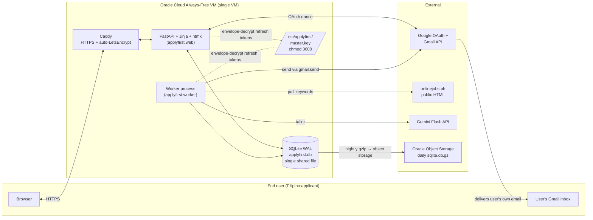
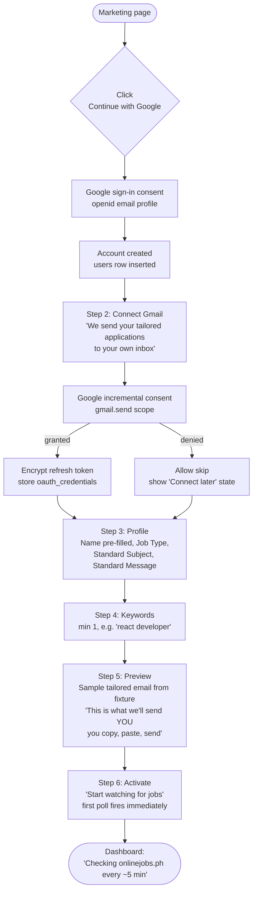
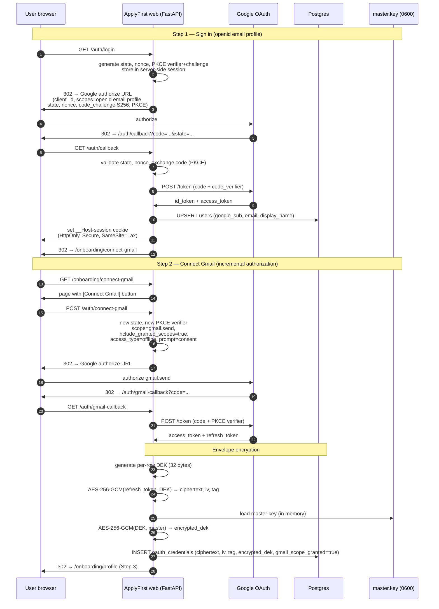
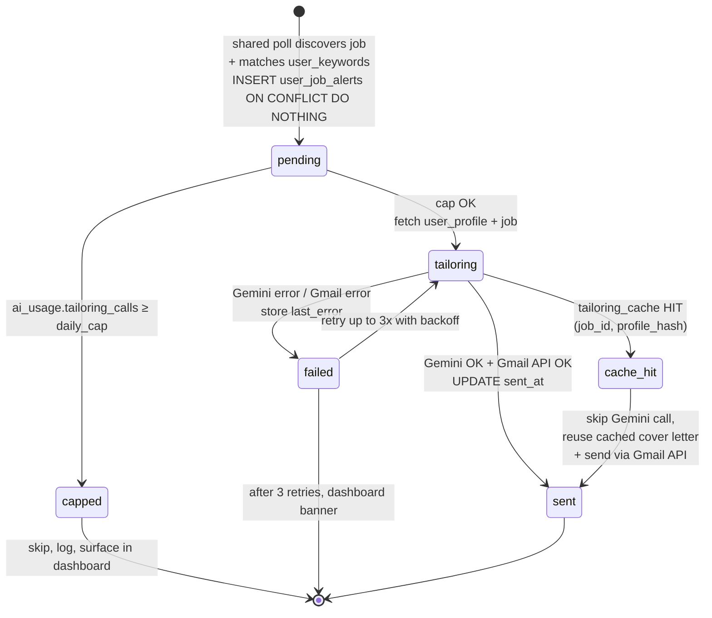

# ApplyFirst V2 — Multi-Tenant SaaS — System Design

- **Date:** 2026-06-21
- **Status:** 🟡 DRAFT — pending owner validation of each diagram below (per Bryl's System Design Mode)
- **Owner:** Omhar (solo founder)
- **Pivot:** evolve the single-user CLI into a public, multi-tenant SaaS for onlinejobs.ph applicants
- **Successor of:** `docs/superpowers/specs/2026-06-08-applyfirst-v1-design.md` §17 (V2)

---

## 0. Goal in one line

> A Filipino freelancer signs in with Google, finishes a <3-minute onboarding, and starts receiving **ready-to-paste tailored applications in their own Gmail inbox** within minutes of a matching onlinejobs.ph post going live — so they apply first.

The SaaS does **NOT** auto-send to employers. Delivery = the user's own inbox (V1 behavior, multi-tenant).

---

## 1. Locked Decisions (validated with owner before design)

| # | Decision | Owner's choice |
|---|---|---|
| D1 | Identity provider | **Google Sign-In** ("Continue with Google", OIDC `openid email profile`) |
| D2 | Gmail integration | **Google OAuth `gmail.send` scope** — no App Password walkthrough |
| D3 | Delivery model | **Email to the user's own Gmail inbox** (multi-tenant V1 behavior) |
| D4 | UI stack | **Extend the existing FastAPI + Jinja + htmx app** (`applyfirst/web/`) |
| D5 | Onboarding scope | **4 fields** (Name, Type of Job, Standard Subject, Standard Message) + Connect Gmail + Add Keywords + Preview |

---

## 2. Cross-Team Synthesis (Bryl's calls)

Below is what each specialist proposed, the conflicts I resolved, and the consolidated calls that drive every diagram in this doc.

| Area | Omhar (Backend) | Custodio (Security) | Manny (Product) | Gab (DevOps) | **Bryl's call** |
|---|---|---|---|---|---|
| Multi-tenancy | Shared DB, `user_id` on every row | Same + tenant-scoped session helper + Postgres RLS as defense-in-depth | — | — | **Shared Postgres + `user_id` everywhere + `tenant_scope()` helper + RLS on every table** |
| DB engine | "Migrate before launch — SQLite WAL + concurrent workers is a ticking clock" | Wants Postgres for RLS | — | "Stay on SQLite until SQLITE_BUSY shows up" | **OVERRIDDEN by owner 2026-06-21 → SQLite (WAL) for MVP.** Postgres migration becomes a later milestone (M6, see §10). **Trade-off accepted:** Postgres RLS is unavailable on SQLite, so application-level `tenant_scope()` + the cross-tenant integration test (Custodio P0-3) is the **only** isolation defense during MVP — no defense-in-depth. Worker + web both writing the SQLite file must use `PRAGMA journal_mode=WAL` and `PRAGMA busy_timeout=10000`; the M6 trigger is the first sustained `SQLITE_BUSY` retry curve in logs (Gab). |
| ORM/SQL layer | SQLAlchemy **Core** (not full ORM) — dialect-swap seam | Code snippet uses SQLAlchemy session | — | — | **SQLAlchemy 2.0 Core + Alembic migrations.** Tenant-scope helper sits on top. |
| OAuth flow | — | **Two-step consent (sign-in first, then Connect Gmail incremental)** | **Two consents back-to-back during onboarding** | — | **Two-step, executed back-to-back in onboarding** — Custodio's clean denial/revoke path + Manny's "don't lose the moment". |
| Refresh-token storage | — | **Envelope encryption: per-row AES-256-GCM data key, master key in a 0600 file outside DB** | — | "Single `TOKEN_ENCRYPTION_KEY` Fernet key in `/etc/applyfirst/env`" | **Custodio's envelope encryption** wins — Fernet alone for a SaaS-grade bearer credential is too thin. Master key in `/etc/applyfirst/master.key`, 0600, app user. |
| Polling | Single shared poll per unique keyword across tenants | — | Randomize poll interval 4–7 min, dead-man's switch if 0 jobs for 3 cycles | Inline fanout, no Redis/RQ at 100 users | **Inline shared poll, per-keyword dedupe across tenants, 4–7 min jittered, dead-man's switch.** |
| Tailoring cost | Per-tenant **daily cap** + `(job_id, profile_hash)` cache | Per-(user, job) call isolation, no cross-tenant context | **10 emails/day** waitlist beta default | — | **10/day default (Manny)**, configurable per user (Omhar). Cache by `(job_id, profile_hash)` — stores OUTPUT, not personal data; cross-tenant cache hit is safe because two identical profiles by definition have identical output. |
| Pricing | — | — | **Waitlist-gated free beta, no Stripe day 1, `plan: free \| pro` column from day 1** | — | **Adopt as-is.** |
| Process topology | — | — | — | **Uvicorn workers + Caddy + one worker process; two systemd units** | **Adopt as-is.** |
| HTTPS / domain | — | — | — | **Caddy on the VM** (auto-LetsEncrypt) | **Adopt as-is.** Cloudflare Tunnel deferred. |
| CI/CD | — | — | — | GH Actions: lint + pytest on push; deploy on tag via ssh + systemctl restart. **No Docker yet.** | **Adopt as-is.** |
| Backward compat with CLI | "Fork: leave CLI alone, separate process + DB" | — | — | — | **Adopt as-is.** SaaS is a new deployment; CLI keeps running for the owner. |
| Google app verification | — | **4–6 weeks (sometimes 3+ months) — start day 1 of launch prep** | Waitlist caps risk of hitting 100-user testing limit before verification lands | "Need privacy policy + verified domain from day one" | **Start verification application the day SaaS public landing page goes live.** Waitlist gates risk in the meantime. |

---

## 3. Architecture — Components



Two systemd units, one VM, one shared SQLite file (WAL mode, `busy_timeout=10000`). Both processes load the master encryption key at startup; the key never lives inside the DB. The SaaS DB (`applyfirst.db`) is **separate from the existing single-user CLI DB** — see §2 backward-compat row.

---

## 4. Data Model (ERD)

```mermaid
erDiagram
    users ||--o| oauth_credentials : has
    users ||--|| user_profiles : has
    users ||--o{ user_keywords : owns
    users ||--o{ user_job_alerts : receives
    users ||--o{ ai_usage : meters
    jobs ||--o{ user_job_alerts : "fans out to"
    jobs ||--o{ tailoring_cache : "cached for"
    user_keywords ||--o{ user_job_alerts : "matched by"
    user_job_alerts ||--o| applications : "produces"

    users {
        uuid id PK
        text google_sub UK "Google subject id, NEVER email"
        text email
        text display_name
        text plan "free | pro (free by default)"
        timestamptz created_at
    }

    oauth_credentials {
        uuid id PK
        uuid user_id FK
        text provider "google"
        bytea refresh_token_ciphertext "AES-256-GCM"
        bytea refresh_token_iv
        bytea refresh_token_tag
        bytea encrypted_dek "DEK encrypted by master key"
        boolean gmail_scope_granted
        timestamptz access_token_expiry
        timestamptz updated_at
    }

    user_profiles {
        uuid id PK
        uuid user_id FK UK "one-to-one"
        text full_name "onboarding field 1"
        text job_type "onboarding field 2"
        text standard_subject "onboarding field 3"
        text standard_message "onboarding field 4"
        jsonb profile_extras_json "links, skills, experience..."
        text profile_hash "SHA-256 of full profile"
        timestamptz updated_at
    }

    user_keywords {
        uuid id PK
        uuid user_id FK
        text keyword
        boolean is_active
        timestamptz created_at
    }

    jobs {
        uuid id PK
        text onlinejobs_id UK "dedupe key"
        text title
        text employer_name
        text url
        text description_raw
        text apply_instructions
        timestamptz scraped_at
    }

    user_job_alerts {
        uuid id PK
        uuid user_id FK
        uuid job_id FK
        uuid keyword_id FK
        text status "pending|tailoring|sent|failed|capped"
        timestamptz sent_at
        timestamptz created_at
    }

    applications {
        uuid id PK
        uuid alert_id FK
        text cover_letter_text
        text email_subject
        text resume_pdf_path
        timestamptz sent_at
    }

    tailoring_cache {
        uuid id PK
        uuid job_id FK
        text profile_hash
        text cover_letter_text
        jsonb screening_answers_json
        timestamptz created_at
    }

    ai_usage {
        uuid id PK
        uuid user_id FK
        date day
        int tailoring_calls
        int input_tokens
        int output_tokens
    }
```

**Constraints & indexes worth calling out:**
- `users.google_sub` — UNIQUE, the login key (never email).
- `user_keywords` — UNIQUE `(user_id, keyword)`; partial index on `is_active = true` for the worker scan.
- `jobs.onlinejobs_id` — UNIQUE; INSERT … ON CONFLICT DO NOTHING for cross-tenant dedupe.
- `user_job_alerts` — UNIQUE `(user_id, job_id)`; this is the per-user dedupe guard.
- `tailoring_cache` — UNIQUE `(job_id, profile_hash)`; rows older than 30 days purged nightly.
- `ai_usage` — UNIQUE `(user_id, day)`; daily cap enforced with `INSERT … ON CONFLICT DO UPDATE SET tailoring_calls = ai_usage.tailoring_calls + 1`.
- **Postgres RLS is DEFERRED to M6** (SQLite override). For MVP, tenant isolation rests on **one defense, not two**: the `tenant_scope()` helper + a CI-enforced cross-tenant integration test (Custodio P0-3). Every tenant-scoped table gets a `user_id` column anyway so RLS lights up cleanly when Postgres lands.
- SQLite-specific: the schema is created and migrated via **Alembic against SQLite** (Alembic supports it natively); columns that would be `UUID`/`BYTEA`/`JSONB`/`TIMESTAMPTZ` on Postgres map to `TEXT (UUID4 string)` / `BLOB` / `TEXT (JSON)` / `TEXT (ISO-8601 UTC)` on SQLite. The Alembic migration files are written dialect-neutral so the M6 swap is just a connection-string change.

---

## 5. Onboarding Flow (6 steps, <3 min)



Hard rules baked in:
- **Step 2 is two-step (separate consent screen), not combined** with Step 1 — Custodio's denial-handling + Manny's incremental authorization.
- **Step 2 is skippable.** A user with no Gmail connection lands in dashboard with a banner: "Connect Gmail to start receiving applications." Polling is paused.
- **Step 4 (keywords) is required.** No keywords = no polls = no value. Min 1 keyword.
- **Step 5 (preview) is non-skippable** — Manny's expectation-gap defense. Copy explicitly says "we send to YOU, you copy + paste."

---

## 6. "Continue with Google" + "Connect Gmail" — Sequence



**Security invariants enforced in this flow:**
- PKCE on both legs (Custodio: P0).
- `state` validated before *anything* else on the callback — mismatch returns 400 and invalidates session (defeats login-CSRF account takeover).
- `nonce` validated against `id_token` (defeats ID token replay).
- Refresh token NEVER stored raw; access token NEVER stored in DB (re-fetched from refresh on demand, held in worker memory only).
- One Google OAuth client across both legs (not two).

---

## 7. Polling worker — state machine per alert



**Worker loop (shared poll, per-tenant fanout):**

```
every 4–7 min (jittered):
  unique_keywords = SELECT DISTINCT keyword FROM user_keywords WHERE is_active
  for kw in unique_keywords:
      sleep 1.0–2.5s        # politeness between keyword fetches
      listings = scrape(kw)
      for L in listings:
          INSERT INTO jobs (onlinejobs_id, ...) ON CONFLICT DO NOTHING
      for user in users subscribed to kw:
          INSERT INTO user_job_alerts (user_id, job_id) ON CONFLICT DO NOTHING

  pending = SELECT FROM user_job_alerts WHERE status='pending'
  for alert in pending:
      with tenant_scope(user_id=alert.user_id):
          if ai_usage(today) >= cap: mark 'capped'; continue
          package = tailoring_cache_get(job_id, profile_hash) or gemini_tailor(...)
          access_token = refresh_or_use(oauth_credentials)
          gmail_api_send(to=user.email, subject, body, attachments=[resume_pdf])
          mark 'sent', increment ai_usage
```

**Dead-man's switch (Manny):** if shared poll returns 0 listings for 3 consecutive cycles, the worker emits a `worker_blind` alert to the owner — not to users. (Likely an IP ban or onlinejobs.ph layout change.)

---

## 8. Cost & Safety Controls

- **Per-tenant daily cap** — 10 tailored emails/day default (Manny), configurable per user up to whatever the `plan` column allows.
- **Per-process safety cap** — global ceiling on Gemini calls/hour to bound a runaway bug.
- **Tailoring cache** — `(job_id, profile_hash)` SHA-256 of the profile blob. Two users with identical profiles & same job share one Gemini call (rare but free). Cache rows purged after 30 days. Profile edit → new `profile_hash` → cache misses on next job (correct).
- **Cross-tenant isolation in the LLM call** — Gemini receives ONLY `(user_profile[user_id], job_post[job_id])` fetched via `tenant_scope()`. No shared accumulator, no queue messages with prompt text — only `(user_id, job_id)` pairs in the inline fanout. Prompt-injection in a job post cannot reach another user's data because that data is not in the context.
- **Refresh-token revocation path** — explicit "Disconnect Gmail" route calls Google's `/revoke` endpoint, then zeros the encrypted DEK + ciphertext + tag on the row.

---

## 9. Hosting & Deploy

| Layer | Choice | Where |
|---|---|---|
| VM | Oracle Cloud Always-Free (ARM Ampere) | already provisioned |
| TLS / reverse proxy | **Caddy** (auto-LetsEncrypt) | binds :80 + :443 |
| Web | Uvicorn (4 workers) | `applyfirst-web.service` |
| Worker | Single Python process | `applyfirst-worker.service` |
| DB | SQLite WAL (`/opt/applyfirst/data/applyfirst.db`), file mode 640, owned by the app user | both processes open the same file, `PRAGMA busy_timeout=10000` |
| Backup | Nightly `sqlite3 .backup` (online-backup API) → gzip → Oracle Object Storage (free tier 20 GB) | 30-day lifecycle rule. Existing `applyfirst backup` CLI command already does this — extend it. |
| Secrets | `/etc/applyfirst/env` (mode 640) — GOOGLE_CLIENT_ID/SECRET, DATABASE_URL, GEMINI_API_KEY, SESSION_SECRET. Master encryption key in `/etc/applyfirst/master.key` (mode 0600), not in `.env`. | sealed on host |
| CI/CD | GitHub Actions: ruff + pytest on push; on `v*` tag → ssh + git pull + systemctl restart both units. No Docker. | `.github/workflows/` |
| Domain | Owner provides (Google app verification needs verified-domain ownership) | TBD — owner picks |
| Observability | UptimeRobot → `/health`; JSON logs → `journalctl`; alerts when `last_cycle_at` stale > 2× poll, OAuth-refresh failures, disk < 2 GB. | free tier |

---

## 10. Phased Rollout (M1–M5)

| Milestone | What ships | Done-when |
|---|---|---|
| **M1 — Auth foundation** | SQLAlchemy 2.0 Core + Alembic (against SQLite), `users` + `oauth_credentials` tables, `__Host-` signed session, Google sign-in (PKCE, state, nonce), `tenant_scope()` helper, cross-tenant integration test (returns 404 not 403) | Sign-in works on public HTTPS; cross-tenant test green |
| **M2 — Onboarding wizard** | 6 steps; envelope-encrypted refresh-token storage; "Connect Gmail" incremental authorization; sample tailored email fixture for Step 5 | Owner finishes new signup in <3 min on a fresh browser |
| **M3 — Multi-tenant worker** | Shared poll w/ jitter, per-keyword dedupe, per-tenant fanout, daily cap, tailoring cache, dead-man's switch, Gmail API send | A second beta user receives a real tailored email |
| **M4 — Google verification submission** | Privacy policy URL, ToS URL, scope justification, demo video, verified domain | Submitted (waitlist still gates beyond 100 users) |
| **M5 — Polish + launch** | Disconnect Gmail flow, daily-cap banner, "Worker blind" owner alert, nightly SQLite backup to Object Storage, CSRF on htmx posts, `/auth/*` rate limit | Public landing page live + waitlist open |
| **M6 — Postgres migration (deferred)** | Switch SQLAlchemy DSN from SQLite to Postgres; enable Postgres RLS with `USING (user_id = current_setting('app.current_user_id')::uuid)`; set `app.current_user_id` at request start | Triggered by sustained `SQLITE_BUSY` retries in logs OR 50+ concurrent active users |

CLI is **untouched** through all of this — separate process, separate `applyfirst.db`. The owner keeps using it daily.

---

## 11. Open P0 Risks (consolidated)

| # | Risk | Owner / mitigation |
|---|---|---|
| P0-1 | **Google `gmail.send` verification rejection / 3+ month lead time** blocks > 100 users | Manny + Custodio: submit verification on M4 (day 1 of public landing); waitlist caps users until approved; have privacy policy + ToS + verified domain ready BEFORE M2 |
| P0-2 | **Refresh-token exfiltration via DB compromise** (Oracle Free is shared infra) | Custodio: envelope encryption; Postgres bound `127.0.0.1` only; master key in 0600 file, never in `.env` |
| P0-3 | **Cross-tenant data leak from one missing `WHERE user_id = …`** — **risk elevated on SQLite-MVP** because Postgres RLS defense-in-depth is unavailable until M6 | Custodio: `tenant_scope()` helper + CI-enforced integration test asserting **404 (not 403)** for cross-tenant access + lint rule banning bare `.query(Model)` outside the helper. **Compensating control:** every PR that touches data access requires a passing cross-tenant test in CI — no exceptions. RLS lights up automatically at M6. |
| P0-3b | **SQLite WAL contention** under web+worker concurrent writes — silent degradation to serialized writes; in the worst case, `SQLITE_BUSY` after busy_timeout exhausts | Gab: `PRAGMA journal_mode=WAL` + `PRAGMA busy_timeout=10000` (10 s) on every connection; log `sqlite3.OperationalError: database is locked` retry counts; **the first sustained retry curve = the M6 Postgres trigger.** |
| P0-4 | **OAuth login-CSRF account takeover** (skipped `state` validation) | Custodio: `state` server-side, validated before token exchange, mismatch = 400 + session invalidation |
| P0-5 | **onlinejobs.ph IP ban kills the product for everyone** | Manny + Gab: shared single-IP poll, 4–7 min jitter, 1–2.5 s politeness between keywords, dead-man's switch on 3 consecutive empty cycles |
| P0-6 | **OAuth refresh silently revoked (30-day inactivity, security review)** → user's emails stop arriving with no notice | Manny: health-check refresh on every poll; on failure, send fallback transactional alert to the user's Google email + dashboard banner with "Reconnect Gmail" CTA |
| P0-7 | **Oracle reclaims an "idle" Always-Free VM** | Gab: weekly `rsync` of `/opt/applyfirst` + DB dump to a second location (e.g., $5 Hetzner standby) |

---

## 12. What's NOT in V2 (deliberately deferred)

- Multiple résumé profiles per user
- Auto-applying to jobs (legal/trust + onlinejobs.ph TOS)
- Sites beyond onlinejobs.ph
- Stripe billing (deferred until usage justifies; `plan` column already in schema)
- Mobile app
- Browser extension
- Analytics dashboard for the owner (replace `applyfirst/web/` dashboard, deferred)

---

## 13. Changelog

- **2026-06-21** — v0.1 draft. Authored by Bryl from synthesis of Omhar/Custodio/Manny/Gab input. Pending owner validation of diagrams in §3, §4, §5, §6, §7.
- **2026-06-21** — v0.2 owner overrides: **SQLite (WAL) for MVP**, Postgres deferred to new M6 milestone. §2 synthesis updated, §3 components redrawn (SQLite file in place of Postgres), §4 ERD callout on deferred RLS, §9 hosting row updated, §10 milestones updated (M1 no longer includes Postgres migration), §11 P0-3 risk re-leveled + new P0-3b for SQLite WAL contention. §5, §6, §7 unchanged.
